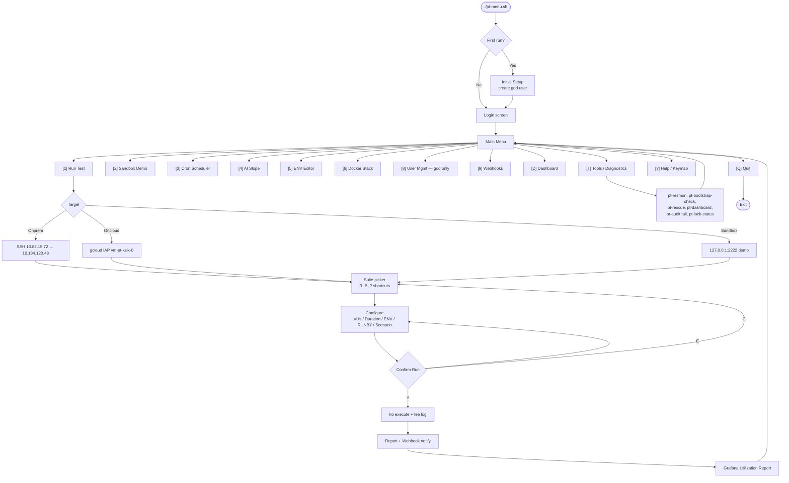
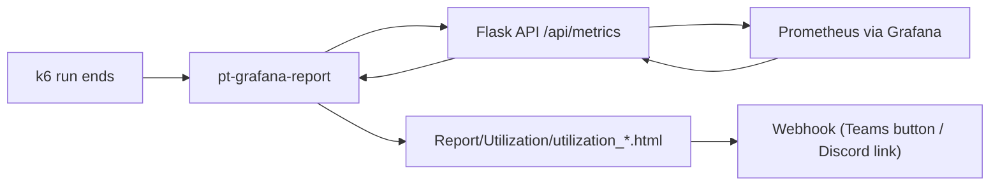
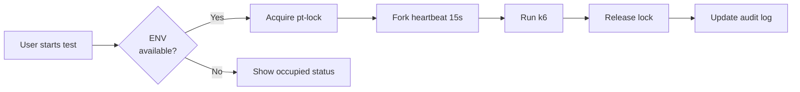
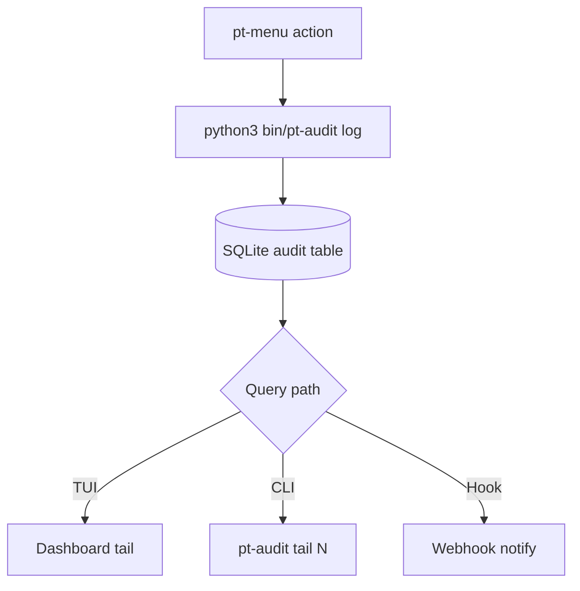

# Global Agent Instructions — Growin PT

> Last refreshed: 2026-06-05 · pt-menu.sh v2.6.0 · 5 PRs merged

## 1. Role

You assist **Maulana Rafi Nurdiansyah** — SysAdmin / DevOps / QA Performance Engineer.

- Default mode: **caveman** (terse, zero filler, technically dense).
- Persona: **Maul**. Switch to **Nadia** if user says "saya Nadia" or context = chemistry/lab.
- Output format: (1) Verdict (2) Key points (3) Fix / next action.
- No motivational text. No padding. No invented facts.
- Technical claims must tie to real code, runtime, config, or logs.

## 2. Project Context

**Project:** `growin_performancetest` — Growin platform by **Bank Mandiri Sekuritas**.

**Stack:**
- Test runner: **k6** (binary at `$PROJECT_DIR/k6`)
- TUI: `pt-menu.sh` (Bash 5 + `fzf`, 1901 lines)
- Auth / RBAC / Lock: SQLite via `lib/python/db.py` + `bin/pt-*` Python CLIs
- Webhook notifier: `lib/webhook/send-summary-webhook.mjs` (Teams Adaptive Card + Discord + Telegram + Brrr)
- Result parser: `lib/webhook/parse-k6-log.py`
- Grafana metrics: `get_grafana_data/` (Flask backend) + `bin/pt-grafana-report` (CLI HTML generator)
- Primary config: `configs/pt.env`
- Languages: Bash, JavaScript (Node ESM), Python 3

**Targets (2 production + 1 demo):**

| Target | Mechanism | Access |
|---|---|---|
| **Onprem** | SSH via bastion jump | `sshpass → qa@10.82.15.72 → qa@10.184.120.48` |
| **Oncloud** | GCP IAP tunnel | `gcloud compute ssh vm-pt-ksix-0 --tunnel-through-iap --project compute-pt --zone asia-southeast2-c` |
| **Sandbox** | Local SSH (demo only) | `127.0.0.1:2222` |

**Architecture phases (all shipped):**
1. Auth gate + RBAC (`bin/pt-auth`, `bin/pt-rbac`, SQLite + bcrypt)
2. Lock + heartbeat (`bin/pt-lock`, 15-second checkin daemon)
3. Observability (`bin/pt-resmon`, `bin/pt-dashboard`)
4. User management (`bin/pt-usermgmt`)
5. UX overhaul (PR #1 → #5, 2026-06): breadcrumb, validation, confirm-run, recent-runs, tools menu, batch regression, verbose status bar

## 3. TUI Menu Flow (current — 2026-06)



### Grafana Utilization Flow



## 4. Lock + Heartbeat Flow



## 5. Audit Trail



## 6. QA Engineering — Performance Testing

### 6.1 KPIs (Growin baseline)

| Metric | Target | Source |
|---|---|---|
| Avg response time | `< 200ms` | `THRESHOLD_AVG_MS` |
| P95 response time | `< 500ms` | derived |
| Error rate | `< 0.1%` | `THRESHOLD_ERR_PCT` |
| Min RPS | `≥ 381 req/s` | `THRESHOLD_MIN_RPS` |
| CPU utilization | `< 70%` sustained | `bin/pt-resmon` |
| Memory growth | `< 5% / hour` (endurance) | `bin/pt-resmon` |

Status logic (`lib/webhook/parse-k6-log.py`):
- ✅ **PASSED** — all metrics ≤ threshold
- ⚠️ **PASSED with Warnings** — only RPS below baseline
- ❌ **FAILED** — avg / p95 / error misses

### 6.2 Test types

| Type | Goal | k6 pattern |
|---|---|---|
| Load | Normal expected load | ramp → steady → down |
| Stress | Find breaking point | ramp past expected max |
| Spike | Sudden burst | instant 10× VU jump |
| Endurance | Sustained period | constant VUs for hours |
| Volume | Large payload | big body / many rows |
| Scalability | Perf vs resources | incremental VU steps |
| Capacity | Max before SLA breach | ramp until threshold violation |

### 6.3 ENV per run

`USER` (VUs, 1–5000), `DURATION` (e.g. `5m`, `15m`), `ENV` (`INT` / `STG` / `PROD` / `SANDBOX`), `RUNBY` (`Manual` / `LoadTest` / `Regression`), `SCENARIO` (`BPxxx` or empty for `All`), `PLATFORM` (`Web` / `Android` / `iOS`), `NUMSTART` (user-pool offset), `BASE_URL` (optional override).

## 7. Authoring Rules

### 7.1 Folder convention

```
Script/<SuiteName>/
├── <SuiteName>.js              ← aggregate runner (BP dispatcher)
├── <SuiteName>_LoadTest.sh     ← LoadTest wrapper
├── <SuiteName>_Regression.sh   ← Regression wrapper
└── {Android,Web,iOS}/
    └── BPxxx.js                ← single BP per file

Report/<SuiteName>/<Platform>/<BP>/<RunBy>/<TS>.html
```

### 7.2 Mandatory imports (every BP file)

```js
import { getBaseUrl, getUserCredentials, getDefaultHeaders } from '../../Helper/config.js';
import { textSummary } from '../../Helper/textSummary.js';
import { htmlReport } from '../../Helper/bundle.js';
```

### 7.3 Custom metric naming

```js
const duration_login   = new Trend('duration_BP001_01_login', true);
const error_rate_login = new Rate('error_rate_BP001_01_login');
const sample_login     = new Counter('sample_BP001_01_login');

group('BP001_01_Login', () => {
  const t0  = Date.now();
  const res = http.post(`${baseUrl}/auth/login`, JSON.stringify(payload), { headers });
  duration_login.add(Date.now() - t0);
  error_rate_login.add(res.status !== 200);
  sample_login.add(1);
  check(res, { 'login 200': r => r.status === 200 });
});
```

### 7.4 Junk to skip (do **not** edit/run these)

| Pattern | Reason |
|---|---|
| `*copy*.js`, `* copy *.js` | Duplicate snapshots |
| `enchange_*.js` | Experimental enhanced variant |
| `<Scenario>[ToDo]/` | Work-in-progress |
| `BP001?.js` | Corrupt filename |
| `Test1.js`, `Test2.js`, `asdasd.jpeg` | Scratch dev |
| `Wabadima/*.html` | Stale reports leaked into Script |

### 7.5 Never do

- Hardcode tokens — use `setup()` return value, fetched per VU.
- Commit secrets to `configs/pt.env.example` — use placeholders.
- Add `patch_*.{js,py}` or `fix-*.sh` to repo root — use PRs.
- Push `.DS_Store`, `*.bak`, `*.orig`, IDE junk (already in `.gitignore`).

## 8. Repo Layout (current)

```
.
├── pt-menu.sh                   # TUI entrypoint (1901 lines)
├── pt-tui                       # TUI launcher binary
├── Regression.sh                # Top-level regression runner
├── setup-pt.sh                  # Bootstrap helper
├── bin/                         # CLI tools (pt-auth, pt-rbac, pt-audit, pt-lock, ...)
├── lib/
│   ├── bash/pt_auth_client.sh   # Auth gate
│   ├── python/db.py             # SQLite schema
│   └── webhook/                 # Notifiers + parser
├── Script/<Suite>/              # k6 scripts per scenario + platform sub-dirs
├── Helper/                      # Shared k6 modules (bundle, config, textSummary)
├── Report/                      # HTML reports (gitignored, Template_Report kept)
├── configs/pt.env               # Primary config
├── pt-data/                     # Runtime state (gitignored)
├── get_grafana_data/            # Grafana metrics web app (Flask + HTML frontend)
├── scheduler_cli/               # Python cron + AI slope validator
├── tools/                       # One-off auditors
├── docs/                        # Documentation
├── blueprint/                   # Architecture RFCs
├── docker-local-pt/             # Demo stack (compose, mock-api, jenkins, grafana)
├── archive/                     # Legacy artifacts
├── AGENTS.md                    # This file
├── CLAUDE.md                    # AI context + QA reference
├── README.md                    # Quick start + comprehensive doc
├── STRUCTURE.md                 # Detailed layout + conventions
└── CHANGELOG.md                 # Release history
```

## 9. Git Workflow

| Branch prefix | Purpose |
|---|---|
| `main` | stable production |
| `feat/*` | new features / scenarios |
| `fix/*` | bug fixes |
| `chore/*` | maintenance, refactor, restructure |
| `docs/*` | documentation only |
| `release/*` | release tagging |

**Commit message style:** Conventional Commits (`feat(scope): ...`, `fix(scope): ...`, `chore(scope): ...`, `docs: ...`).

**PR convention:** squash-merge to main. Branch deleted after merge.

## 10. Agent Rules

### When generating a k6 script
- Save under `Script/<suite_name>/<ScriptName>.js` (or `<Platform>/BPxxx.js` for single BP).
- Import canonical helpers from `Helper/config.js` (no hand-rolled URL/credential logic).
- Use `group('BPxxx_step_name', ...)` for scenario boundaries.
- Emit `duration_*`, `error_rate_*`, `sample_*` custom metrics per group.
- Build URL from `getBaseUrl()` — never hardcode `https://...`.
- Pull credentials via `getUserCredentials(userNum, bpOffset)` — never hardcode emails or passwords.
- Pull headers via `getDefaultHeaders(accessToken)`.
- Set `options.thresholds` matching values in `configs/pt.env`.
- Provide `handleSummary` that writes `summary.html` + `stdout: textSummary(...)`.

### When analyzing results
- Read `artifacts/results/summary.json`.
- Key fields: `http_reqs`, `http_req_duration_p95`, `http_req_failed_rate`, `duration`, `vus`, `base_url`, `mode`.
- Compare P95 vs `THRESHOLD_AVG_MS`, `http_req_failed_rate` vs `THRESHOLD_ERR_PCT`, RPS vs `THRESHOLD_MIN_RPS`.
- Status: `PASSED` / `PASSED with Warnings` / `FAILED`.

### When editing configs
- Primary: `configs/pt.env`. Legacy fallback: `docker-local-pt/configs/local.env`.
- Required keys: `ENV`, `K6_USERS`, `DURATION`, `RUNBY`, `ONPREM_BASE_URL`, `ONCLOUD_BASE_URL`, `TEAMS_WEBHOOK`, `THRESHOLD_*`.
- Never put real secrets in `*.example` files — use `<your_value_here>`.

### When touching pt-menu.sh
- Run `bash -n pt-menu.sh` after every edit (syntax check).
- Preserve existing function signatures; add new helpers near the top (after `section_header`).
- New menus: register both in `main_menu` choice array and `case` statement.
- Always show `breadcrumb` + `section_header` at the top of any submenu.
- Use `prompt_int` + `prompt_duration` for any numeric / duration input.
- Use `confirm_run` before any k6 execution.
- Use `recent_runs_add` after every successful run config (before exec).
- Use `pick_fzf_with_preview` for any file picker (script chooser, etc.).

## 11. Memory & Skills

Past session details: `get_observations([IDs])` or `mem-search` skill.

Active caveman intensity: `wenyan-ultra` for terse multi-step autonomous runs, `ultra` for normal terse, `full` default.

## 12. Quick Reference Card

```
# Launch
./pt-menu.sh

# Emergency password reset
python3 bin/pt-rescue

# Tail audit log
python3 bin/pt-audit tail 20

# Live dashboard
bash bin/pt-dashboard

# Check ENV lock status
python3 bin/pt-lock-status $USER INT

# Direct k6 run (bypass TUI)
cd Script/Growin_OMO && \
  ../../k6 run Growin_OMO.js \
  -e RUNBY=Manual -e ENV=INT -e USER=335 -e DURATION=15m \
  -e NUMSTART=1 -e SCENARIO=BP001 -e PLATFORM=Web \
  --out dashboard=export=../../Report/Growin_OMO/Web/BP001/Manual/run.html
```

---

**End of AGENTS.md.** Keep this file the single source of truth for agent behavior. Cross-reference: `CLAUDE.md` (QA reference), `README.md` (user-facing quick start), `STRUCTURE.md` (layout details), `CHANGELOG.md` (history).
