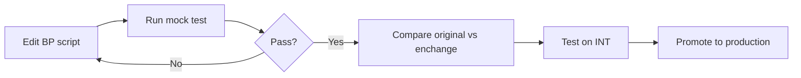

# Growin Performance Test

k6-based performance test suite for Growin platform. Supports Web, Android, iOS scenarios across multiple product suites with local Docker mock environment and remote VM execution.

## Quick Start

```bash
# Interactive TUI menu (recommended)
./pt-menu.sh

# Direct local mock run
cd docker-local-pt
docker compose --env-file configs/local.env up -d mock-api
docker compose --env-file configs/local.env run --rm k6-runner
```

## Repository Structure

```
growin_performancetest/
├── Script/                    # Test suites by product
│   ├── Growin_Calendar/       # Calendar module (Web/Android/iOS)
│   ├── Growin_Community/      # Community features
│   ├── Growin_2FA/            # Two-factor auth scenarios
│   ├── Growin_PT_Dev[ToDo]/   # Dev playground suite
│   └── ...                    # ~25 product suites
├── docker-local-pt/           # Local mock PT environment
│   ├── docker-compose.yml     # mock-api + k6 + observability
│   ├── configs/local.env      # Environment config
│   ├── scripts/               # Runner/generator scripts
│   └── results/               # Test outputs
├── docker/pt/                 # Alternative compose (real INT)
├── tools/                     # Audit & utility scripts
├── Report/                    # Historical test reports
├── Helper/                    # k6 helpers (bundle, config)
├── pt-menu.sh                 # Interactive TUI menu
└── go.mod                     # xk6 extension (mostngk6x)
```

## Test Suites

| Suite | Description | Platforms |
|-------|-------------|-----------|
| `Growin_Calendar` | Calendar/scheduling features | Web, Android, iOS |
| `Growin_Community` | Social/community features | Web, Android, iOS |
| `Growin_2FA` | Two-factor authentication | Web |
| `Growin_Banner_Promo` | Banner/promo display | Web, Android, iOS |
| `Growin_Password_Expired` | Password expiry flows | Android |
| `Growin_PT_Dev[ToDo]` | Development test scenarios | Web |
| ... | ~25 total suites | varies |

Each suite contains:
- `BPxxx.js` — Original scenario scripts
- `enchange_BPxxx.js` — Enhanced variants with improvements
- Organized by platform: `Web/`, `Android/`, `iOS/`

## Local Mock Environment

Docker-based mock API for safe local testing without hitting real backends.

### Start Stack

```bash
cd docker-local-pt

# Basic: mock-api + k6
docker compose --env-file configs/local.env up -d mock-api

# With observability (Grafana + InfluxDB)
docker compose --env-file configs/local.env --profile observability up -d

# With Jenkins CI
docker compose --env-file configs/local.env --profile ci up -d
```

### Run Tests

```bash
# Single scenario via helper
bash scripts/run-mock-scenario.sh BP001 Web original

# Suite sweep
bash scripts/run-mock-suite.sh Growin_Calendar Web

# Generate static runners
node scripts/gen-mock-runner.mjs
```

### Environment Config (`configs/local.env`)

```bash
SUITE=Growin_PT_Dev[ToDo]     # Active suite
SCENARIO=BP001                 # Scenario ID (BPxxx)
PLATFORM=Web                   # Web | Android | iOS
VARIANT=original               # original | enchange
K6_USERS=1                     # Virtual users
DURATION=30s                   # Test duration
ENV=LOCAL                      # LOCAL | DEV | QA | INT
BASE_URL=http://mock-api:8080  # Target API
DEBUG=true                     # Verbose logging
USE_GRAFANA_OUTPUT=false       # Send metrics to Influx
```

## Remote Execution

### SSH Targets

| Environment | Host | User | Access |
|-------------|------|------|--------|
| Onprem-1 | `10.82.15.72` | `qa` | Password: `M@nsek.1234` |
| Onprem-2 | `10.184.120.48` | `qa` | Password: `M@nsek.1234` |
| Cloud (GCP) | `vm-pt-ksix-0` | IAP | `gcloud compute ssh --zone asia-southeast2-c vm-pt-ksix-0 --tunnel-through-iap --project compute-pt` |

Use `pt-menu.sh` → SSH for interactive selection, or:

```bash
# Onprem
ssh qa@10.82.15.72

# Cloud via IAP
gcloud compute ssh --zone "asia-southeast2-c" "vm-pt-ksix-0" \
  --tunnel-through-iap --project "compute-pt"
```

### Report Sync

```bash
# Pull reports from VM to local
scp -r qa@10.82.15.72:/home/qa/Report/Growin_Calendar ./Report/

# Push to VM
scp -r ./Report/Growin_Calendar qa@10.82.15.72:/home/qa/Report/
```

## TUI Menu (`pt-menu.sh`)

Interactive fzf-based menu for common operations:

```bash
./pt-menu.sh
```

**Features:**
- 🖥 **SSH** — Connect to Onprem/Cloud servers (auto password copy)
- ⚙️ **ENV** — Edit `local.env` inline (BASE_URL, VUs, duration, etc.)
- 🐳 **Docker** — Start/stop/restart local PT stack
- ▶️ **Run Test** — Execute scenarios via mock runner

**Requirements:** `fzf` (install: `brew install fzf`)

## Custom k6 Extension (mostngk6x)

Built via xk6 with multiple extensions:

```bash
# Compile extension
go mod init mostngk6x
go mod tidy

# Build k6 with extensions
xk6 build \
  --with github.com/grafana/xk6-dashboard \
  --with github.com/avitalique/xk6-file \
  --with github.com/grafana/xk6-sql \
  --with github.com/denyshuzovskyi/xk6-sql-driver-oracle \
  --with github.com/grafana/xk6-sql-driver-postgres \
  --with github.com/stefnedelchevbrady/xk6-sql-with-oracle \
  --with mostngk6x=.
```

## Scripts Reference

### docker-local-pt/scripts/

| Script | Purpose |
|--------|---------|
| `run-mock-scenario.sh` | Run single BP scenario |
| `run-mock-suite.sh` | Sweep all scenarios in suite |
| `gen-mock-runner.mjs` | Generate static k6 runner files |
| `list-scenarios.mjs` | List available scenarios |
| `compare-summary.mjs` | Compare original vs enchange results |
| `yaml-to-json.mjs` | Convert YAML config to JSON |
| `check-k6-js-compat.mjs` | Check JS syntax compatibility |
| `resolve-k6-users.sh` | Resolve VU count from env vars |

### tools/

| Script | Purpose |
|--------|---------|
| `audit-enhanced-contracts.mjs` | Audit enchange script contracts |
| `audit-banner-promo-bp001-parity.mjs` | Banner promo parity check |

## Observability

### Grafana Dashboard

When running with `--profile observability`:
- **URL:** http://localhost:3000
- **Dashboard:** `Local k6 PT Dashboard` (uid: `k6-local-pt`)
- **Credentials:** admin/admin

### InfluxDB

- **URL:** http://localhost:8086
- **Database:** `k6`

### Jenkins CI

When running with `--profile ci`:
- **URL:** http://localhost:18081
- **Pipeline:** `local-k6-mock-pipeline`

```bash
# Get initial admin password
docker exec pt-jenkins cat /var/jenkins_home/secrets/initialAdminPassword
```

## Workflow

### Local Development



### Promotion Checklist

1. ✅ Mock test passes (original + enchange)
2. ✅ `compare-summary.mjs` shows compatible metrics
3. ✅ INT parallel run (low VU)
4. ✅ Grafana metrics comparison
5. ✅ Jenkins env reproduction

## Documentation

- [`READMOCKDOCK.md`](./READMOCKDOCK.md) — Detailed Docker mock operator guide
- [`docs/`](./docs/) — Additional documentation
- [`docker-local-pt/README.md`](./docker-local-pt/README.md) — Local PT stack details

## Requirements

- Docker Desktop (for local mock)
- Node.js 18+ (for generator scripts)
- pnpm (optional, for dependency management)
- fzf (for `pt-menu.sh`)
- Go 1.22+ (for xk6 extension compilation)
- gcloud CLI (for Cloud IAP SSH)
