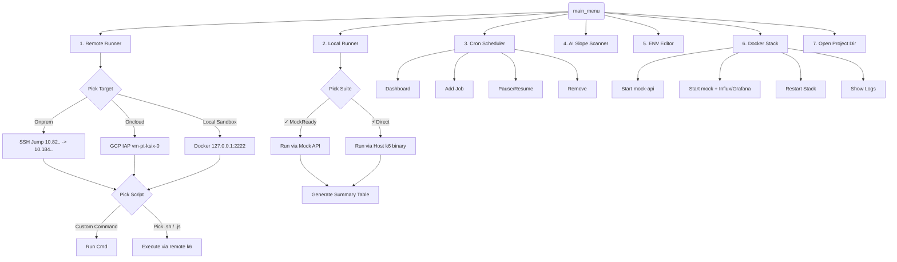

# Growin Performance Test Framework

Enterprise-grade **k6-based** performance testing suite for the Growin platform. Designed to run massive scale load tests across Web, Android, and iOS scenarios using remote VMs or safely test locally via Dockerized Mock APIs. 

Includes an advanced **interactive terminal UI (TUI)** to orchestrate all environments, schedulers, code quality checks, and runners seamlessly from your command line.

---

## 🚀 Quick Start

Launch the interactive TUI (Requires `fzf` and `python3`):

```bash
./pt-menu.sh
```

## 🗺️ TUI Architecture & Navigation



---

## 💻 Environment Capabilities

### 1. Local Runner (Mock & Direct)
Execute scripts directly from your host machine.
- **✓ MockReady Suites:** Scripts structured inside `Web/`, `iOS/`, `Android/` subdirectories (`BPxxx.js`). Runs tests through the `docker-local-pt` stack against `http://mock-api:8080`.
- **⚡ Direct Suites:** Scripts that use flat structures or hardcoded environments (`ENV=INT`). Runs via the native `./k6` binary from your host.

> **Note:** A metric summary table (RPS, Errors, P95, Max/Min) is automatically printed to the terminal after every local run.

### 2. Remote Runner (SSH)
Deploy load tests to high-capacity execution environments.
- **Onprem:** Connects through bastion jump host to execution servers via automated `sshpass`.
- **Oncloud:** Connects to GCP VMs via Google Cloud IAP tunneling.
- **Local Sandbox:** SSH into an isolated Docker container (`127.0.0.1:2222`) that simulates a remote server environment.

### 3. Cron Scheduler CLI
Built-in Python scheduling system for unmanned execution.
- Automatically validates script quality via **AI Slope Scanner** before adding jobs to the schedule.
- Dashboard for viewing `Running` or `Paused` jobs.

### 4. Docker Stack
A complete isolated ecosystem for test development.
- **`mock-api`:** Simulates platform responses safely.
- **`influxdb` + `grafana`:** Local observability when needed.

---

## 📁 Repository Structure

```text
growin_performancetest/
├── Script/                    # Test suites by product (~25 products)
│   ├── Growin_Calendar/       # Calendar module (Web/Android/iOS)
│   ├── OMO_Android/           # Flat-structure android tests
│   └── ... 
├── docker-local-pt/           # Local mock PT environment
│   ├── docker-compose.yml     # mock-api + k6 + observability
│   ├── configs/local.env      # Environment config
│   ├── scripts/               # Generators, YAML/JSON converters, table parsers
│   └── results/               # Test outputs & summaries
├── Report/                    # Generated HTML Dashboard Reports
├── scheduler_cli/             # Python Cron scheduler & AI scanner
├── pt-menu.sh                 # 🌟 Main entrypoint TUI
└── k6                         # Native k6 binary (compiled with custom extensions)
```

---

## 🛠️ Script Authoring Guidelines

To ensure compatibility across both **Local Mock** and **Remote Environments**, scripts should dynamically construct URLs based on environment variables:

```javascript
// ✅ Correct (Supports Mocking)
const env = __ENV.ENV || 'LOCAL';
const baseUrl = env === 'LOCAL' ? __ENV.BASE_URL : `https://${env.toLowerCase()}-api.growin.com`;

// ❌ Incorrect (Cannot be mocked locally)
if (`${__ENV.ENV}` != 'INT') {
    // Only works on Real Servers
}
```

**Variants:**
- `BPxxx.js` — Original scenario scripts.
- `enchange_BPxxx.js` — Refactored, enhanced variants with structured modularity.

---

## 📊 K6 Custom Extensions (mostngk6x)
The `k6` binary included is compiled via `xk6` with specialized drivers for our ecosystem:
- `xk6-dashboard`
- `xk6-file`
- `xk6-sql` (Postgres & Oracle drivers)

*For complete local mock operator documentation, see [`READMOCKDOCK.md`](./READMOCKDOCK.md).*
