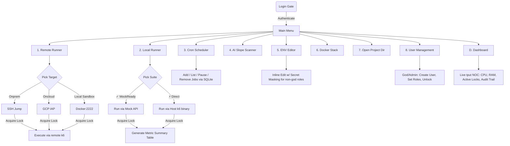

# Growin Performance Test Framework

Enterprise-grade **k6-based** performance testing suite for the Growin platform. Designed to run massive scale load tests across Web, Android, and iOS scenarios using remote VMs or safely test locally via Dockerized Mock APIs. 

Built on the **Kimi Enterprise Architecture RFC**, it includes terminal-native authentication, RBAC, environment concurrency locking, metric parsing, and a live NOC-style dashboard.

---

## 🚀 Quick Start

Launch the interactive TUI (Requires `fzf` and `python3`):

```bash
./pt-menu.sh
```

**Default God User:**
- Username: `maul`
- Password: `Mandirisekuritas2026.`

*(You can change this password inside the TUI via `User Management` > `Reset Password`)*

### 🚑 Emergency Access (Forgot Password)
If you lose access to the `god` account or get locked out, run the CLI rescue tool directly from the terminal:
```bash
python3 bin/pt-rescue
```
It will prompt for the username and force-reset the password/unlock the account directly via SQLite.

---

## 🗺️ TUI Architecture & Navigation



---

## 💻 Environment Capabilities

### 1. Local Runner (Mock & Direct)
Execute scripts directly from your host machine. Safely extracts and prints a tabulated **K6 Load Test Summary** (RPS, P95, Errors, etc.) at the end of each run.
- **✓ MockReady Suites:** Scripts structured inside `Web/`, `iOS/`, `Android/` subdirectories (`BPxxx.js`). Runs tests through the `docker-local-pt` stack against `http://mock-api:8080`.
- **⚡ Direct Suites:** Scripts that use flat structures or hardcoded environments (`ENV=INT`). Runs via the native `./k6` binary from your host.

### 2. Remote Runner (SSH)
Deploy load tests to high-capacity execution environments.
- **Onprem:** Connects through bastion jump host to execution servers via automated `sshpass`.
- **Oncloud:** Connects to GCP VMs via Google Cloud IAP tunneling.
- **Local Sandbox:** SSH into an isolated Docker container (`127.0.0.1:2222`) that simulates a remote server environment.

### 3. Distributed Locking & Concurrency Protection
Prevents QA engineers from stepping on each other's toes.
- Automatically acquires an **environment lock** (e.g., `INT`, `STG`) before launching a test.
- Forks a background heartbeat daemon (`pt-lock`) that checks in every 15s.
- TUI Status Bar transforms into 3 states dynamically:
  - 🟢 `Available | maul [Idle]`
  - 🟡 `OCCUPIED | BP001 | By: budi | since 2m 10s`
  - 🔴 `PT ACTIVE | BP001 | 5m elapsed`

### 4. RBAC & User Management
Full terminal-native role-based access control backed by SQLite (`~/.pt/var/pt.db`).
- **Roles:** `god` (Full admin), `admin`, `operator` (PT runner), `readonly`, `guest`.
- **User Management TUI:** Create users, lock/unlock, reset passwords, assign roles.

---

## 📁 Repository Structure

```text
growin_performancetest/
├── bin/                       # 🌟 Kimi Architecture Python CLIs (pt-auth, pt-lock, pt-dashboard)
├── lib/                       # Python DB models and Bash auth clients
├── Script/                    # Test suites by product (~25 products)
│   ├── Growin_Calendar/       # Calendar module (Web/Android/iOS)
│   ├── OMO_Android/           # Flat-structure android tests
│   └── ... 
├── docker-local-pt/           # Local mock PT environment
│   ├── docker-compose.yml     # mock-api + k6 + observability
│   ├── configs/local.env      # Environment config
│   ├── scripts/               # Generators, YAML/JSON converters, table parsers
│   └── results/               # Test outputs & summaries
├── scheduler_cli/             # Python Cron scheduler & AI scanner
├── pt-menu.sh                 # 🌟 Main entrypoint Bash TUI
└── k6                         # Native k6 binary (compiled with custom extensions)
```
*(Dynamic data like `~/.pt/var/pt.db`, session tokens, and audit logs are safely stored outside the git working tree in the user's home directory).*

---

## 🛠️ Script Authoring Guidelines

To ensure compatibility across both **Local Mock** and **Remote Environments**, scripts should dynamically construct URLs based on environment variables:

```javascript
// ✅ Correct (Supports Mocking)
const env = __ENV.ENV || 'LOCAL';
const baseUrl = env === 'LOCAL' ? __ENV.BASE_URL : `https://${env.toLowerCase()}-api.growin.com`;

// ❌ Incorrect (Cannot be mocked locally)
if (`${__ENV.ENV}` != 'INT') {
    // Only works on Real Servers
}
```

---

## 📊 Observability & K6 Extensions

The framework provides real-time and post-run observability:
- **Live Dashboard:** Select `[D] Dashboard` in the TUI to watch CPU/RAM health, active test locks, and a tail of the audit trail.
- **Summary Table:** A custom Python parser (`print-summary-table.py`) renders an Excel-like ASCII table of K6 metrics locally.
- **Grafana/InfluxDB:** Start the `observability` Docker profile to ship real-time metrics.

*For complete local mock operator documentation, see [`READMOCKDOCK.md`](./READMOCKDOCK.md).*
