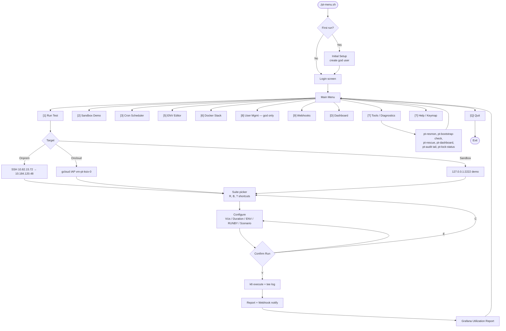
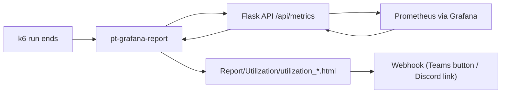

# Growin Performance Test Framework

> Enterprise-grade **k6-based** performance testing suite for the Growin platform by **Bank Mandiri Sekuritas**. Targets **Onprem** (SSH jump) and **Oncloud** (GCP IAP) production; **Sandbox** demo locally via Docker.

[](https://www.gnu.org/software/bash/)
[](https://k6.io)
[](https://www.python.org)
[](./CHANGELOG.md)

Built on the **Core Enterprise Architecture RFC**: terminal-native auth (bcrypt + SQLite), RBAC, env concurrency locking, metric parsing, multi-channel webhooks (Teams / Discord / Telegram / Brrr), NOC-style live dashboard.

---

## 📊 Codebase Analysis (Latest)
*Analysis Date: 2026-06-17*

Full findings available in [KNOWLEDGE.md](./KNOWLEDGE.md).
- **Code Health**: `pt-menu.sh` and core bash/python tools are robust and tested. Fixed bugs related to octal numbers parsing and temporary file cleanups.
- **Security Check**: 🛡️ **GOD MODE AUDIT PASSED** - Completed deep static, runtime, and architectural audits (`SECURITY_GODMODE_REPORT.md`). All legacy test artifacts and `patch_*.py` files purged from root.
- **Testing**: `k6` scripts validate execution safely. Sandbox mock API stack fully verified.
- **Agent Skills**: `fable5` and `caveman` (ultra) autonomous execution protocols actively enforced.
- **Verdict**: DONE - Repository hygiene and CLI bounds are tightly controlled.

---

## 🚀 Latest Changes

- Improved `pt-menu.sh` robustness (fixed `/tmp` file leaks via EXIT trap).
- Fixed octal parsing bugs in prompt interactions (base 10 forced).
- Relaxed k6 duration regex validators to support bare numbers.
- Added hours format formatting for long-running k6 duration results.
- Purged legacy patch scripts and untracked artifacts from the repository root.
- Performed God Mode security audit (Static/Runtime/Architecture) producing `SECURITY_GODMODE_REPORT.md`.

---

## Quick Start

### Prerequisites

| Tool | Why | Install |
|---|---|---|
| `bash` ≥ 4 | TUI runtime | macOS: `brew install bash` · Linux: built-in |
| `fzf` | Menu picker | `brew install fzf` / `apt install fzf` |
| `python3` ≥ 3.9 | Auth / scheduler / audit | `brew install python` / built-in |
| `node` ≥ 18 | Webhook senders | `brew install node` |
| `jq` | JSON parsing in TUI | `brew install jq` / `apt install jq` |
| `sshpass` | Onprem jump host | `brew install sshpass` |
| `gcloud` | Oncloud IAP | [gcloud SDK](https://cloud.google.com/sdk/docs/install) |
| `docker` | Local sandbox stack | [Docker Desktop](https://www.docker.com/products/docker-desktop) |

### One-Command Setup

```bash
git clone https://github.com/termaulmaul/growin_performancetest.git
cd growin_performancetest
bash setup-pt.sh     # Checks & installs all deps, inits DB, starts Docker
./pt-menu.sh         # Launch TUI — first run creates god admin account
```

`setup-pt.sh` is idempotent — safe to re-run. Shows `✓ [already installed]` for existing deps.

### Configuration

```bash
# Auto-created on first ./pt-menu.sh from pt.env.example
configs/pt.env        # Primary config (gitignored — never committed)
configs/pt.env.example  # Template with all keys (committed)
```

Key variables in `configs/pt.env`:

| Variable | Purpose |
|----------|---------|
| `ENV` | Target environment: `INT`, `DEV`, `QA`, `DRC`, `SANDBOX` |
| `K6_USERS` | Default VUs per run |
| `DURATION` | Default duration (e.g. `5m`, `60s`) |
| `PT_SSH_PASS` | SSH password for Onprem jump host |
| `TEST_PASSWORD` | k6 test account password |
| `TEST_PIN` | 2FA PIN for login flow |
| `TEAMS_WEBHOOK` | Power Automate webhook URL |
| `THRESHOLD_AVG_MS` | P95 threshold (default: 200ms) |
| `THRESHOLD_ERR_PCT` | Error rate threshold (default: 0.1%) |
| `THRESHOLD_MIN_RPS` | Min RPS threshold (default: 381) |
| `GRAFANA_BACKEND_URL` | Grafana data backend URL (default: `http://localhost:5000`) |

---

## TUI Menu (`pt-menu.sh`)

Interactive fzf-based menu. All operations accessible from one entry point.

```
┏━╸┏━┓┏━┓╻ ╻╻┏┓╻   ┏━┓╺┳╸   ┏━╸┏━┓┏━┓┏┳┓┏━╸╻ ╻┏━┓┏━┓╻┏
┃╺┓┣┳┛┃ ┃┃╻┃┃┃┗┫   ┣━┛ ┃    ┣╸ ┣┳┛┣━┫┃┃┃┣╸ ┃╻┃┃ ┃┣┳┛┣┻┓
┗━┛╹┗╸┗━┛┗┻┛╹╹ ╹   ╹   ╹    ╹  ╹┗╸╹ ╹╹ ╹┗━╸┗┻┛┗━┛╹┗╸╹ ╹
```

| Key | Menu | Access |
|-----|------|--------|
| `[1]` | **Run Test** (Onprem / Oncloud / Sandbox) | god, admin, operator |
| `[2]` | **Sandbox Demo** (Local Docker mock) | god, admin, operator |
| `[3]` | **Cron Scheduler** (SQLite-backed) | god, admin |
| `[5]` | **ENV Editor** | all except viewer |
| `[6]` | **Docker Stack** (start/stop/logs) | god, admin |
| `[7]` | **Open Project Dir** | all |
| `[8]` | **User Management** | god only |
| `[9]` | **Webhooks** (set/test/toggle) | god, admin |
| `[D]` | **Live Dashboard** (NOC view) | god, admin |
| `[T]` | **Tools / Diagnostics** | all |
| `[?]` | **Help / Keymap** | all |
| `[Q]` | **Quit** | — |

### Run Test Flow


```mermaid
graph TD
    Start(["./pt-menu.sh"]) --> Auth{First run?}
    Auth -- Yes --> Bootstrap["Initial Setup<br/>create god user"]
    Auth -- No --> Login["Login screen"]
    Bootstrap --> Login
    Login --> Main["Main Menu"]

    Main --> M1["[1] Run Test"]
    Main --> M2["[2] Sandbox Demo"]
    Main --> M3["[3] Cron Scheduler"]
    Main --> M5["[5] ENV Editor"]
    Main --> M6["[6] Docker Stack"]
    Main --> M8["[8] User Mgmt — god only"]
    Main --> M9["[9] Webhooks"]
    Main --> MD["[D] Dashboard"]
    Main --> MT["[T] Tools / Diagnostics"]
    Main --> MH["[?] Help / Keymap"]
    Main --> MQ["[Q] Quit"]

    M1 --> T1{Target}
    T1 -- Onprem --> O1["SSH 10.82.15.72 → 10.184.120.48"]
    T1 -- Oncloud --> O2["gcloud IAP vm-pt-ksix-0"]
    T1 -- Sandbox --> O3["127.0.0.1:2222 demo"]

    O1 --> SP["Suite picker<br/>R, B, ? shortcuts"]
    O2 --> SP
    O3 --> SP

    SP --> CFG["Configure<br/>VUs / Duration / ENV / RUNBY / Scenario"]
    CFG --> CR{Confirm Run}
    CR -- Y --> EXE["k6 execute + tee log"]
    CR -- E --> CFG
    CR -- C --> SP

    EXE --> RPT["Report + Webhook notify"]
    RPT --> GRAF["Grafana Utilization Report"]
    GRAF --> Main
    MT --> Tools["pt-resmon, pt-bootstrap-check,<br/>pt-rescue, pt-dashboard,<br/>pt-audit tail, pt-lock-status"]
    Tools --> Main
    MQ --> End(["Exit"])
```

**Recent Runs:** `[R]` in suite picker → select previous run → re-execute with same params.

**Batch Regression:** `[B]` → multi-select suites with TAB → run all sequentially.

### Skip Auth (15 min)

God users can temporarily bypass login via `Tools → [S] Skip Auth (15 min)`.

---

## Execution Targets

### Onprem

```
PT Machine → SSH qa@10.82.15.72 (jump) → SSH qa@10.184.120.48 (runner)
```

- Scripts uploaded as tarball, extracted to `/tmp/pt-run-UUID/`
- k6 uses **repo-level binary** first (`~/growin_performancetest/k6`), falls back to system k6
- Reports saved to `Report/<Suite>/<Platform>/<BP>/<RunBy>/`

### Oncloud (GCP)

```
PT Machine → gcloud compute ssh vm-pt-ksix-0 --tunnel-through-iap
```

Same tarball upload flow. IAP handles authentication (no password needed).

### Sandbox (Docker)

```
PT Machine → SSH qa@127.0.0.1:2222 (Docker container) → mock-api:8080
```

- `pt-mock-api` container serves mock HTTP endpoints
- `pt-sandbox-ssh` container mimics remote runner
- `configs/pt.env` auto-bootstrapped from `pt.env.example`
- Reports written to `/tmp/Report/` inside container

---

## Test Suites

| Suite | Description | Platforms |
|-------|-------------|-----------|
| `Growin_Auth_AdminPermission_Create` | Admin permission CRUD | Web, iOS, Android |
| `Growin_2FA` | Two-factor auth login flow | Web |
| `Growin_Calendar` | Calendar/scheduling | Web, Android, iOS |
| `Growin_Community` | Social features | Web |
| `Growin_Banner_Promo` | Banner/promo display | Web, Android, iOS |
| `Growin_Daily_Trade` | Daily trade operations | Web |
| `Growin_Data_Visualization` | Data viz endpoints | Web |
| `Growin_Eipo_Stock` | eIPO stock operations | Web, iOS |
| `Growin_News` | News feed | Web |
| `Growin_OMO` | OMO trading flow | iOS |
| `Growin_Password_Expired` | Password expiry | Android |
| `Growin_Ratelimit_Reset_Password` | Rate limit + reset | Web |
| `Growin_Rewards` | Rewards/loyalty | Web |
| `Growin_UUPDP` | UUPDP flow | Web, Android, iOS |
| `ExaCC` | ExaCC operations | Web, Android, iOS |
| `Template_Project` | Skeleton for new suites | Web |
| `Sandbox_Demo` | Framework validation (mock) | Web |

### Suite Structure

```
Script/<Suite>/
├── <Suite>.js                    # Main dispatcher (BP routing + setup/teardown)
├── <Suite>_LoadTest.sh           # LoadTest wrapper script
├── <Suite>_Regression.sh         # Regression wrapper script
├── Web/
│   ├── BP001.js                  # Business process 001
│   ├── BP002.js
│   ├── Template_ByPass_Setup.js  # Login-per-iteration pattern
│   └── Template_Use_Setup.js     # Use setup() token pattern
├── iOS/
│   └── BP001.js
└── Android/
    └── BP001.js
```

### Running a Script (Manual)

```bash
# From Script/<Suite>/ directory:
../../k6 run <Suite>.js \
  -e RUNBY=Manual \
  -e ENV=INT \
  -e USER=335 \
  -e DURATION=5m \
  -e NUMSTART=1 \
  -e SCENARIO=BP001 \
  -e PLATFORM=iOS \
  --out dashboard=export=../../Report/<Suite>/iOS/BP001/Manual/report.html
```

Or use `./pt-menu.sh` → Run Test for interactive selection.

---

## Web UI (pt-webui)

Growin PT now includes a modern, terminal-inspired Web UI (`pt-webui`) built with React and Bun. It provides an alternative to the `pt-menu.sh` TUI.

### Setup & Installation

1. **Prerequisites**: Ensure you have [Bun](https://bun.sh/) installed.
2. **Install Dependencies**:
   ```bash
   cd pt-webui
   bun install
   ```

### Running the Web UI

The Web UI requires both the frontend dev server and the backend API server.

**Option 1: Using ui-skills (Recommended)**
```bash
# From the project root
npx ui-skills start
```

**Option 2: Manual Start**
1. Start the UI Backend (handles `k6` execution, system status, and report serving):
   ```bash
   cd pt-webui
   bun run server.ts
   ```
   *(Runs on port `3001`)*
2. Start the Frontend:
   ```bash
   cd pt-webui
   bun run dev
   ```
   *(Runs on port `5173`, access via `http://localhost:5173`)*

### Key Features
- **Run Tests**: Interactive form to trigger `k6` test suites with live execution status.
- **Global Footer**: Displays current IP, Webhook status, Grafana backend status, and K6 Engine state.
- **Grafana Reports**: Easily view the latest generated Grafana utilization `.html` report directly from the Settings tab.
- **Service Controls**: Start and stop the Grafana Python backend directly from the UI.

---

## Webhooks

Multi-channel notifications after each run. Configured in `configs/pt.env`.

| Channel | Variable | Format |
|---------|----------|--------|
| **Teams** | `TEAMS_WEBHOOK` | Adaptive Card (full-width) |
| **Discord** | `DISCORD_WEBHOOK` | Markdown table |
| **Telegram** | `TELEGRAM_WEBHOOK` | Markdown table |
| **Brrr** | `BRRR_WEBHOOK` | Plain text |

### Teams Card Features

- ✅/⚠️/❌ Status with threshold comparison
- Global summary: Samples, P95, Error Rate, RPS
- Per-API performance table (monospace, full-width)
- **Top Errors section** — e.g. `[500] /user/api/v2/watchlistgroup — 39×`
- Full-width card via `msteams.width: Full`

### Test Webhook

```
pt-menu.sh → Webhooks → Test Webhook (Send Sample)
```

Runs DNS check → HTTP preflight → actual payload send with verbose output.

---

## Auth & RBAC

SQLite-backed authentication with bcrypt password hashing.

| Role | Run Test | Sandbox | Scheduler | Docker | User Mgmt | Webhooks |
|------|----------|---------|-----------|--------|-----------|----------|
| **god** | ✓ | ✓ | ✓ | ✓ | ✓ | ✓ |
| **admin** | ✓ | ✓ | ✓ | ✓ | — | ✓ |
| **operator** | ✓ | ✓ | — | — | — | — |
| **readonly** | — | — | — | — | — | — |
| **guest** | — | — | — | — | — | — |

### First Boot

```bash
./pt-menu.sh
# → "No God user found" → create god username + password
```

### Emergency Rescue

```bash
python3 bin/pt-rescue   # Force-reset god password (bypasses normal auth)
```

---

## Observability (Docker)

```bash
# Start with observability profile
cd docker-local-pt
docker compose --env-file configs/local.env --profile observability up -d
```

| Service | URL | Credentials |
|---------|-----|-------------|
| **Grafana** | http://localhost:3000 | admin / admin |
| **InfluxDB** | http://localhost:18086 | — |
| **Mock API** | http://localhost:18080 | — |
| **Jenkins** | http://localhost:18081 | (initial password in container) |

---

## Repository Structure

```
growin_performancetest/
├── pt-menu.sh              # Main TUI (2100+ lines, fzf-based)
├── setup-pt.sh             # Bootstrap: check deps, init DB, start Docker
├── configs/
│   ├── pt.env              # Primary config (gitignored)
│   └── pt.env.example      # Template (committed)
├── bin/                    # CLI tools (Core Architecture)
│   ├── pt-auth             # Login, sessions, bootstrap (bcrypt)
│   ├── pt-rbac             # Permission checks
│   ├── pt-audit            # Immutable audit log
│   ├── pt-lock             # Environment concurrency locking
│   ├── pt-usermgmt         # User CRUD (god only)
│   ├── pt-scheduler        # Cron job management
│   ├── pt-dashboard        # NOC-style live monitor
│   ├── pt-resmon           # CPU/Mem/Load snapshot
│   ├── pt-rescue           # Emergency god password reset
│   └── pt-grafana-report   # Grafana utilization HTML report generator
├── lib/
│   ├── bash/pt_auth_client.sh  # Auth wrapper (session verify, skip-auth)
│   ├── python/db.py            # SQLite schema (WAL mode)
│   └── webhook/
│       ├── send-summary-webhook.mjs  # Teams/Discord/Telegram sender
│       ├── parse-k6-log.py           # Extract metrics + errors from log
│       └── webhook-tester.mjs        # Verbose webhook test
├── Script/                 # k6 test suites (~27 suites)
│   ├── <Suite>/<Suite>.js  # Dispatcher + setup/teardown
│   ├── <Suite>/Web/BP*.js  # Platform-specific BPs
│   └── Template_Project/   # Skeleton for new suites
├── Helper/
│   ├── config.js           # getBaseUrl, getUserCredentials, headers
│   ├── bundle.js           # k6 polyfills
│   └── textSummary.js      # Terminal summary formatter
├── Report/                 # HTML reports (gitignored except template)
│   └── Utilization/        # Auto-generated Grafana utilization reports
├── get_grafana_data/       # Grafana metrics web app (Flask backend + HTML frontend)
├── docker-local-pt/        # Docker stack (mock-api, sandbox-ssh, grafana, influx, jenkins)
├── scheduler_cli/          # Python cron backend + AI slope validator
├── blueprint/              # Architecture RFCs (Deep Research)
├── docs/                   # Audit checklists, UX docs
├── tools/                  # One-off audit scripts
├── archive/                # Legacy files (do not extend)
├── G0DM0D3-GUIDE.md        # Advanced security godmode protocol guidelines
└── SECURITY_GODMODE_REPORT.md # Latest deep security audit results
```

---

## Security (v2.7.0+)

- **No hardcoded passwords** — all credentials via `configs/pt.env` (gitignored)
- **bcrypt** password hashing (migration from SHA-256)
- **No auth bypass** — `PT_AUTH_BYPASS` removed
- **Webhook URL purged** from git history via `filter-branch`
- **Session-based auth** with configurable expiry
- **RBAC** enforced on all menu items

---

## KPI Thresholds

| Metric | Threshold | Config Key |
|--------|-----------|------------|
| P95 Response Time | < 200ms | `THRESHOLD_AVG_MS` |
| Error Rate | < 0.1% | `THRESHOLD_ERR_PCT` |
| Min RPS | ≥ 381 | `THRESHOLD_MIN_RPS` |
| CPU Usage | < 70% | (Grafana alert) |

---

## 📈 Grafana Utilization Report

After each test run, the framework **automatically generates a Grafana utilization report** showing CPU and Memory metrics for Growin pods during the test window.

### How It Works


```mermaid
graph LR
    A["k6 run ends"] --> B["pt-grafana-report"]
    B --> C["Flask API /api/metrics"]
    C --> D["Prometheus via Grafana"]
    D --> C --> B
    B --> E["Report/Utilization/utilization_*.html"]
    E --> F["Webhook (Teams button / Discord link)"]
```

### Setup

1. **Grafana data backend starts automatically** on the first test run. It tries port 5000, 5001, then 5002.
2. Set `GRAFANA_BACKEND_URL` in `configs/pt.env` if you want to use a specific remote instance (default: auto-detected local backend).
- If Grafana backend fails to start or is unreachable, an empty report is generated (graceful fallback).

### Report Contents

| Section | Data |
|---------|------|
| **Container Metrics** | Avg/Min/Max CPU (millicores) and Memory (MB) per pod |
| **Node Utilization** | Avg CPU % and Memory per node (if available) |
| **Time Range** | Exact start → end timestamps of test run |

### Webhook Integration

- **Teams**: Adaptive Card with a "📈 View Utilization Report" action button.
- **Discord / Telegram**: Direct file path link appended to message.
- If Grafana backend is unreachable, an empty report is generated (graceful fallback).

---

## New Team Member Onboarding

```bash
# 1. Clone
git clone https://github.com/termaulmaul/growin_performancetest.git
cd growin_performancetest

# 2. Setup (installs deps, creates pt.env, starts Docker)
bash setup-pt.sh

# 3. Launch
./pt-menu.sh
# First boot → create god account → login → ready

# 4. Run a test
# Menu → [1] Run Test → Onprem → Select Suite → Configure → Run
```

---

## Documentation

- [`CHANGELOG.md`](./CHANGELOG.md) — Release history
- [`STRUCTURE.md`](./STRUCTURE.md) — Detailed repo map
- [`CLAUDE.md`](./CLAUDE.md) — AI agent context + QA reference
- [`READMOCKDOCK.md`](./READMOCKDOCK.md) — Docker mock operator guide
- [`docs/`](./docs/) — Audit checklists, UX improvement logs
- [`blueprint/`](./blueprint/) — Architecture RFCs

---

## Contributing

1. Branch from `main`: `feat/<suite>`, `fix/<issue>`, `refactor/<area>`
2. No `copy.js` files in main
3. No secrets in commits — use `configs/pt.env` (gitignored)
4. Script commit = script + Report scaffold + CHANGELOG entry
5. All k6 scripts must be ES5-compatible (no `?.` or `??` — remote k6 v0.51.0)
6. Test in Sandbox before pushing to Onprem/Oncloud
