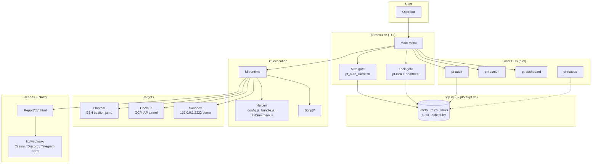
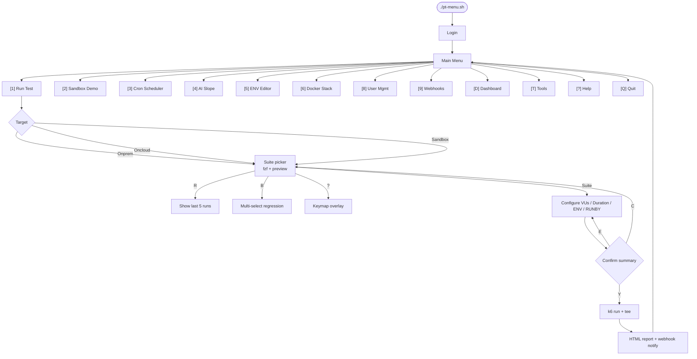

# Growin Performance Test Framework

> Enterprise-grade **k6-based** performance testing suite for the Growin platform by **Bank Mandiri Sekuritas**. Targets **Onprem** (SSH jump) and **Oncloud** (GCP IAP) production; **Sandbox** demo locally.

[](https://www.gnu.org/software/bash/)
[](https://k6.io)
[](https://www.python.org)
[](./CHANGELOG.md)

Built on the **Kimi Enterprise Architecture RFC**: terminal-native auth, RBAC, env concurrency locking, metric parsing, multi-channel webhooks (Teams / Discord / Telegram / Brrr), NOC-style live dashboard.

## Table of Contents

- [Quick Start](#quick-start)
- [System Overview](#system-overview)
- [TUI Navigation](#tui-navigation)
- [Menu Reference](#menu-reference)
- [Targets](#targets)
- [Authoring k6 Scripts](#authoring-k6-scripts)
- [Running Tests](#running-tests)
- [Reports & Webhooks](#reports--webhooks)
- [RBAC & User Management](#rbac--user-management)
- [Configuration](#configuration)
- [Troubleshooting](#troubleshooting)
- [Contributing](#contributing)
- [Recent Changes (v2.6.0)](#recent-changes-v260)

---

## Quick Start

### Prerequisites

| Tool | Why | Install |
|---|---|---|
| `bash` ≥ 5 | TUI runtime | macOS: `brew install bash` · Linux: built-in |
| `fzf` | menu picker | macOS: `brew install fzf` · Debian: `sudo apt install fzf` · RHEL: `sudo yum install fzf` |
| `python3` ≥ 3.9 | auth / scheduler / audit | macOS: `brew install python` · Linux: built-in or `apt install python3` |
| `node` ≥ 18 | webhook senders | macOS: `brew install node` · Linux: `nodesource.com` |
| `sshpass` | onprem jump | macOS: `brew install sshpass` · Linux: `apt install sshpass` |
| `gcloud` | oncloud IAP | [gcloud SDK install guide](https://cloud.google.com/sdk/docs/install) |
| `docker` (optional) | local mock stack | [Docker Desktop](https://www.docker.com/products/docker-desktop) |

### Launch

```bash
git clone https://github.com/termaulmaul/growin_performancetest.git
cd growin_performancetest
./pt-menu.sh
```

### First-run bootstrap

On a fresh server, `pt-menu.sh` detects no users exist and enters **Initial Setup Mode**:

1. Prompts for first **god** username + password.
2. Creates SQLite DB at `~/.pt/var/pt.db` (auth + locks + audit + scheduler tables).
3. You can change credentials later via `User Management → Reset Password`.

### Emergency rescue

Locked out of the `god` account?

```bash
python3 bin/pt-rescue
```

Direct SQLite force-reset password or unlock (bypasses normal auth).

---

## System Overview


```mermaid
graph TB
    subgraph User
        U["Operator"]
    end

    subgraph "pt-menu.sh (TUI)"
        TUI["Main Menu"]
        Auth["Auth gate<br/>pt_auth_client.sh"]
        Lock["Lock gate<br/>pt-lock + heartbeat"]
    end

    subgraph "Local CLIs (bin/)"
        Audit["pt-audit"]
        Resmon["pt-resmon"]
        Dash["pt-dashboard"]
        Rescue["pt-rescue"]
    end

    subgraph "SQLite (~/.pt/var/pt.db)"
        DB[("users · roles · locks<br/>audit · scheduler")]
    end

    subgraph "k6 execution"
        K6["k6 runtime"]
        Helper["Helper/<br/>config.js, bundle.js, textSummary.js"]
        Script["Script/<Suite>/"]
    end

    subgraph "Targets"
        Onprem["Onprem<br/>SSH bastion jump"]
        Oncloud["Oncloud<br/>GCP IAP tunnel"]
        Sandbox["Sandbox<br/>127.0.0.1:2222 demo"]
    end

    subgraph "Reports + Notify"
        Report["Report/<Suite>/<Platform>/<BP>/<RunBy>/*.html"]
        Webhook["lib/webhook/<br/>Teams / Discord / Telegram / Brrr"]
    end

    U --> TUI
    TUI --> Auth
    Auth --> DB
    TUI --> Lock
    Lock --> DB
    TUI --> Audit
    TUI --> Resmon
    TUI --> Dash
    Audit --> DB
    TUI --> K6
    K6 --> Helper
    K6 --> Script
    K6 --> Onprem
    K6 --> Oncloud
    K6 --> Sandbox
    K6 --> Report
    Report --> Webhook
    Rescue -.-> DB
```

---

## TUI Navigation


```mermaid
graph TD
    Start(["./pt-menu.sh"]) --> Login["Login"]
    Login --> Main["Main Menu"]

    Main --> M1["[1] Run Test"]
    Main --> M2["[2] Sandbox Demo"]
    Main --> M3["[3] Cron Scheduler"]
    Main --> M4["[4] AI Slope"]
    Main --> M5["[5] ENV Editor"]
    Main --> M6["[6] Docker Stack"]
    Main --> M8["[8] User Mgmt"]
    Main --> M9["[9] Webhooks"]
    Main --> MD["[D] Dashboard"]
    Main --> MT["[T] Tools"]
    Main --> MH["[?] Help"]
    Main --> MQ["[Q] Quit"]

    M1 --> T{Target}
    T -- Onprem --> SP["Suite picker<br/>fzf + preview"]
    T -- Oncloud --> SP
    T -- Sandbox --> SP

    SP -- "R" --> Recent["Show last 5 runs"]
    SP -- "B" --> Batch["Multi-select regression"]
    SP -- "?" --> Help["Keymap overlay"]
    SP -- "Suite" --> Cfg["Configure VUs / Duration / ENV / RUNBY"]

    Cfg --> Confirm{Confirm summary}
    Confirm -- "Y" --> Exec["k6 run + tee"]
    Confirm -- "E" --> Cfg
    Confirm -- "C" --> SP

    Exec --> Report["HTML report + webhook notify"]
    Report --> Main
```

**Keybindings:**

| Key | Action |
|---|---|
| ↑ ↓ / j k | Navigate |
| Enter | Select / confirm |
| ESC | Back to previous menu |
| Ctrl-C | Quit immediately |
| / | Search within fzf list |
| TAB | Mark item (multi-select mode) |
| ? | Show keymap overlay |
| Q | Quit (from main) |
| R | Recent runs shortcut (suite picker) |
| B | Batch regression shortcut (suite picker) |
| T | Tools menu (main) |

---

## Menu Reference

| Key | Menu | RBAC | Purpose |
|---|---|---|---|
| `[1]` | Run Test | god, admin, tester | Execute k6 against Onprem / Oncloud / Sandbox |
| `[2]` | Sandbox Demo | god, admin, tester | Local mock-api stack or direct `./k6` |
| `[3]` | Cron Scheduler | god, admin | Add / pause / resume / remove scheduled jobs |
| `[4]` | AI Slope | god, admin, tester | Code quality scan for k6 scripts |
| `[5]` | ENV Editor | non-viewer | Inline / `$EDITOR` / summary modes for `configs/pt.env` |
| `[6]` | Docker Stack | god, admin | Start / restart / logs / stop local mock + observability |
| `[7]` | Open Project Dir | all | Open repo in OS file manager |
| `[8]` | User Management | god only | Create / lock / reset / role-assign / delete users |
| `[9]` | Webhooks | god, admin | Set / verbose test / toggle / clear webhook URLs |
| `[D]` | Dashboard | god, admin | Live CPU / RAM / locks / audit tail |
| `[T]` | Tools / Diagnostics | all | `pt-resmon`, `pt-bootstrap-check`, `pt-rescue`, `pt-dashboard`, audit tail, lock status, recent runs |
| `[?]` | Help / Keymap | all | Global keybind reference |
| `[Q]` | Quit | all | Exit TUI |

---

## Targets

### Onprem

- **Mechanism:** `sshpass` automated bastion jump.
- **Path:** `qa@10.82.15.72` → `qa@10.184.120.48`.
- **Execution:** repo is `tar`-uploaded to `/tmp/pt-run-<stamp>/`, k6 runs on remote using bundled `k6-linux-amd64` / `k6-linux-arm64` binary.
- **Auto-pull:** remote `git pull --ff-only origin main` before each run if repo present.

### Oncloud

- **Mechanism:** GCP IAP tunnel.
- **VM:** `vm-pt-ksix-0` in `asia-southeast2-c`, project `compute-pt`.
- **Command:** `gcloud compute ssh vm-pt-ksix-0 --tunnel-through-iap --project compute-pt --zone asia-southeast2-c`.

### Sandbox (demo only)

- **Mechanism:** local SSH container at `127.0.0.1:2222`.
- **Purpose:** dry-run smoke tests against mock-api on port 18080.
- **NOT a production target.** Real Growin scripts may fail at first non-trivial endpoint since mock-api can't fully emulate backend.
- **Demo-friendly suites:** `Sandbox_Demo`, `Sandbox_Test`.

---

## Authoring k6 Scripts

### Folder layout per suite

```
Script/<SuiteName>/
├── <SuiteName>.js              ← aggregate runner (BP dispatcher)
├── <SuiteName>_LoadTest.sh     ← LoadTest wrapper
├── <SuiteName>_Regression.sh   ← Regression wrapper
└── {Android,Web,iOS}/
    ├── BP001.js                ← single BP per file
    ├── BP002.js
    └── ...
```

### Template (start from `Script/Template_Project/`)

```js
import { getBaseUrl, getUserCredentials, getDefaultHeaders } from '../../Helper/config.js';
import { textSummary } from '../../Helper/textSummary.js';
import { htmlReport } from '../../Helper/bundle.js';
import http from 'k6/http';
import { check, group, sleep } from 'k6';
import { Trend, Rate, Counter } from 'k6/metrics';

export const options = {
  stages: [
    { duration: '1m',  target: __ENV.USER || 1 },
    { duration: __ENV.DURATION || '5m', target: __ENV.USER || 1 },
    { duration: '1m',  target: 0 },
  ],
  thresholds: {
    http_req_duration: ['p(95)<500'],
    http_req_failed: ['rate<0.001'],
  },
};

export function setup() {
  const baseUrl = getBaseUrl();
  const { email, password } = getUserCredentials(1);
  const headers = getDefaultHeaders();
  // login, get access token...
  return { baseUrl, accessToken: '...', headers };
}

export default function (data) {
  group('BP001_01_Login', () => {
    const res = http.post(`${data.baseUrl}/auth/login`, /* ... */);
    check(res, { 'login 200': r => r.status === 200 });
  });
  sleep(1);
}

export function handleSummary(data) {
  return {
    'summary.html': htmlReport(data),
    stdout: textSummary(data, { indent: '  ', enableColors: true }),
  };
}
```

### Custom metric naming (mandatory)

```js
const duration_login   = new Trend('duration_BP001_01_login', true);
const error_rate_login = new Rate('error_rate_BP001_01_login');
const sample_login     = new Counter('sample_BP001_01_login');
```

Pattern: `duration_<BP>_<step>_<slug>`, `error_rate_<BP>_<step>_<slug>`, `sample_<BP>_<step>_<slug>`.

### Junk patterns — do NOT use

| Pattern | Reason |
|---|---|
| `*copy*.js` | Duplicate snapshot (purged in PR #1) |
| `enchange_*.js` | Experimental enhanced variant |
| `<Scenario>[ToDo]/` | Work-in-progress |
| `BP001?.js` | Corrupt filename |
| `Test*.js`, `asdasd.jpeg` | Scratch dev |

---

## Running Tests

### Via TUI (recommended)

```bash
./pt-menu.sh
# → [1] Run Test → Pick target → Pick suite → Pick script file
# → Configure VUs / Duration / ENV / RUNBY → Confirm → Execute
```

### Via CLI (direct k6 — bypass TUI)

```bash
# Single BP, Web platform, 335 VUs, 15 minutes, INT env, Manual run
cd Script/Growin_OMO
../../k6 run Growin_OMO.js \
  -e RUNBY=Manual \
  -e ENV=INT \
  -e USER=335 \
  -e DURATION=15m \
  -e NUMSTART=1 \
  -e SCENARIO=BP001 \
  -e PLATFORM=Web \
  --out dashboard=export=../../Report/Growin_OMO/Web/BP001/Manual/run.html
```

### Multi-BP LoadTest

```bash
# All BPs in suite, Web platform, 316 VUs, 5 minutes, starting from user 101
cd Script/Growin_OMO
../../k6 run Growin_OMO_LoadTest.js \
  -e RUNBY=LoadTest \
  -e ENV=INT \
  -e USER=316 \
  -e DURATION=5m \
  -e NUMSTART=101 \
  -e PLATFORM=Web \
  --out dashboard=export=../../Report/Growin_OMO/Web/LoadTest/run.html
```

### Batch Regression (multi-suite via TUI)

```
Main → [1] Run Test → Pick target → [B] Batch Run Regression
  → TAB to mark suites → ENTER to confirm
  → Configure shared VUs / Duration / ENV
  → Confirm summary → Sequential execution + final PASS/FAIL/SKIP report
```

### ENV variable reference

| Var | Meaning | Example |
|---|---|---|
| `USER` / `K6_USERS` | concurrent VUs | `335` |
| `DURATION` | k6 format | `15m`, `1h30m` |
| `ENV` | environment | `INT`, `DEV`, `QA`, `DRC`, `SANDBOX` |
| `RUNBY` | run type | `Manual`, `LoadTest`, `Regression` |
| `SCENARIO` | BP id | `BP001`, omit for All |
| `PLATFORM` | platform | `Web`, `Android`, `iOS` |
| `NUMSTART` | user pool offset | `1`, `101`, `501` |
| `BASE_URL` | override | `http://localhost:18080` |

---

## Reports & Webhooks

### Reports

- **Location:** `Report/<Suite>/<Platform>/<BP>/<RunBy>/<TS>.html`
- **Format:** dashboard-export HTML (k6 native).
- **Latest summary JSON:** `artifacts/results/summary.json` (used by webhook senders).

### Webhooks

| Channel | Env var | Format |
|---|---|---|
| Teams | `TEAMS_WEBHOOK` | Adaptive Card |
| Discord | `DISCORD_WEBHOOK` | Embed |
| Telegram | `TELEGRAM_WEBHOOK` | Bot API message |
| Brrr | `BRRR_WEBHOOK` | Custom JSON |

Master toggle: `NOTIFY_TEAMS=true` in `configs/pt.env`.

### Verbose test (PR #3)

```
Main → [9] Webhooks → Test Webhook (Send Sample) → Pick target
```

Output:
- `[1/3]` DNS resolution check
- `[2/3]` HTTP preflight via `curl` (status code + latency + peer IP)
- `[3/3]` Actual payload via `webhook-tester.mjs`

---

## RBAC & User Management

| Role | Permissions |
|---|---|
| `god` | Full admin: user mgmt, all menus, rescue, all targets |
| `admin` | Most operations except destructive god ops |
| `operator` / `tester` | Run tests, view results, no user mgmt |
| `readonly` | View dashboard + reports only |
| `guest` | Minimal — login + view summary |

### Operations

```
Main → [8] User Management (god only)
  → [1] List Users     → tabular view
  → [2] Create User    → username + role pick
  → [3] Lock/Unlock    → toggle account
  → [4] Reset Password → force password change
  → [5] Assign Role    → god only
  → [6] Delete User    → god only, confirmation required
```

Backend: SQLite `users` table at `~/.pt/var/pt.db`, bcrypt-hashed passwords.

---

## Configuration

Primary config: `configs/pt.env`. Legacy fallback: `docker-local-pt/configs/local.env`.

### Required keys

```bash
# Targets
ONPREM_BASE_URL=https://int-api.onprem.growin.com
ONCLOUD_BASE_URL=https://int-api-oncloud.growin.com

# Defaults (filled at run-time prompts)
ENV=INT
K6_USERS=100
DURATION=5m
RUNBY=Manual

# Thresholds (used by parse-k6-log.py)
THRESHOLD_AVG_MS=200
THRESHOLD_ERR_PCT=0.1
THRESHOLD_MIN_RPS=381

# Webhooks (optional)
NOTIFY_TEAMS=true
TEAMS_WEBHOOK=https://...
DISCORD_WEBHOOK=
TELEGRAM_WEBHOOK=
BRRR_WEBHOOK=

# k6
K6_INSECURE_SKIP_TLS_VERIFY=true
```

### ENV editor modes (PR #3)

```
Main → [5] ENV Editor
  → [1] Inline edit         → pick key from fzf, masked secrets, set/clear via "-"
  → [2] Open in $EDITOR     → vi/nano/$EDITOR fallback
  → [3] Show full summary   → RBAC-aware: non-god roles see masked secrets
```

### User pool email patterns (`Helper/config.js`)

| ENV | Pattern | Example |
|---|---|---|
| `DEV`, `QA` | `mostng###@guysmail.com` (3-digit pad) | `mostng001` |
| `DRC` | `MOSTNG#@guysmail.com` (no pad) | `MOSTNG1` |
| `INT`, `SANDBOX` | `TESTMON##@guysmail.com` (2-digit pad) | `TESTMON01` |

Password (all envs, PT user pool): `M@nsek.123`.

---

## Troubleshooting

### `fzf not found`
```bash
# macOS
brew install fzf
# Debian/Ubuntu
sudo apt install fzf
# RHEL/CentOS
sudo yum install fzf
```

### `sshpass not installed` warning
```bash
brew install sshpass     # macOS
sudo apt install sshpass # Linux
```

### Locked out of `god` account
```bash
python3 bin/pt-rescue
# Follow prompts to force-reset password or unlock account
```

### Remote run fails with `repo not found`
The remote machine doesn't have the repo at expected path. Clone first:
```bash
ssh qa@10.184.120.48 \
  'git clone https://github.com/termaulmaul/growin_performancetest.git ~/growin_performancetest'
```

### k6 syntax error on remote (`??`, `?.`, spread)
Remote may have outdated system k6. Framework auto-uses bundled `k6-linux-amd64` / `k6-linux-arm64` from upload tarball. If you see `WARN: Using system k6`, your bundled binary upload failed.

### Lock stuck — can't acquire ENV
```bash
python3 bin/pt-lock-status $USER INT
# If shows stale lock, manually clear:
python3 -c "from lib.python.db import release_lock; release_lock('INT')"
```

### Webhook test passes preflight but actual send fails
The webhook endpoint accepts preflight but rejects actual payload. Check payload format compat:
- Teams expects Adaptive Card JSON
- Discord expects embed object
- Telegram expects bot API method endpoint

### Permission denied on `pt-menu.sh`
```bash
chmod +x pt-menu.sh pt-tui setup-pt.sh
chmod +x bin/*
```

### `python3 not found` warning
Scheduler / AI Slope / audit features disabled but TUI still works. Install:
```bash
brew install python  # macOS
sudo apt install python3 python3-pip  # Linux
```

---

## Contributing

### Branch convention

| Prefix | Use |
|---|---|
| `feat/<scope>` | New feature or scenario |
| `fix/<scope>` | Bug fix |
| `chore/<scope>` | Maintenance, refactor |
| `docs/<scope>` | Documentation only |
| `release/<version>` | Tagged release |

### Commit message — Conventional Commits

```
feat(tui): add batch regression multi-select
fix(webhook): handle Teams adaptive card payload edge case
chore(repo): purge cruft, harden .gitignore
docs: refresh README + STRUCTURE
```

### PR checklist

- [ ] `bash -n pt-menu.sh` passes
- [ ] No `*copy*.js` or `patch_*` added
- [ ] `configs/pt.env` updated only via `[5] ENV Editor` (no manual git diff)
- [ ] Secrets stay out of commits (use placeholders in `.example` files)
- [ ] Script follows naming convention (`duration_*`, `error_rate_*`, `sample_*`)
- [ ] PR description includes test plan and risk level

### Code review

- Squash-merge to `main`.
- Delete branch after merge.
- Tag release if user-facing changes warrant version bump.

### Adding a new suite

1. Copy `Script/Template_Project/` to `Script/<NewSuite>/`.
2. Rename files (`Growin_Template.js` → `<NewSuite>.js`, etc.).
3. Implement BP files in `Web/`, `Android/`, `iOS/` sub-dirs.
4. Update BP_CONFIG dispatcher in `<NewSuite>.js`.
5. Add `<NewSuite>_LoadTest.sh` + `<NewSuite>_Regression.sh` wrappers.
6. Test locally via `[2] Sandbox Demo` → Direct k6.
7. PR with `feat/<newsuite>` branch.

---

## Recent Changes (v2.6.0)

Major UX overhaul + repo hygiene across PRs #1 → #5 (2026-06).

### TUI improvements
- **Breadcrumb headers** (`Main ▸ Run Test ▸ Onprem`)
- **Validated input** (`prompt_int`, `prompt_duration` with retry on bad input)
- **Confirmation summary** before any k6 execution (`[Y] Run · [E] Edit · [C] Cancel`)
- **Recent runs** (`~/.pt/var/recent_runs.json`, last 5, `[R]` shortcut)
- **Tools / Diagnostics menu** (`[T]` exposes pt-resmon, pt-rescue, pt-bootstrap-check, pt-dashboard, pt-audit tail, pt-lock-status)
- **Global help keymap** (`[?]`)
- **fzf preview** for script picker (`head -40` of selected file)
- **Multi-select batch regression** (`[B]` TAB to mark, ENTER to confirm, per-suite PASS/FAIL/SKIP)
- **Verbose webhook test** (DNS → HTTP preflight → actual payload, with peer IP + latency)
- **Hybrid ENV editor** (inline / `$EDITOR` / RBAC-aware summary)
- **Verbose status bar** (2-line: User · Role · Last run · Webhook · Docker)

### Repo hygiene
- 270 `.DS_Store` files cleaned
- 78 `* copy*.js` duplicates purged from `Script/`
- 17 `patch_*` / `fix-*` / `*.bak` archived
- k6 binaries untracked (`-183MB`), kept local
- `security.db`, `pt-data/active_run.json`, `pt-data/users.json` untracked
- IDE junk untracked (`.obsidian/`, `.cursor/`, `.playwright-mcp/`)
- `docker-local-pt/results/*.json/*.md` untracked, `.gitkeep` preserved
- `.gitignore` hardened (covers all of the above + future)

### Docs
- `README.md` (this file) comprehensive rewrite
- `AGENTS.md` refreshed to current state
- `STRUCTURE.md` updated with menu reference
- `CHANGELOG.md` v2.6.0 entry
- Mermaid flowcharts fixed (quoted node labels, no `·` bullets in labels)

### Stats

| Metric | Before | After |
|---|---|---|
| `pt-menu.sh` lines | 1389 | 1901 (+37%) |
| UX audit items addressed | 0 / 12 | **12 / 12** |
| Tracked binaries | k6 + 2 Linux | none |
| Tracked junk | 78 copy + 270 DS_Store | 0 |
| PRs merged this cycle | — | **5** |

See [CHANGELOG.md](./CHANGELOG.md) for full release history.

---

## Links

- [AGENTS.md](./AGENTS.md) — agent / AI assistant instructions
- [CLAUDE.md](./CLAUDE.md) — QA performance testing reference
- [STRUCTURE.md](./STRUCTURE.md) — repo layout + conventions
- [CHANGELOG.md](./CHANGELOG.md) — release history
- [docs/performance-audit/](./docs/performance-audit/) — CI/Grafana/Jenkins checklists
- [blueprint/](./blueprint/) — architecture RFCs (Kimi, Manus, DeepSeek)

---

_Last refreshed: 2026-06-05 · Maintained by Maul · Internal — Bank Mandiri Sekuritas_
