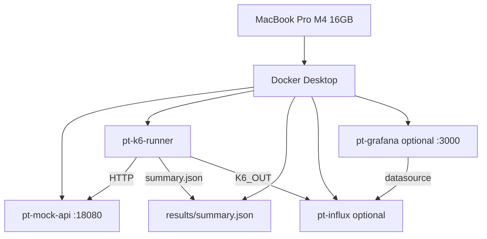
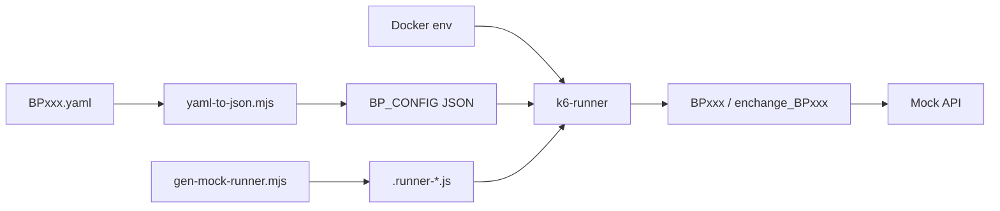
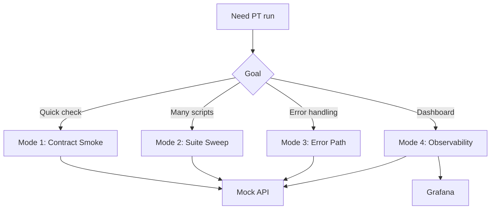
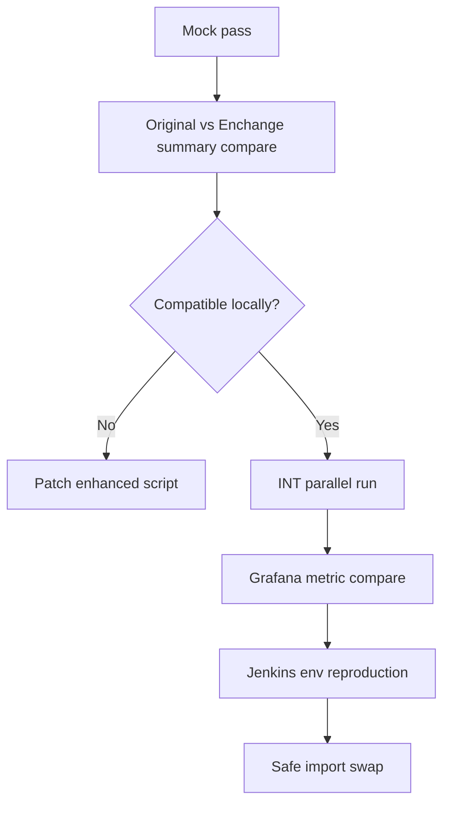
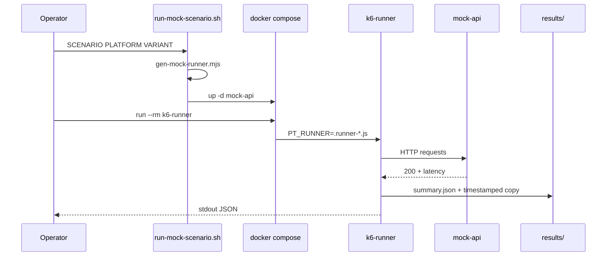
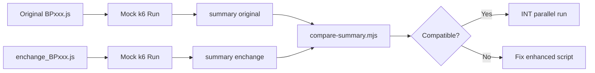
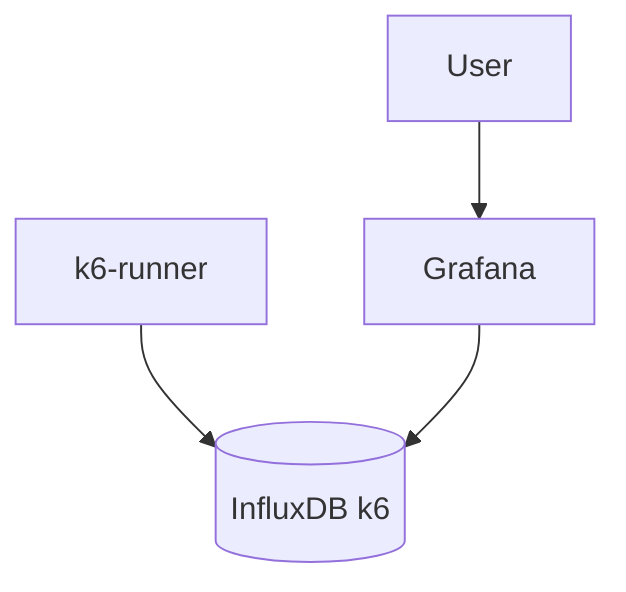

# READMOCKDOCK.md

Operator guide: jalankan simulasi k6 PT ke **Docker mock API lokal** — aman untuk MacBook Pro M4 16GB.

> **RTK:** Semua command di bawah memakai prefix `rtk` sesuai `RTK.md`. Jika `rtk` diblok/hang di environment agent, gunakan command yang sama **tanpa** `rtk` (fallback — dicatat di Troubleshooting).

---

## Verdict

Local Docker mock PT lab memungkinkan smoke/sweep skenario k6 **tanpa** backend INT/DEV/QA.

- Validasi: shape script, config, metrics, threshold handling, original vs enchange diff.
- **Bukan** bukti kapasitas produksi atau kebenaran bisnis API.

**Status validasi (2026-05-18):**

| Check | Result |
|-------|--------|
| `docker compose config` | OK |
| `curl http://localhost:18080/health` | `{"ok":true}` |
| BP001 `Growin_PT_Dev[ToDo]` Web original 30s | 72 iter, 144 http_reqs, p95≈87ms |
| BP001 `Growin_Calendar` Web original 15s | 36 iter, mock OK |
| Jenkins `run-k6-mock.sh` BP001 30s | exit 0, summary di `results/jenkins/` |
| Jenkins job preload | `local-k6-mock-pipeline` via init Groovy |
| k6 → Influx from Jenkins | `http_reqs` count > 0 |
| Grafana datasource | `k6-influxdb` uid OK |
| Grafana dashboard | `Local k6 PT Dashboard` uid `k6-local-pt` |
| Jenkins UI `:18081` | job exists; build API 403 until unlock |

---

## What This Is

- Local mock environment (`pt-mock-api` → host `:18080`)
- k6 runner container (`pt-k6-runner`)
- Optional InfluxDB + Grafana (`--profile observability`)
- Optional Jenkins CI (`--profile ci` → `:18081`)
- Helper scripts: scenario run, suite sweep, list, compare
- Generated static-import runner per skenario (`gen-mock-runner.mjs`)

## What This Is Not

- Bukan production load test
- Bukan INT parity proof
- Bukan validasi business API / response body correctness
- Bukan security test
- Bukan benchmark backend nyata

---

## Architecture

### Docker Mock Architecture



### Config Flow



### Run Mode Decision



### Promotion Gate



---

## Execution Flow



## Original vs Enchange Flow



## Grafana Flow



---

## Scenario Modes

| Mode | USER | DURATION | MOCK_LATENCY_MS | MOCK_ERROR_RATE | Purpose |
|------|-----:|----------|----------------:|----------------:|---------|
| 1 Contract smoke | 1 | 30s | 80 | 0 | Validasi manual satu skenario |
| 2 Suite sweep | 1 | 10s | 50 | 0 | Smoke banyak skenario (syntax/config/metrics) |
| 3 Error path | 2 | 30s | 300 | 0.1 | error_rate, threshold, logging |
| 4 Observability | 1 | 30s | 80 | 0 | Grafana + Influx (`K6_OUT`) |

Hard caps sweep: `USER≤2`, `DURATION≤15s` per skenario (default sweep: USER=1, 10s).

---

## Suite / Scenario Matrix

Discover: `rtk node docker-local-pt/scripts/list-scenarios.mjs`

**172 runnable rows** (kombinasi suite × platform × variant) — `mockReady=yes` jika file script ada.

| Suite | Runner | Config Dir | Platform | Scenario rows | Enchange rows | Mock-ready |
|-------|--------|------------|----------|--------------:|--------------:|------------|
| Growin_2FA | k6-mock / gen | - | Web, Android | 9 | 9 | yes |
| Growin_AI_Summarizer | gen | - | Web | 37 | 37 | yes |
| Growin_Auth_AdminPermission_Create | gen | - | Web, iOS, Android | 2 | 2 | yes |
| Growin_Banner_Promo | gen | - | Web, iOS | 4 | 4 | yes |
| Growin_Calendar | gen | - | Web, iOS, Android | 10 | 10 | yes |
| Growin_Community | gen | - | Web, iOS, Android | 45 | 45 | yes |
| Growin_Daily_Trade | gen | - | Web, iOS, Android | 2 | 2 | yes |
| Growin_Data_Visualization | gen | - | Web, iOS, Android | 2 | 2 | yes |
| Growin_Eipo_Stock | gen | - | Web, iOS, Android | 27 | 27 | yes |
| Growin_News | gen | - | Web, iOS, Android | 2 | 2 | yes |
| Growin_OMO | gen | - | Web, iOS, Android | 2 | 2 | yes |
| Growin_PT_Dev[ToDo] | gen | Configs | Web | 2 | 2 | yes (+ YAML) |
| Growin_Password_Expired | gen | - | iOS, Android | 8 | 8 | yes |
| Growin_UUPDP | gen | - | Web, iOS, Android | 10 | 10 | yes |
| Optimize_Trading_Personal_Profile | gen | - | Web, iOS, Android | 10 | 10 | yes |

Suite tanpa skenario BP di tree (Rewards, Template_Project, Wabadima): tidak masuk sweep.

---

## Command Catalog

### A. Start mock API

```bash
rtk docker compose -f docker-local-pt/docker-compose.yml up -d mock-api
rtk curl http://localhost:18080/health
```

### B. Render BP YAML → JSON

```bash
rtk node docker-local-pt/scripts/yaml-to-json.mjs "Script/Growin_PT_Dev[ToDo]/Configs/BP001.yaml" > docker-local-pt/results/BP001.json
```

### C. Default local smoke (PT_Dev BP001)

```bash
rtk node docker-local-pt/scripts/yaml-to-json.mjs "Script/Growin_PT_Dev[ToDo]/Configs/BP001.yaml" > docker-local-pt/results/BP001.json
rtk docker compose -f docker-local-pt/docker-compose.yml run --rm k6-runner
```

Pastikan `docker-local-pt/configs/local.env` ada (copy dari `local.env.example`). Untuk smoke tanpa Influx, kosongkan `K6_OUT` di `local.env`.

### D. Run selected scenario (compose langsung)

```bash
rtk docker compose -f docker-local-pt/docker-compose.yml run --rm \
  -e PT_RUNNER=docker-local-pt/results/.runner-Growin_Calendar_BP001_Web_original.js \
  -e SUITE=Growin_Calendar \
  -e SCENARIO=BP001 \
  -e PLATFORM=Web \
  -e VARIANT=original \
  -e USER=1 \
  -e DURATION=30s \
  -e MOCK_LATENCY_MS=80 \
  -e MOCK_ERROR_RATE=0 \
  -e BASE_URL=http://mock-api:8080 \
  k6-runner
```

Generate runner dulu:

```bash
rtk node docker-local-pt/scripts/gen-mock-runner.mjs \
  --suite Growin_Calendar --scenario BP001 --platform Web --variant original \
  --has-config false --out docker-local-pt/results/.runner-Growin_Calendar_BP001_Web_original.js
```

### E. Stability mode

```bash
rtk docker compose -f docker-local-pt/docker-compose.yml run --rm \
  -e SCENARIO=BP001 \
  -e PLATFORM=Web \
  -e USER=5 \
  -e DURATION=1m \
  -e MOCK_LATENCY_MS=120 \
  -e MOCK_ERROR_RATE=0 \
  k6-runner
```

### F. Error-path mode

```bash
rtk docker compose -f docker-local-pt/docker-compose.yml run --rm \
  -e SCENARIO=BP001 \
  -e PLATFORM=Web \
  -e USER=2 \
  -e DURATION=30s \
  -e MOCK_LATENCY_MS=300 \
  -e MOCK_ERROR_RATE=0.1 \
  k6-runner
```

Set error di mock container:

```bash
MOCK_LATENCY_MS=300 MOCK_ERROR_RATE=0.1 rtk docker compose -f docker-local-pt/docker-compose.yml up -d --force-recreate mock-api
```

### G. Grafana / Influx

```bash
rtk docker compose -f docker-local-pt/docker-compose.yml --profile observability up -d mock-api influxdb grafana

rtk docker compose -f docker-local-pt/docker-compose.yml --profile observability run --rm \
  -e K6_OUT=influxdb=http://influxdb:8086/k6 \
  -e SCENARIO=BP001 \
  -e PLATFORM=Web \
  -e USER=1 \
  -e DURATION=30s \
  k6-runner
```

Buka: http://localhost:3000 — `admin` / `admin`

### H. Query Influx

```bash
rtk docker exec pt-influx influx -database k6 -execute 'SHOW MEASUREMENTS'
rtk docker exec pt-influx influx -database k6 -execute 'SELECT count(value) FROM http_reqs'
```

### I. Helper — single scenario (disarankan)

```bash
rtk bash docker-local-pt/scripts/run-mock-scenario.sh BP001 Web original
rtk bash docker-local-pt/scripts/run-mock-scenario.sh BP001 Web enchange
SUITE=Growin_Calendar rtk bash docker-local-pt/scripts/run-mock-scenario.sh BP001 Web original
```

Env opsional: `USER`, `DURATION`, `MOCK_LATENCY_MS`, `MOCK_ERROR_RATE`, `K6_OUT`, `SUITE`, `VARIANT`.

### J. Compare original vs enchange

```bash
rtk node docker-local-pt/scripts/compare-summary.mjs \
  docker-local-pt/results/Growin_Calendar_BP001_Web_original_20260518_090950.json \
  docker-local-pt/results/Growin_Calendar_BP001_Web_enchange_20260518_091200.json
```

### K. Suite sweep

```bash
# semua suite (172 rows × ~10s ≈ lama — gunakan filter)
rtk bash docker-local-pt/scripts/run-mock-suite.sh

# satu suite + platform
rtk bash docker-local-pt/scripts/run-mock-suite.sh Growin_Calendar Web

# batasi jumlah
MAX_SCENARIOS=5 USER=1 DURATION=10s rtk bash docker-local-pt/scripts/run-mock-suite.sh Growin_2FA Web
```

Laporan: `docker-local-pt/results/mock-suite-report.md` + `.json`

### L. List scenarios

```bash
rtk node docker-local-pt/scripts/list-scenarios.mjs
rtk node docker-local-pt/scripts/list-scenarios.mjs --json
rtk node docker-local-pt/scripts/list-scenarios.mjs --suite Growin_Calendar
```

### M. Cleanup

```bash
rtk docker compose -f docker-local-pt/docker-compose.yml down
rtk docker compose -f docker-local-pt/docker-compose.yml --profile observability down
rtk docker compose -f docker-local-pt/docker-compose.yml --profile observability down -v
```

---

## Result Files

| File | Purpose |
|------|---------|
| `docker-local-pt/results/summary.json` | Output terakhir k6 |
| `docker-local-pt/results/{suite}_{scenario}_{platform}_{variant}_{ts}.json` | Copy timestamped per run helper |
| `docker-local-pt/results/.runner-*.js` | Generated k6 entry (static import) |
| `docker-local-pt/results/BP001.json` | BP_CONFIG dari YAML |
| `docker-local-pt/results/mock-suite-report.md` | Sweep human report |
| `docker-local-pt/results/mock-suite-report.json` | Sweep machine report |

---

## Safe Limits (MacBook Pro M4 16GB)

| Mode | USER | DURATION | Safe? |
|------|-----:|----------|-------|
| Contract smoke | 1 | 30s | yes |
| Suite sweep | 1 | 10s per script | yes |
| Stability | 5 | 1m | yes |
| Error path | 2 | 30s | yes |
| Heavy local | 10 | 2m | max recommended |
| Above 10 VU | >10 | >2m | avoid unless plugged in + monitored |

Docker Desktop: alokasi **6–8 GB RAM**, **4–6 CPU**. Jangan alokasi full 16 GB.

> Mock mode proves script mechanics, not production capacity.

**Sweep warning:** 172 skenario × 10s ≈ 30+ menit CPU. Pakai `MAX_SCENARIOS` atau filter suite/platform. **Jangan** naikkan USER massal untuk full sweep.

---

## Troubleshooting

| Symptom | Cause | Fix |
|---------|-------|-----|
| `await is a reserved word` di k6 | dynamic `import()` tidak didukung k6 0.51 | Pakai `gen-mock-runner.mjs` / `run-mock-scenario.sh` |
| `BP_CONFIG must be valid JSON` | YAML belum di-render | Command B |
| `script not found` | SUITE/PLATFORM/VARIANT salah | `list-scenarios.mjs` |
| k6 cannot reach influx | observability profile off / K6_OUT set | `K6_OUT=` atau `up observability` |
| mock health fail | container down | Command A |
| threshold fail Mode 3 | MOCK_ERROR_RATE tinggi | expected — cek metrics error_rate |
| path `[ToDo]` | bracket di path | quote path di shell |
| RTK shell blocked | agent policy | jalankan tanpa `rtk` — sama persis |
| Jenkins 403 | belum setup wizard | buka `:18081`, unlock dengan initial password |
| `cp: same file` di Jenkins | `/results` = bind mount sama | fixed di `run-k6-mock.sh` |

---

## Stage Alignment Check

| Stage | Docker/k6 | Jenkins | Grafana | Status |
|-------|-----------|---------|---------|--------|
| Workspace / env check | `run-local.sh` echo | Workspace | — | OK |
| Tool validation | k6 in image | Validate Tools | — | OK |
| Audit enhanced | optional host | Audit | — | OK |
| Scenario discovery | `list-scenarios.mjs` | **missing** | — | gap (CLI only) |
| YAML → BP_CONFIG | `yaml-to-json.mjs` | Render BP Config | — | OK |
| Mock health | compose healthcheck | Mock API Healthcheck | — | OK |
| Influx health | — | Influx Healthcheck (if Grafana out) | datasource ping | OK |
| k6 mock run | `run-mock-scenario.sh` | Run k6 Mock | — | OK |
| Summary artifact | `handleSummary` | Publish Summary | — | OK |
| Influx metrics | `K6_OUT` | Check Influx | panels query | OK |
| Grafana visibility | manual | URL in Publish | dashboard uid `k6-local-pt` | partial |
| Archive results | `results/` mount | post archiveArtifacts | — | OK |
| Promotion gate | READMOCKDOCK doc | **missing** | INT compare | doc only |

## Script Coverage (Docker mock)

| Metric | Count |
|--------|------:|
| Original `BP*.js` files | ~152 |
| `enchange_BP*.js` files | ~86 |
| Runnable rows (`list-scenarios.mjs`) | **172** |
| Suites with BP scenarios | **15** |
| YAML configs | **1** (Growin_PT_Dev[ToDo] only) |
| Main `Growin_*.js` runners | ~25 — **not** used by Docker mock path |

**Docker mock runs:** per-scenario `BPxxx` / `enchange_BPxxx` via `SUITE` + `SCENARIO` + `PLATFORM` + `VARIANT` (`gen-mock-runner.mjs`).

**Not covered by mock lab:** multi-BP `Growin_*.js` orchestrators, LoadTest-only scripts, shell helpers, suites without `BP*.js` under Web/iOS/Android.

## Env Rules

Use `K6_USERS` or `USER_COUNT` for VU count.

Resolution: `K6_USERS` → `USER_COUNT` → numeric `USER` → `1`

```bash
K6_USERS=1 DURATION=30s bash docker-local-pt/scripts/run-mock-scenario.sh BP001 Web original
```

Bad (host shell leaks username → NaN):

```bash
USER=maul bash docker-local-pt/scripts/run-mock-scenario.sh ...
```

## k6 JS Compatibility

Local k6 0.51 may reject `?.` and `??` in scenario scripts.

```bash
node docker-local-pt/scripts/check-k6-js-compat.mjs
node docker-local-pt/scripts/check-k6-js-compat.mjs --suite Growin_2FA
```

Default local mock: `ENV=LOCAL`. `K6_OUT` only when `USE_GRAFANA_OUTPUT=true`.

## Promotion Rule

Mock pass **tidak cukup**. Urutan:

1. Mock original vs enchange (`compare-summary.mjs`)
2. INT parallel run (low VU, creds di luar repo)
3. Grafana metric compare
4. Jenkins env reproduction (`RUNBY`, `ENV`, `SCENARIO`, `PLATFORM`, `BP_CONFIG`)

---

## Jenkins Env Contract (preserved)

| Var | Mock default |
|-----|----------------|
| `RUNBY` | LocalDocker |
| `ENV` | INT (mock ignores real host via `BASE_URL`) |
| `SCENARIO` | BP001 |
| `PLATFORM` | Web |
| `USER` / `DURATION` | capped locally |
| `BP_CONFIG` / `BP_CONFIG_FILE` | YAML suites |
| `NUMSTART` | 1 |
| `DEBUG` | true (local.env) |

---

## Jenkins CI (profile `ci`)

```bash
docker compose -f docker-local-pt/docker-compose.yml --profile ci up -d mock-api jenkins
docker exec pt-jenkins cat /var/jenkins_home/secrets/initialAdminPassword
# http://localhost:18081 — pipeline: docker-local-pt/jenkins/pipelines/Jenkinsfile.local-k6-mock
docker exec pt-jenkins bash /workspace/docker-local-pt/jenkins/scripts/run-k6-mock.sh
```

```mermaid
flowchart TD
  User[User] --> Jenkins[Jenkins :18081]
  Jenkins --> Workspace[/workspace]
  Jenkins --> Audit[audit-enhanced-contracts.mjs]
  Jenkins --> K6[k6]
  K6 --> Mock[mock-api:8080]
  K6 --> Results[results/jenkins]
```

**Job auto-created:** `local-k6-mock-pipeline` (init Groovy on fresh `pt-jenkins-home`).

Full stack + Grafana sync:

```bash
docker compose -f docker-local-pt/docker-compose.yml --profile ci --profile observability up -d mock-api influxdb grafana jenkins
docker logs pt-jenkins 2>&1 | grep local-k6-mock-pipeline
docker exec pt-jenkins bash -c 'USE_GRAFANA_OUTPUT=true bash /workspace/docker-local-pt/jenkins/scripts/run-k6-mock.sh'
```

Grafana: http://localhost:3000/d/k6-local-pt/local-k6-pt-dashboard (Last 15m)

Lihat `docker-local-pt/jenkins/README.md`.

---

## Layout Reference

```
docker-local-pt/
  docker-compose.yml
  jenkins/
  mock-api/
  configs/local.env.example
  scripts/
    run-local.sh
    k6-local-runner.js      # legacy BP001 PT_Dev
    k6-mock-runner.js         # default entry PT_Dev
    gen-mock-runner.mjs       # static runner generator
    run-mock-scenario.sh
    run-mock-suite.sh
    list-scenarios.mjs
    compare-summary.mjs
    yaml-to-json.mjs
  results/
```

---

## Quick Validation Checklist

```bash
rtk test -f READMOCKDOCK.md && echo "READMOCKDOCK exists"
rtk docker compose -f docker-local-pt/docker-compose.yml config -q
rtk curl -sf http://localhost:18080/health
K6_OUT= USER=1 DURATION=30s rtk bash docker-local-pt/scripts/run-mock-scenario.sh BP001 Web original
```

---

`READMOCKDOCK.md` siap sebagai operator guide untuk simulasi k6 PT ke Docker mock lokal.
