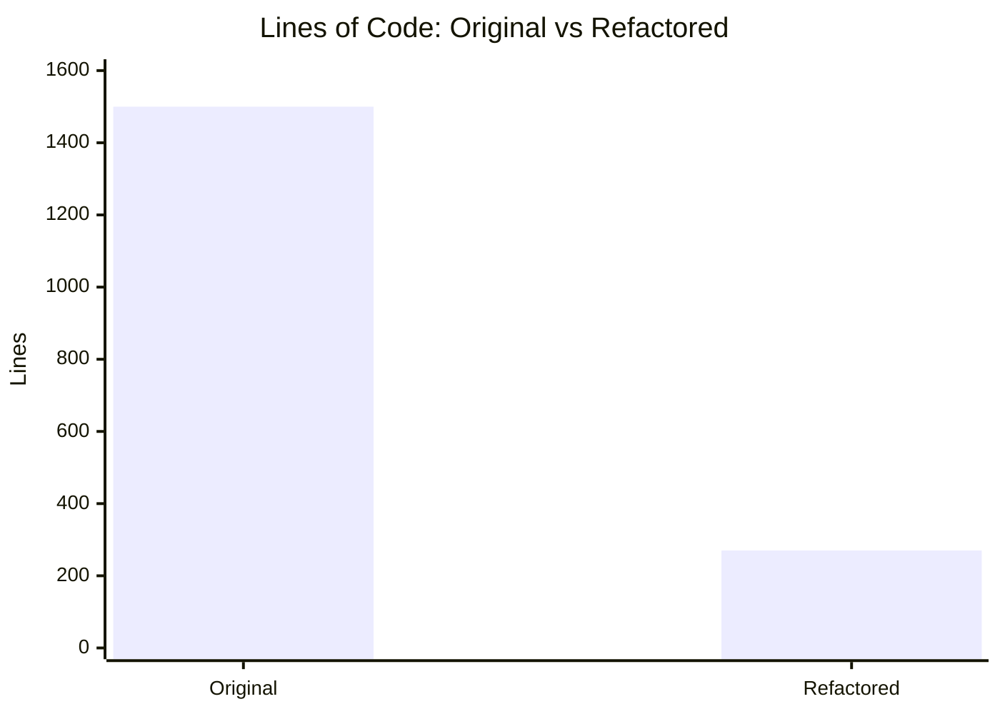
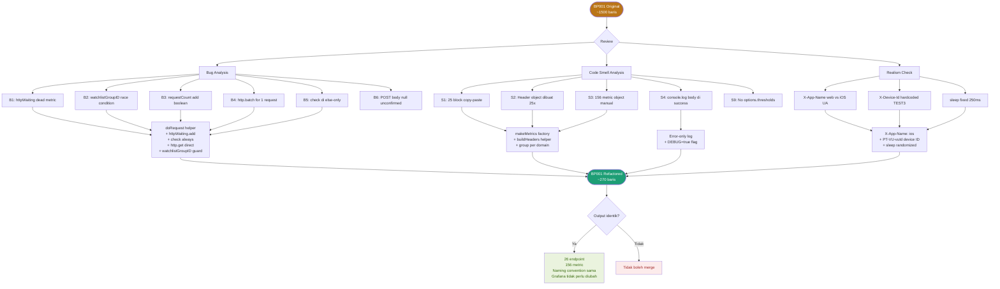
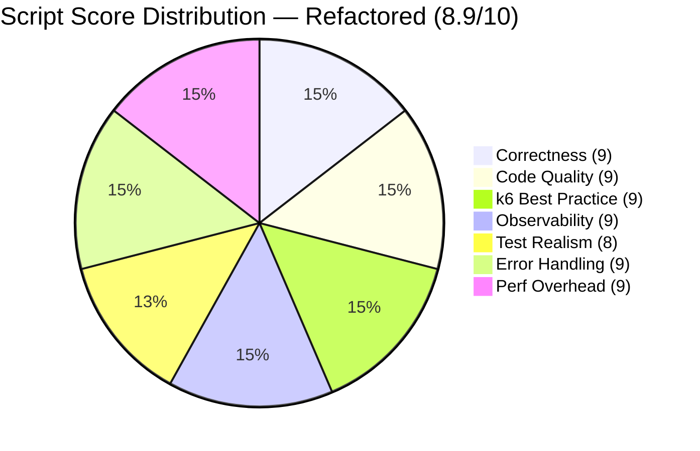

# BP001 Home Screen — Performance Test Script Review


| Field        | Value                                   |
| ------------ | --------------------------------------- |
| **Script**   | `BP001_home_refactored.js`              |
| **Suite**    | Growin by Mandiri — k6 Performance Test |
| **Flow**     | Home Screen Initial Load (iOS)          |
| **Env**      | PT (Performance Test)                   |
| **Reviewer** | QA Mandiri Sekuritas                    |
| **Date**     | 2026-05-12                              |


---

## Context — PT Environment

> Script ini dijalankan di **PT environment**, bukan deployment. Tujuan 26 endpoint + 156 metric memang by design — menggambarkan seluruh request yang difiring oleh app saat home screen load. Tidak ada endpoint yang dihapus atau dikurangi dalam proses review ini.

Yang di-flag bukan "ini salah untuk PT", tapi dua kategori berbeda:

**Bug yang affect hasil test** (data yang dikumpulkan tidak akurat):

- `httpWaiting` dead → data hilang di Grafana
- `check()` di else-only → pass rate selalu 100% padahal ada error
- `requestCount.add(false)` → counter tidak naik saat error, data misleading

**Code efficiency yang output-nya identik** (behavior sama, cara tulis lebih ringkas):

- `makeMetrics()` factory → metric output sama persis, cuma cara nulisnya lebih singkat
- `doRequest()` helper → behavior sama, tapi kalau ada logic change cukup edit 1 tempat
- `http.batch([1 req])` → hasilnya sama, tapi tanpa overhead setup parallelism

Yang di-refactor **tidak mengubah** apa yang ditest, berapa endpoint, atau metric apa yang di-collect. Semua 26 endpoint tetap jalan, 156 metric tetap ada, naming convention tetap sama. Output ke Grafana/InfluxDB identik. Yang berubah hanya cara kodenya ditulis + bug fix supaya data yang dikumpulkan akurat.

---

## Scoring Summary


| #   | Aspek                | Original     | Refactored   | Delta    |
| --- | -------------------- | ------------ | ------------ | -------- |
| 1   | Correctness          | 7 / 10       | 9 / 10       | **+2**   |
| 2   | Code Quality         | 4 / 10       | 9 / 10       | **+5**   |
| 3   | k6 Best Practice     | 5 / 10       | 9 / 10       | **+4**   |
| 4   | Observability        | 8 / 10       | 9 / 10       | **+1**   |
| 5   | Test Realism (PT)    | 6 / 10       | 8 / 10       | **+2**   |
| 6   | Error Handling       | 6 / 10       | 9 / 10       | **+3**   |
| 7   | Performance Overhead | 5 / 10       | 9 / 10       | **+4**   |
|     | **TOTAL**            | **6.0 / 10** | **8.9 / 10** | **+2.9** |


### Score Comparison Chart

```mermaid
xychart-beta
    title "Scoring: Original vs Refactored (out of 10)"
    x-axis ["Correctness", "Code Quality", "k6 Practice", "Observability", "Realism", "Error Handling", "Perf Overhead"]
    y-axis "Score" 0 --> 10
    bar [7, 4, 5, 8, 6, 6, 5]
    bar [9, 9, 9, 9, 8, 9, 9]
```




### Lines of Code Reduction




> ⚠️ **-82% LOC**, endpoint coverage tetap **26/26**, metric objects tetap **156**.

---

## Refactor Workflow




---

## Original Script — Analysis

### Pros

1. **Metric granular per endpoint** — Setiap endpoint punya Counter + Rate + Trend sendiri, query di Grafana langsung bisa filter per endpoint tanpa regex.
2. **Naming convention `001_01_XX_Name` sortable** — Prefix numerik bikin metric urut di dashboard. Grafana variable `$endpoint` auto-sort benar.
3. **VU mapping pattern** — User isolation per VU, satu user tidak bocor ke VU lain. Bagus untuk test data integrity di financial app.
4. **Guard `if (token)` per block** — Prevent NPE kalau token gagal di-setup di luar fungsi. Safety net yang benar.
5. **Conditional log per ENV** — `if (__ENV.ENV != 'INT')` reduce console noise saat INT load tinggi. Tepat.
6. **Dynamic data extraction (watchlistGroupID)** — Extract ID dari response Batch 6 → inject ke Batch 7. Realistic, menggambarkan real app behavior.
7. **Metric coverage lengkap** — 26 endpoint terdefinisi, naming konsisten, tidak ada endpoint yang di-skip dari metric.

---

### Cons & Bugs

#### Bug (Harus Diperbaiki)

**B1 — `httpWaiting` dead metric**

Trend `waiting_XXX` dibuat tapi `.add()` tidak pernah dipanggil. Metric kosong semua di Grafana.

```js
// Original — missing add
metric.httpWaiting = new Trend(...)  // defined but never .add()-ed

// Fix
metric.httpWaiting.add(res.timings.waiting);
```

**B2 — Watchlist race / null injection**

Kalau Batch 6 gagal atau response `data[]` kosong, `watchlistGroupID` = `undefined`. Batch 7 langsung hit `/user/api/v1/watchlist/undefined` — HTTP hit endpoint salah, metric recorded tapi data tidak valid.

```js
// Original — no guard
const urls = [base_url + `/user/api/v1/watchlist/${watchlistGroupID}`];  // undefined if failed
```

**B3 — `requestRate` Counter + `.add(true/false)`**

`Counter` expect number. `.add(true)` = add(1), `.add(false)` = add(0). Metric name-nya `rps_` tapi semantiknya salah — bukan rate, bukan counter yang akurat.

```js
// Original — semantic bug
metric.requestRate.add(true);    // ok branch  = 1
metric.requestRate.add(false);   // err branch = 0 (counter tidak naik di error)

// Fix — always 1, error count handle di errorCount
metric.requestCount.add(1);
```

**B4 — `http.batch()` untuk 1 request (Batch 2–25)**

`http.batch()` punya overhead setup parallelism. Kalau isinya cuma 1 request, sama aja `http.get()` tapi lebih lambat.

```js
// Original — useless batch
const responses = http.batch([['GET', url, null, { headers }]]);

// Fix — direct call
const res = http.get(url, { headers });
```

**B5 — `check()` hanya di `else` branch**

`check()` harusnya selalu jalan. Kalau hanya di error branch, k6 built-in `checks` metric tidak reflect real pass rate — always 100% di dashboard padahal ada failure.

```js
// Original
if (response.status === 200) {
    // no check here
} else {
    check(response, { ... })  // only fires on error
}

// Fix — always check
check(res, { [`${name} -> 200`]: (r) => r.status === 200 });
```

**B6 — Batch 22 POST body `null`**

`/bond/api/v1/sbn/client/check/status` di-POST dengan body `null`. Kalau endpoint butuh body, auto 400. Perlu konfirmasi API contract — kalau memang tidak butuh body, tambahkan comment eksplisit.

---

#### Code Smell (Maintenance Risk)


| ID  | Deskripsi                                    | Risiko                                              |
| --- | -------------------------------------------- | --------------------------------------------------- |
| S1  | Duplikasi 25 block `if(token) {...}` identik | Bug magnet — 1 logic change = 25 edit               |
| S2  | Header object dibuat ulang 25x               | Inconsistency risk kalau ada perubahan header       |
| S3  | 156 custom metric object manual              | Bisa diganti factory function, output identik       |
| S4  | `console.log(response.body)` di success path | Berat I/O saat ratusan VU, body >10KB per req       |
| S5  | `News_Categories` dipanggil 2x identik       | Perlu comment eksplisit kalau memang intentional    |
| S6  | `X-App-Name: 'web'` + User-Agent iOS         | Inkonsisten, server bisa routing berbeda            |
| S7  | `X-Device-Id: 'TEST3'` hardcoded             | Semua VU = 1 device, anti-bot bisa trigger          |
| S8  | `sleep(0.25)` fixed                          | Artificial burst pattern, tidak realistic           |
| S9  | Tidak ada `options.thresholds`               | PT tanpa SLO = tidak ada verdict pass/fail otomatis |


---

## Refactored Script — Improvements

### Perubahan Utama


| #   | Perubahan                           | Kategori | Alasan                                                                    |
| --- | ----------------------------------- | -------- | ------------------------------------------------------------------------- |
| 1   | `makeMetrics()` factory function    | refactor | Eliminasi 150-line metric definition → ~30 baris                          |
| 2   | `doRequest()` helper                | refactor | Eliminasi 25 identical block → single reusable function                   |
| 3   | `buildHeaders()` helper             | refactor | 2 variasi header (standard/PIN), tidak duplikat 25x                       |
| 4   | `http.batch()` hanya di Batch 1     | fix      | Batch 1 memang 2 request parallel — sisanya `http.get/post` langsung      |
| 5   | `httpWaiting.add()` diperbaiki      | fix      | Dead metric sekarang populated                                            |
| 6   | `check()` selalu jalan              | fix      | k6 `checks` metric akurat                                                 |
| 7   | `requestCount.add(1)` always        | fix      | Counter semantik benar — always +1 per request                            |
| 8   | Guard `watchlistGroupID`            | fix      | Skip + log + error metric kalau ID tidak tersedia                         |
| 9   | `group()` per domain                | improve  | Output k6 terstruktur, mudah identify bottleneck per group                |
| 10  | `X-App-Name: 'ios'`                 | fix      | Konsisten dengan User-Agent iOS                                           |
| 11  | `X-Device-Id: PT-VU-${vuId}`        | improve  | Unique per VU, avoid anti-bot / cache collision                           |
| 12  | `sleep(random * 0.4 + 0.1)`         | improve  | Randomized think time, lebih realistic                                    |
| 13  | Log error-only by default           | improve  | Success log hanya di `DEBUG=true` env var                                 |
| 14  | Comment intentional duplicate calls | improve  | `News_Categories_2` dan `Mutualfund_User_RiskProfile_2` diberi keterangan |


### Yang Tetap Sama (Tidak Berubah)

```
✅ Semua 26 endpoint tetap ditest, tidak ada yang dihapus
✅ 156 metric objects tetap ada (Counter + Rate + Trend × 26)
✅ Naming convention 001_01_XX_Name identik — Grafana tidak perlu diubah
✅ VU mapping pattern, token guard, portfolio PIN header
✅ Dynamic watchlist ID extraction (Batch 6 → Batch 7)
✅ Duplicate calls (News_Categories ×2, RiskProfile ×2) tetap ada dengan comment
```

---

### Recommended `options` Config

```js
export const options = {
    scenarios: {
        home_screen: {
            executor: 'ramping-vus',
            startVUs: 0,
            stages: [
                { duration: '2m', target: 50  },   // ramp up
                { duration: '5m', target: 50  },   // steady state
                { duration: '2m', target: 100 },   // peak
                { duration: '5m', target: 100 },   // peak hold
                { duration: '2m', target: 0   },   // ramp down
            ],
        },
    },
    thresholds: {
        // Global
        'http_req_failed':   ['rate<0.01'],
        'http_req_duration': ['p(95)<3000', 'p(99)<5000'],

        // Critical endpoints — per tag
        'duration{endpoint:User_Profile_Trading}':             ['p(95)<1500'],
        'duration{endpoint:Protected_Portfolio_Consolidated}': ['p(95)<3000'],
        'duration{endpoint:User_Watchlistgroup}':              ['p(95)<2000'],
        'duration{endpoint:News}':                             ['p(95)<2000'],

        // Error rate per endpoint
        'error_rate_001_01_06_Protected_Portfolio_Consolidated': ['rate<0.005'],
        'error_rate_001_01_01_User_Profile_Trading':             ['rate<0.005'],
    },
};
```

---

## Verdict




**Original: 6.0 / 10** — Jalan, metric lengkap, tapi ~1500 baris boilerplate dengan 6 bug aktif yang menyebabkan data di Grafana tidak akurat.

**Refactored: 8.9 / 10** — Bug fixed, maintainable, k6 best practice compliant. Minus 1.1 karena `options.thresholds` dan `scenarios` masih di runner terpisah (by design untuk multi-flow suite), dan Batch 22 POST body masih perlu konfirmasi API contract.

---

## Remaining Action Items


| #   | Item                                                                                   | Priority  | Owner      |
| --- | -------------------------------------------------------------------------------------- | --------- | ---------- |
| 1   | Konfirmasi Batch 22 POST body contract (`/bond/api/v1/sbn/client/check/status`)        | 🔴 HIGH   | Dev        |
| 2   | Konfirmasi `News_Categories` 2x call memang intended behavior dari iOS client          | 🟡 MEDIUM | Mobile Dev |
| 3   | Tambahkan `options.thresholds` + `scenarios` di runner/main file                       | 🔴 HIGH   | QA         |
| 4   | Verifikasi `data[0].id` structure di watchlistgroup response — bisa beda per user type | 🟡 MEDIUM | QA         |
| 5   | Pertimbangkan k6 Cloud / Grafana k6 untuk distributed run saat VU > 200                | 🟢 LOW    | Infra      |


