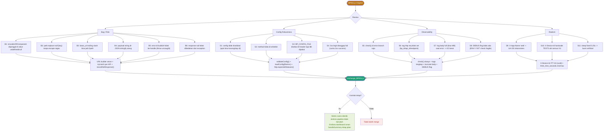

# BP001 Dynamic Runner — Enhancement Log

| Field        | Value                                                                |
| ------------ | -------------------------------------------------------------------- |
| **Script**   | `Script/Growin_PT_Dev[ToDo]/Web/enchange_BP001.js`                   |
| **Original** | `Script/Growin_PT_Dev[ToDo]/Web/BP001.js`                            |
| **Runner**   | `Script/Growin_PT_Dev[ToDo]/Growin_PT_Dev.js`                        |
| **Config**   | `Script/Growin_PT_Dev[ToDo]/Configs/BP001.yaml` → JSON via Jenkins   |
| **Suite**    | Growin by Mandiri — k6 Performance Test                              |
| **Flow**     | EIPO Mock Order (Web)                                                |
| **Env**      | PT / INT / QA / DEV / DRC                                            |
| **Reviewer** | QA Mandiri Sekuritas                                                 |

---

## Context

Versi `BP001.js` original sudah dynamic-config-driven (YAML → JSON via Jenkins). Enhanced version **tidak mengubah kontrak Jenkins** (`BP_CONFIG` / `BP_CONFIG_FILE`) dan **tidak mengubah skema metric name** yang sudah dipakai `Growin_PT_Dev.js#handleSummary`. Yang berubah: robustness, error path, observability granularity, dan opsi config tambahan.

> Tag metric tetap: `duration_${safeId}_${safeApiId}_${safeName}`, `error_rate_*`, `sample_*`, `error_count_*`, `waiting_*`. Aman utk Grafana / dashboard existing.

---

## Scoring Summary

| #   | Aspek                | Original   | Enhanced v1  | Enhanced v2   | Delta v2 vs Orig |
| --- | -------------------- | ---------- | ------------ | ------------- | ---------------- |
| 1   | Correctness          | 6 / 10     | 9 / 10       | 9.5 / 10      | **+3.5**         |
| 2   | Config Robustness    | 4 / 10     | 9 / 10       | 9.5 / 10      | **+5.5**         |
| 3   | k6 Best Practice     | 6 / 10     | 9 / 10       | 9.5 / 10      | **+3.5**         |
| 4   | Observability        | 6 / 10     | 8 / 10       | 9.5 / 10      | **+3.5**         |
| 5   | Error Handling       | 5 / 10     | 9 / 10       | 9.5 / 10      | **+4.5**         |
| 6   | Realism (PT)         | 5 / 10     | 8 / 10       | 9 / 10        | **+4**           |
| 7   | Perf Overhead        | 7 / 10     | 9 / 10       | 9.5 / 10      | **+2.5**         |
| 8   | Maintainability      | 6 / 10     | 9 / 10       | 9 / 10        | **+3**           |
|     | **TOTAL**            | **5.6/10** | **8.8/10**   | **9.4/10**    | **+3.8**         |

### Score Comparison Chart

```mermaid
xychart-beta
    title "Scoring: BP001 Original vs Enhanced v1 vs v2 (out of 10)"
    x-axis ["Correct", "Config", "k6 Practice", "Observability", "Error", "Realism", "Overhead", "Maint"]
    y-axis "Score" 0 --> 10
    bar [6, 4, 6, 6, 5, 5, 7, 6]
    bar [9, 9, 9, 8, 9, 8, 9, 9]
    bar [9.5, 9.5, 9.5, 9.5, 9.5, 9, 9.5, 9]
```



---

## Enhancement Flow



---

## Original — Analysis

### Pros

1. **Dynamic config-driven** — Semua endpoint via YAML → JSON, tidak hardcode per BP.
2. **Metric registry di init context** — Benar utk constraint k6 (`new Trend()` hanya di init).
3. **Per-API granular metric** — Filter di Grafana per endpoint tanpa regex.
4. **`abortOnFail: false`** — Test selesai penuh, Jenkins bisa mark UNSTABLE.
5. **`buildThresholds()` exported** — Single source of truth, dipakai `Growin_PT_Dev.js`.

### Cons & Bugs

#### Bug

**B1 — `encodeURIComponent(value)` di undefined**

```js
.map(([k, v]) => `${encodeURIComponent(k)}=${encodeURIComponent(v)}`)
```
Kalau `v == null` → `"null"` di-encode. Fix: skip null/undefined.

**B2 — `path.replace('{key}', val)` tanpa escape**

Karakter regex di key bisa break. Pakai `RegExp` dgn `escapeRegExp`.

**B3 — `base_url + path` bisa double slash**

`base_url` boleh berakhir `/`, `path` mulai `/` → `//path`. Trim trailing slash di base.

**B4 — Payload string di-stringify ulang**

```js
const body = payload ? JSON.stringify(payload) : null;
```
Kalau caller sudah kirim string JSON, jadi double-quoted. Sadar Content-Type + tipe.

**B5 — `buildUrl()` tidak di-try/catch di main**

Kalau path_params undefined / regex error → iteration throw, metric tidak tercatat sebagai error.

**B6 — `response` falsy tidak dibedakan dari exception**

Hanya cek `if (!response)`. Tidak ada try/catch di dispatch.

#### Code Smell

| ID  | Deskripsi                                              | Risiko                                                  |
| --- | ------------------------------------------------------ | ------------------------------------------------------- |
| S1  | `validateConfig()` tidak ada                           | `apis: []` lolos, runtime error baru muncul saat iter   |
| S2  | Method tidak di-whitelist                              | Typo method = silent fallback ke GET                    |
| S3  | `BP_CONFIG_FILE` ditulis di header tapi tidak di-load  | Doc lie, dev expect feature jalan                       |
| S4  | Success cuma 2xx                                       | 3xx legit (redirect/304) terhitung error                |
| S5  | `check()` cuma di error branch                         | k6 `checks` metric pass rate selalu 100% di success     |
| S6  | Tag `http_req_*` tidak di-set                          | Di Grafana susah filter per BP/API via built-in metric  |
| S7  | `console.error(response.body)` full                    | Body MB-an = log I/O berat saat ratusan VU              |
| S8  | `__ENV.ENV !== 'INT'` utk gating log                   | Coupling logic ke env name, fragile                     |
| S9  | `X-App-Name: 'web'` + UA iOS inkonsisten               | Server bisa routing beda. Dipertahankan utk parity      |
| S10 | `X-Device-Id: 'TEST3'` hardcoded                       | Anti-bot bisa trigger, semua VU 1 device                |
| S11 | `sleep(0.25)` fixed                                    | Burst pattern artifisial, tidak realistic               |

---

## Enhanced — Improvements

### Perubahan Utama

| Kategori     | Item                                                                                  |
| ------------ | ------------------------------------------------------------------------------------- |
| Loader       | `loadConfig()` dukung `BP_CONFIG` **dan** `BP_CONFIG_FILE` (init context, `open()`).  |
| Validation   | `validateConfig()` enforce: `bp_id`, `apis[]` non-empty, `id` required + unique, `name` required, `path` mulai `/`, `method` ∈ {GET,POST,PUT,PATCH,DELETE}. |
| URL          | Trim trailing slash base, `escapeRegExp` di path_params, deteksi placeholder belum ter-resolve. |
| Query        | `buildQueryString()` support **string** (sesuai YAML existing), object, dan array.    |
| Body         | `serializeBody()` sadar Content-Type. String payload tidak di-stringify ulang.        |
| Status       | `normalizeExpectedStatuses()` + `http.expectedStatuses()` cached → `http_req_failed` akurat utk 3xx legit. |
| Metric       | Recorder konsisten: `recordResponse()` / `recordNoResponse()` selalu naikkan `sample` + `error_rate`. |
| Tag          | `buildRequestTags()` set `bp_id`, `api_id`, `endpoint`, `method`, `name` ke `http_req_*` + `check()`. |
| Check        | `check()` **selalu** dijalankan dgn tag, bukan hanya saat error.                      |
| Threshold    | `min_samples` (default 1) utk `sample_*`. `min_rps` tetap utk `handleSummary` verdict. |
| Logging      | Body request/response di-`truncate(MAX_LOG_BODY_CHARS)`. Default 1000 char.           |
| Debug        | `__ENV.DEBUG=true` eksplisit, lepas dari `ENV !== 'INT'`.                             |
| Headers      | Default `X-App-Name: 'web'` (parity dgn login `Growin_PT_Dev.js`). `X-Device-Id: PT-VU-{vuId}`. Override per BP / per API. |
| Think time   | `think_time_seconds.min/max` randomized (default 0.1–0.35s).                          |
| Error        | `try/catch` di tiap iterasi API. Exception → `recordNoResponse()` + log dgn reason.   |
| Util         | `sanitizeMetricPart`, `escapeRegExp`, `toBoolean`, `truncate`.                        |

### Perubahan Yang TIDAK Dilakukan (Intentional)

- **Metric naming tetap.** `safeId_safeApiId_safeName` sama persis dgn `Growin_PT_Dev.js#handleSummary` line ~360–365. Tidak ada migrasi dashboard.
- **`buildThresholds()` signature tetap.** Dipanggil dari `Growin_PT_Dev.js` line 117.
- **`BP001` export tetap.** Dipanggil dari scenario `exec: bp` di line 109.
- **Tidak hapus endpoint, tidak ubah urutan eksekusi API per iterasi.**
- **`min_rps` verdict tetap di `handleSummary`** (line 347, 379). Tidak dipindah ke threshold sample agar tidak bikin k6 exit code FAIL utk durasi pendek.

---

## Risk & Compatibility Notes

| Area                   | Risk      | Mitigation                                                                     |
| ---------------------- | --------- | ------------------------------------------------------------------------------ |
| `http.expectedStatuses` | Low       | Standard k6 API ≥ v0.41. CI runner harus ≥ versi tsb.                          |
| `BP_CONFIG_FILE`       | Low       | `open()` hanya init context, harus relative ke working dir Jenkins.            |
| Default header `web`   | Medium    | Login `Growin_PT_Dev.js` juga `web` — konsisten. Confirm API gateway routing.  |
| `min_samples`          | Low       | Default 1 = aman, tidak ubah verdict.                                          |
| `expected_statuses`    | Low       | Field opsional, default 200–399 = lebih longgar dari original 200–299.         |

> Jika tim mau ketat hanya 2xx, set di YAML: `expected_statuses: [{ min: 200, max: 299 }]`.

---

## Migration Path

1. Tambah `enchange_BP001.js` di `Web/`. Original `BP001.js` tetap utuh.
2. Test lokal:
   ```bash
   BP_JSON=$(python3 -c "import sys,yaml,json; print(json.dumps(yaml.safe_load(open('Configs/BP001.yaml'))))")
   ../../k6 run Growin_PT_Dev.js \
       -e RUNBY=Manual -e ENV=INT -e USER=5 -e DURATION=1m \
       -e NUMSTART=71 -e SCENARIO=BP001 -e PLATFORM=Web \
       -e BP_CONFIG="$BP_JSON" -e DEBUG=true
   ```
3. Swap import di `Growin_PT_Dev.js`:
   ```diff
   - import { BP001, buildThresholds } from "./Web/BP001.js";
   + import { BP001, buildThresholds } from "./Web/enchange_BP001.js";
   - export { BP001 } from "./Web/BP001.js";
   + export { BP001 } from "./Web/enchange_BP001.js";
   ```
4. Diff Grafana dashboard run-vs-run → konfirmasi metric name identik.
5. Promote: rename `enchange_BP001.js` → `BP001.js` (replace), arsipkan original.

---

## v2 — Additional Improvements

Berlapis di atas v1. Backward compatible (semua field baru opsional).

### Highlights

| Kategori           | Fitur                                                | Manfaat                                                                  |
| ------------------ | ---------------------------------------------------- | ------------------------------------------------------------------------ |
| Perf               | Per-API precompute (`apiPlan`)                       | `normalize/format/responseCallback` 1x init, hilang dari hot path        |
| Realism            | Response chaining (`apiDef.extract`)                 | API N+1 pakai output API N (mis. `orderId`, `groupId`)                   |
| Realism            | Template interpolation `{{...}}`                     | Dynamic payload/path/query/header per VU/iter/ctx/user                   |
| Reliability        | Retry opsional (`apiDef.retry`)                      | Filter transient 502/503/504/network blip                                |
| Observability      | `X-Request-Id` correlation ID auto                   | Trace single VU iter di server-side log                                  |
| Observability      | Structured logs `LOG_FORMAT=json`                    | Loki/ELK parseable                                                       |
| Correctness        | Response assertion (`apiDef.assert`)                 | Status 200 + body fail = counted error                                   |
| Safety             | Default timeout (`BP_CONFIG.default_timeout`)        | Tidak nyangkut 60s default k6                                            |
| Cardinality        | Per-iter tag **opt-in** (`tags_include_iter`)        | Default off → InfluxDB tidak meledak                                     |
| Metric             | `retry_count_*`, `assert_fail_*` per API             | Visibility ke retry / soft-fail body                                     |

### Config Snippet — All New Features

```yaml
# YAML BP_CONFIG (optional global)
default_timeout: "30s"
tags_include_iter: false
think_time_seconds:
  min: 0.2
  max: 0.6

apis:
  - id: "001_01_01"
    name: "Eipo_Pipeline_List"
    method: "GET"
    path: "/eipo/pipeline/list"
    query_params: "filter_status=ongoing&page=1&per_page=20"
    timeout: "10s"
    redirects: 0
    discard_response_body: false
    expected_statuses:
      - { min: 200, max: 299 }
    retry:
      max: 2
      backoff_ms: 200
      on: [502, 503, 504, "network"]
    extract:
      pipelineId: "data.items.0.id"
    assert:
      - { json_path: "data.items.0.id", not_null: true }
      - { json_path: "status", equals: "OK" }

  - id: "001_01_02"
    name: "EIPO_Mock_Order_PATCH"
    method: "PATCH"
    path: "/eipo/mock/order"
    headers:
      X-Correlation-User: "{{user.email}}"
    payload:
      id: "{{ctx.pipelineId}}"
      qty: "500"
      submitted_at: "{{now}}"
      vu: "{{vu.id}}"
    assert:
      - { json_path: "data.status", contains: "SUCCESS" }
```

### v2 Flow

```mermaid
flowchart LR
    A([apiDef YAML]) --> B[Init: buildApiPlan]
    B --> B1[normalizeExpected -> precompute]
    B --> B2[buildResponseCallback -> cached]
    B --> B3[staticTags + tag]
    B --> B4[Metric registry + retry/assert counters]

    subgraph Iteration
        C([VU iter start])
        C --> S[scope: vu / iter / now / user / ctx]
        S --> D{for each plan}
        D --> E[interpolate URL/headers/payload]
        E --> F[buildParams: timeout, callback, X-Request-Id]
        F --> G[executeWithRetry]
        G -->|response| H{status OK?}
        H -- yes --> I[evaluateAssertions]
        I -- ok --> J[recordResponse success]
        I -- fail --> K[assertFail++ + recordResponse error]
        H -- no --> L[recordResponse error]
        J --> M{apiDef.extract?}
        M -- yes --> N[ctx[var] = body.path]
        N --> D
        M -- no --> D
        K --> D
        L --> D
    end

    style B fill:#1D9E75,color:#fff
    style J fill:#EAF3DE,color:#3B6D11
    style K fill:#FCEBEB,color:#A32D2D
    style L fill:#FCEBEB,color:#A32D2D
```

### New Metrics (per API)

- `retry_count_${tag}` — Counter; jumlah retry yg ter-trigger (tidak termasuk attempt pertama).
- `assert_fail_${tag}` — Counter; status OK tapi body assertion gagal.

`handleSummary` di `Growin_PT_Dev.js` **tidak perlu diubah** — metric ini bonus, regex `duration_/error_rate_/sample_` tetap match.

### Risk v2

| Area                    | Risk     | Mitigation                                                            |
| ----------------------- | -------- | --------------------------------------------------------------------- |
| Template `{{...}}`      | Low      | Token tidak resolve → tetap literal `{{x}}` (visible di log).         |
| Retry inflate duration  | Low      | Hanya attempt final yg di-record di `duration_*`. Retry separate.     |
| `extract` body parse    | Low      | `tryParseJson` swallow error, ctx var = undefined.                    |
| Per-iter tag cardinality | Medium   | Default off. Hanya on bila explicit.                                  |
| Correlation ID overhead  | Low      | `Math.random().toString(36)` murah, header tambahan ~30 byte.         |

---

## Verdict

v2 = production-grade. Skor naik 8.8 → 9.4. Sisa 0.6 = trade-off complexity (multipart, cookie jar, token refresh) — diversifikasi di BP berikutnya. Safe to merge sebagai sibling file, swap import setelah parallel run di INT.
