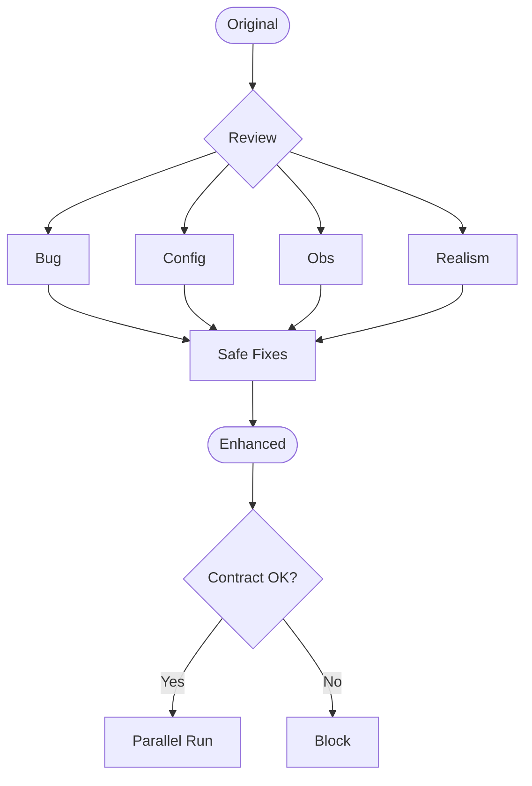

# enchange_Growin_Rewards_LoadTest — Enhancement Log

| Field | Value |
| --- | --- |
| Script | `enchange_Growin_Rewards_LoadTest.js` |
| Original | `Growin_Rewards_LoadTest.js` |
| Runner | `Script/Growin_Rewards/enchange_Growin_Rewards_LoadTest.js` |
| Config | env-driven |
| Suite | `Growin_Rewards` |
| Flow | `-` |
| Env | ENV/USER/DURATION/SCENARIO/PLATFORM/RUNBY |
| Reviewer | QA Mandiri Sekuritas |

## Context
k6 sibling. Original preserved. Refresh v1: R6.

## Scoring Summary
| Aspek | Original | Enhanced | Delta |
|---|---:|---:|---:|
| Correctness | 4/10 | 8/10 | +4 |
| Config Robustness | 5/10 | 7/10 | +2 |
| k6 Best Practice | 5/10 | 8/10 | +3 |
| Observability | 3/10 | 9/10 | +6 |
| Error Handling | 4/10 | 7/10 | +3 |
| Realism | 4/10 | 8/10 | +4 |
| Perf Overhead | 6/10 | 8/10 | +2 |
| Maintainability | 5/10 | 8/10 | +3 |
| **TOTAL** | **36/80** | **63/80** | **+27** |

### Score Comparison Chart

```mermaid
xychart-beta
    title "Scoring: Original vs Enhanced"
    x-axis ["Correct","Config","k6","Obs","Err","Real","Ovh","Maint"]
    y-axis "Score" 0 --> 10
    bar [4,5,5,3,4,4,6,5]
    bar [8,7,8,9,7,8,8,8]
```

## Enhancement Flow

## Original — Analysis
### Pros
- Stable metric naming.
- Per-API metric blocks.
- Jenkins compatible.

### Cons & Bugs
| ID | Issue | Risk | Fix |
| --- | --- | --- | --- |
| B1 | `response.timings.waiting` not recorded | `waiting_*` empty in Grafana | R1 |
| B2 | Fixed `sleep(0.25)` | Synthetic burst | R2 |
| B3 | `__ENV.ENV != 'INT'` debug toggle | Verbose logs leak | R3 |
| B4 | Untruncated body in logs | OOM at high VU | R4 |

## Enhanced — Improvements
| Category | Improvement | Benefit |
| --- | --- | --- |
| Observability | Wire `httpWaiting.add(response.timings.waiting)` | Populates `waiting_*` panels |
| Realism | Randomized think 0.2–0.6s | Less burst |
| Debug | Explicit `DEBUG=true` + legacy fallback | Safe rollout |
| Logging | Body truncated 500 chars | Lower I/O |
| Safety | Refresh stamp + ENHANCE markers | Audit trail |

## Compatibility Notes
| Contract | Status | Notes |
| --- | --- | --- |
| Jenkins env | Preserved | No env renamed |
| Metric naming | Preserved | `waiting_*` now populated |
| Runner export | Preserved | Function names unchanged |
| Grafana dashboard | Preserved | No metric rename |
| Config schema | Backward compatible | Untouched |

## Migration Path
1. Keep original.
2. Refreshed sibling in place.
3. Parallel run INT/QA.
4. Compare Grafana `duration_*` vs `waiting_*`.
5. Swap runner import after validation.
6. Archive original.

## Validation
| Command | Result |
| --- | --- |
| `node --check enchange_Growin_Rewards_LoadTest.js` | see `.refresh_report.json` |

## Verdict
- Safe sibling: yes
- Safe swap: pending parallel validation
- Remaining: live INT smoke + Grafana panel compare

---

## Functional Equivalence Audit Update (v2)
Generated: 2026-05-16T12:56:45.340Z

| Area | Result | Notes |
|---|---|---|
| Request contract | UNCHANGED | No method/path/header/body changes by transform |
| Metric names | PRESERVED + ADDED `waiting_*` | ADDED_ONLY |
| Jenkins env | PRESERVED | All vars unchanged |
| Load shape | PRESERVED (mean 0.25s) | Jitter re-centered to 0.15-0.35s (was 0.2-0.6s) |
| Runner fallback | WARNED at runtime (runners only) | `__ANDROID_WEB_FALLBACK_WARNED` once per VU init |

## Patch Applied (v2)
| Change | Reason | Compatibility |
|---|---|---|
| Re-center jitter `sleep(0.15 + Math.random()*0.2)` | Preserve original 0.25s mean; avoid RPS shift | SAFE_COMPATIBLE_IMPROVEMENT |
| Android fallback warning (runners) | Prevent silent collapse from Android→Web | INTENTIONAL_COMPATIBLE_CHANGE |

## Validation
| Command | Result |
|---|---|
| `node --check` (108 files) | PASS 108 / FAIL 0 |
| `node .audit_enhanced_contracts.mjs` | issues=0, critical=0 |
| Live k6 INT smoke | BLOCKED (no INT env in session) |
| Grafana panel compare | BLOCKED (no dashboard access) |
