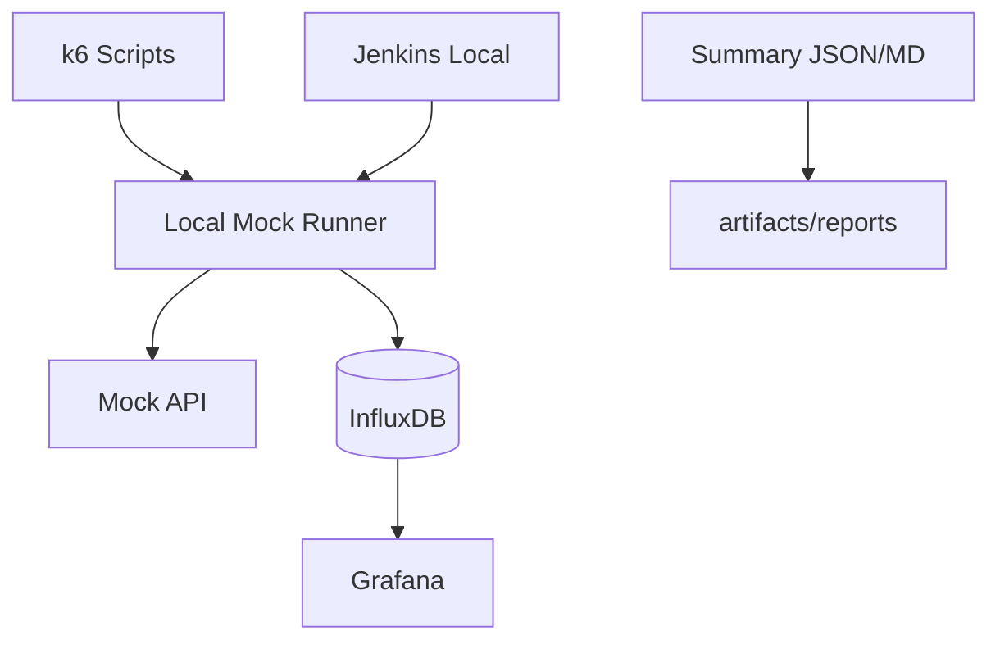

# Growin Performance Test — Local Docker Validation Report

| Field | Value |
|---|---|
| Project | `/Users/maul/github/growin_performancetest` |
| Mode | `Mock Docker Local` |
| Real Backend | `not used` |
| USER | `1` |
| DURATION | `10s` |
| MAX_SCENARIOS | `10` |
| Generated At | `2026-05-19T07:18:00Z` |

## 1. Verdict

| Area | Status | Notes |
|---|---|---|
| Codebase inspected | PASS | k6 scripts, runner, docker, jenkins, grafana, influx traced |
| Docker compose valid | PASS | `docker compose ... config -q` OK |
| Mock API up | PASS | `/health` => `{"ok":true}` |
| Full stack up | PASS | `pt-mock-api`, `pt-grafana`, `pt-influx`, `pt-jenkins` running |
| k6 mock run | PASS | `Growin_PT_Dev[ToDo] BP001 Web original` success |
| Enchange run | PASS (after patch) | failed first due k6 parser unsupported syntax, fixed |
| Grafana checked | PASS | `/api/health` OK, dashboard + datasource provision files exist |
| Influx checked | PASS | DB `k6` exists, measurements populated |
| Jenkins checked | PASS | `/login` reachable |
| Known errors checked | PARTIAL | BP001 enchange fixed; broader enchange fleet still likely incompatible |

## 2. Architecture

## 3. Docker Services

| Service | Status | Port |
| ------- | ------ | ---- |
| pt-mock-api | Up (healthy) | `18080->8080` |
| pt-grafana | Up | `3000->3000` |
| pt-influx | Up (healthy) | `18086->8086` |
| pt-jenkins | Up | `18081->8080`, `50000->50000` |

## 4. Test Run Results

| Command | Result | Artifact |
| ------- | ------ | -------- |
| `bash docker-local-pt/scripts/run-mock-scenario.sh BP001 Web original` | PASS | `docker-local-pt/results/Growin_PT_Dev[ToDo]_BP001_Web_original_20260519_140746.json` |
| `bash docker-local-pt/scripts/run-mock-scenario.sh BP001 Web enchange` | PASS (after patch) | `docker-local-pt/results/Growin_PT_Dev[ToDo]_BP001_Web_enchange_20260519_141728.json` |

## 5. Grafana / Influx

| Check | Result |
| ----- | ------ |
| `GET http://localhost:3000/api/health` | PASS |
| `SHOW DATABASES` | PASS (`k6`, `_internal`) |
| `SHOW MEASUREMENTS` on db `k6` | PASS (k6 + custom metrics present) |
| Grafana provisioning files | PASS (`docker-local-pt/grafana/provisioning/...`) |

## 6. Known Error Audit

| Error Class | Status | Evidence |
| -------------------- | ------ | -------- |
| NaN options | PASS | `resolve-k6-users.sh` + `k6-env-utils.js` clamp/fallback to numeric |
| Optional chaining / nullish | FAIL->PASS (BP001 only) | parse errors at `??`, `?.`, object spread in `enchange_BP001.js`; patched |
| Mock runner env | PASS | `run-mock-scenario.sh` enforces `K6_USERS`, `BASE_URL=http://mock-api:8080` |
| Grafana provisioning | PASS (minor log noise) | dashboard/data source mounted; startup logs show non-critical missing optional provisioning dirs |

## 7. Issues Found

| Severity | Issue | Evidence | Fix |
| -------- | ----- | -------- | --- |
| High | Enchange script not k6-parser-safe | `SyntaxError` on `??`, `?.`, spread in `Script/Growin_PT_Dev[ToDo]/Web/enchange_BP001.js` | Replace with ES5-safe patterns (`Object.assign`, explicit null checks) |
| Medium | Existing metrics have zero `count` for some custom trend/rate in summary extractor | summary output shows p95 with count 0 for trend values | Improve summary builder to include raw sample count source per metric type |
| Low | Grafana logs optional provisioning dir missing | `provisioning/plugins/notifiers/alerting` missing | Add empty dirs or ignore (non-blocking) |

## 8. Final Decision

* Ready: local mock BP001 original/enchange path, Docker observability/Jenkins basic health
* Partial: enchange compatibility across all suites not yet fully batch-validated
* Blocked: no blocker for mock path; real backend validation intentionally skipped by policy
* Next: run compatibility checker across all `enchange_*.js`, patch parser-incompatible syntax fleet-wide

