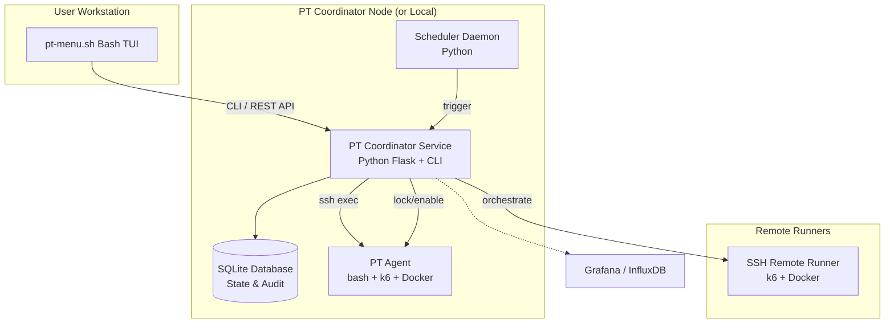
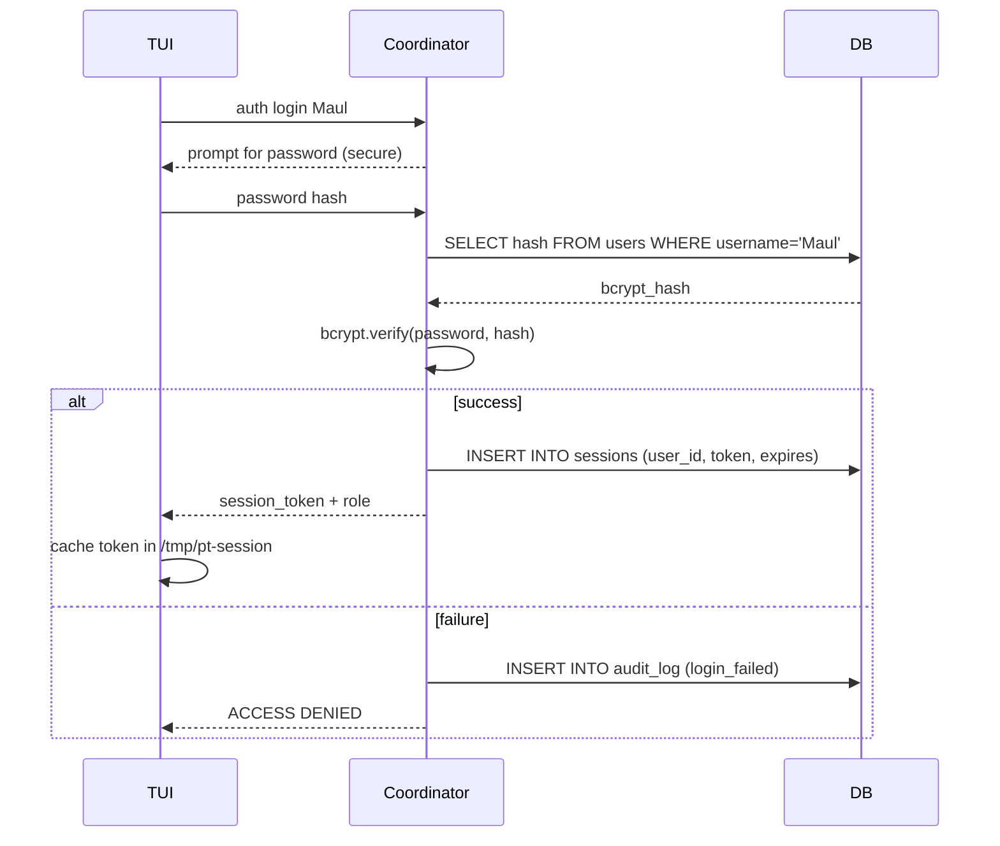
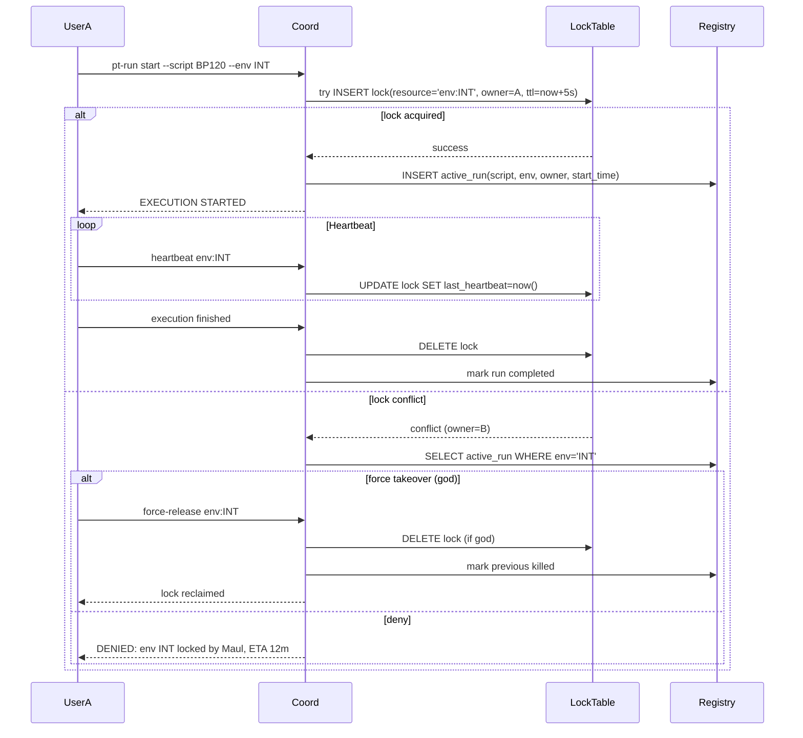
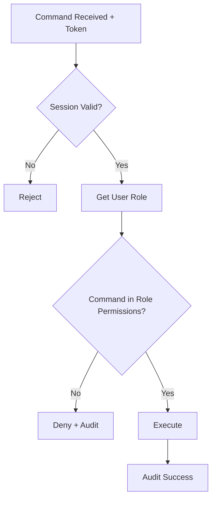
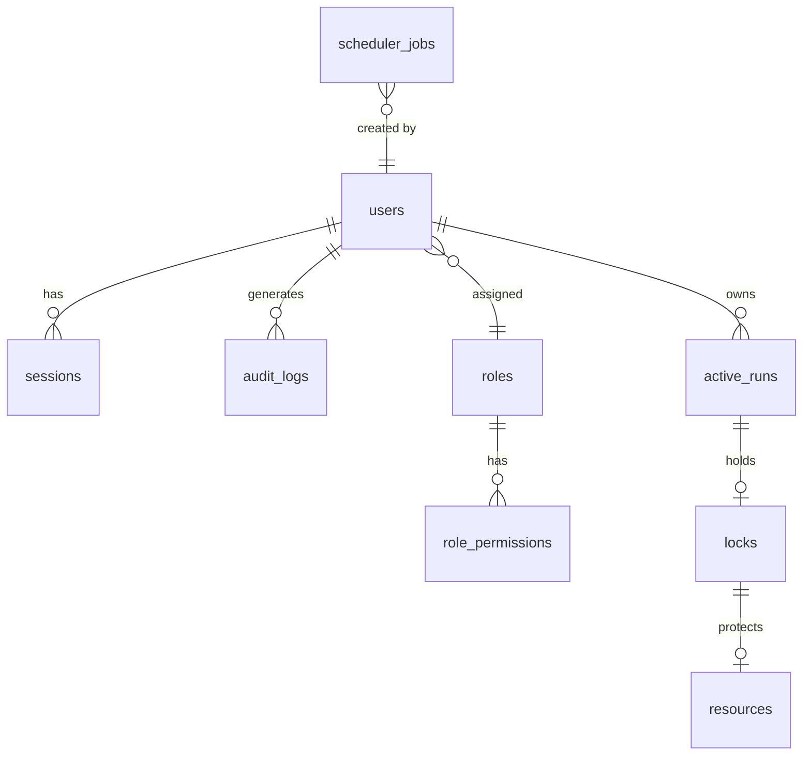

# Growin Performance Test Framework  
## Enterprise Multi-User Orchestration Architecture  
**RFC v2.0 — Senior Staff Engineer Proposal**  
**Repository**: [termaulmaul/growin_performancetest](https://github.com/termaulmaul/growin_performancetest)  

---

## Executive Summary

The current `pt-menu.sh` TUI is a solid single‑operator performance test (PT) launcher.  
However, it operates under the dangerous assumption of **single‑user exclusivity** – no session, no locking, no RBAC, and no global visibility of shared resources. In an environment where multiple engineers concurrently access PT servers, this leads to:

- Accidental simultaneous executions against the same target (collision)
- Undetectable resource exhaustion
- No audit trail or accountability
- Privilege escalation via shared shell access
- Operational chaos with cron‑driven remote runs

This document proposes a **pragmatic, incremental, yet deeply engineered transformation** into a **secure, multi‑user, enterprise‑grade orchestration platform**, while preserving the beloved Bash TUI and avoiding heavy infrastructure dependencies. The architecture is built around a **central PT Coordinator service** (lightweight Python/Flask) backed by a **local SQLite state database**, with Bash acting as the UI shell and Python modules implementing all business logic. This split maintains the existing operational simplicity and adds capabilities for:

- **User authentication & session management** (bcrypt, sqlite, lockout)
- **Hierarchical RBAC** with role inheritance and menu filtering
- **Distributed execution locking** (DB‑backed, heartbeat, stale recovery)
- **Real‑time resource awareness** and overload prevention
- **Live execution observability** (top‑like dashboard)
- **Immutable audit logging** (forensic‑grade)
- **Extensible to REST API, web dashboard, and future Kubernetes runners**

---

## A. Complete System Architecture

### 1. High‑Level Component Diagram



**Key Design Decisions:**
- **Bash TUI remains the primary human interface.** It never touches the database directly; all state mutations go through the Coordinator’s CLI (`pt-ctl`).
- The **Coordinator** is a Python process running either on the same PT server (socket) or as a central service (REST). Initially, it can run as a local daemon, later become a centralized API.
- All critical concurrency primitives (locks, sessions, RBAC checks) live inside the Coordinator to guarantee atomicity.
- Remote runners are spawned via SSH from the Coordinator, using locked capability tokens.

### 2. Authentication & Session Flow



- Password is never transmitted in plaintext over CLI; the TUI prompts interactively and passes the bcrypt‑ready hash.
- Session tokens are opaque UUIDs stored in a tmpfs‑mounted `$TMPDIR/.pt-session` with `chmod 600`.
- On every command, the token is sent to the Coordinator for validation and RBAC adjudication.

### 3. Distributed Lock & Concurrency Prevention

The lock is **not** a simple filesystem flag; it is a database‑backed, heartbeat‑maintained, owner‑tracked soft lock with crash recovery.



**Stale lock recovery**: a background reaper in the Coordinator checks `last_heartbeat < now - threshold` and automatically releases orphaned locks, logging a warning.

### 4. RBAC Decision Flow



Role permissions are stored as a JSON capability set and cached in‑memory for sub‑millisecond lookups.

---

## B. Detailed File Structure Proposal

The new repository layout, living under `/opt/growin-pt`:

```
/opt/growin-pt/
├── bin/
│   ├── pt-menu.sh                 # Entrypoint TUI (bash)
│   ├── pt-ctl                     # Coordinator CLI proxy (Python)
│   └── pt-agent                   # Agent launcher (bash)
├── lib/
│   ├── auth/
│   │   ├── auth_cli.py
│   │   ├── session.py
│   │   └── password.py
│   ├── rbac/
│   │   ├── permissions.py
│   │   └── middleware.py
│   ├── lock/
│   │   ├── lock_manager.py
│   │   └── heartbeat.py
│   ├── registry/
│   │   ├── run_registry.py
│   │   └── resource_monitor.py
│   ├── scheduler/
│   │   ├── cron_parser.py
│   │   └── job_runner.py
│   ├── audit/
│   │   └── logger.py
│   ├── tui/
│   │   ├── renderer.sh           # Status bar, dialogs
│   │   └── live_dashboard.sh
│   └── coordinator/
│       ├── app.py                 # Flask app (if web mode)
│       └── cli.py                 # CLI dispatcher
├── config/
│   ├── pt.conf                    # Main config (env vars, DB path)
│   ├── roles.json                 # Role definitions
│   └── servers.yaml               # Remote runner inventory
├── db/
│   ├── schema.sql
│   └── migrations/
├── logs/                          # Immutable audit logs (rotated)
├── scripts/
│   ├── k6/                        # k6 test scripts
│   └── helpers/
├── tests/                         # Unit/integration for Python modules
└── docs/
```

**Rationale for Bash/Python split**:
- **bash**: all UI rendering, user interaction (dialog/whiptail), process spawning, signal handling.
- **Python**: everything requiring data integrity, complex logic, concurrency, hashing, networking.
- CLI bridge: `pt-ctl` is a Python script that Bash calls with `$(pt-ctl auth login "$user" --password-stdin)`. Exit codes communicate authorization results cleanly.

---

## C. SQLite Database Design

### Entity‑Relationship Diagram



### Core Tables & Indexes

```sql
CREATE TABLE roles (
    id INTEGER PRIMARY KEY,
    name TEXT UNIQUE NOT NULL,          -- god, admin, operator, readonly, guest
    inherits_from INTEGER REFERENCES roles(id),
    capabilities JSON NOT NULL          -- {"can_execute_pt":true, "can_manage_users":false}
);

CREATE TABLE users (
    id INTEGER PRIMARY KEY,
    username TEXT UNIQUE NOT NULL,
    password_hash TEXT NOT NULL,        -- bcrypt $2b$...
    role_id INTEGER NOT NULL REFERENCES roles(id),
    locked_until INTEGER,               -- Unix timestamp for lockout
    failed_attempts INTEGER DEFAULT 0,
    created_at TEXT DEFAULT (datetime('now'))
);
CREATE INDEX idx_users_username ON users(username);

CREATE TABLE sessions (
    token TEXT PRIMARY KEY,
    user_id INTEGER NOT NULL REFERENCES users(id) ON DELETE CASCADE,
    created_at INTEGER NOT NULL,
    expires_at INTEGER NOT NULL,
    last_activity INTEGER NOT NULL
);
CREATE INDEX idx_sessions_expires ON sessions(expires_at);

CREATE TABLE resources (
    id INTEGER PRIMARY KEY,
    name TEXT UNIQUE NOT NULL           -- e.g., "env:INT", "server:10.100.201.192"
);

CREATE TABLE locks (
    id INTEGER PRIMARY KEY,
    resource_id INTEGER UNIQUE NOT NULL REFERENCES resources(id),
    owner_run_id INTEGER REFERENCES active_runs(id) ON DELETE SET NULL,
    owner_user_id INTEGER NOT NULL REFERENCES users(id),
    acquired_at INTEGER NOT NULL,
    last_heartbeat INTEGER NOT NULL,
    ttl_seconds INTEGER DEFAULT 30
);
CREATE INDEX idx_locks_heartbeat ON locks(last_heartbeat);

CREATE TABLE active_runs (
    id INTEGER PRIMARY KEY,
    script_name TEXT NOT NULL,
    environment TEXT NOT NULL,
    executor_user_id INTEGER NOT NULL REFERENCES users(id),
    start_time INTEGER NOT NULL,
    eta_seconds INTEGER,
    status TEXT DEFAULT 'running',     -- running, completed, killed
    details JSON                       -- VUs, RPS, remote host, pid
);
CREATE INDEX idx_active_runs_status ON active_runs(status);

CREATE TABLE audit_logs (
    id INTEGER PRIMARY KEY,
    timestamp INTEGER DEFAULT (strftime('%s','now')),
    user_id INTEGER REFERENCES users(id),
    action TEXT NOT NULL,               -- LOGIN, PT_START, PT_FINISH, USER_LOCK
    target TEXT,                        -- script, env, user
    result TEXT,                        -- SUCCESS, DENIED
    client_ip TEXT,
    details TEXT
);
CREATE INDEX idx_audit_time ON audit_logs(timestamp);

CREATE TABLE scheduler_jobs (
    id INTEGER PRIMARY KEY,
    cron_expression TEXT NOT NULL,
    command TEXT NOT NULL,
    created_by INTEGER REFERENCES users(id),
    enabled INTEGER DEFAULT 1
);
```

**Migration strategy**: SQLite’s limited `ALTER TABLE` is handled by versioned `.sql` scripts in `db/migrations/`, applied by a simple `pt-ctl migrate` that checks a `schema_version` table.

---

## D. Security Hardening Design

### Threat Model & Countermeasures

| Threat | Mitigation |
|--------|------------|
| Password brute‑force | bcrypt (cost 12), lockout after 5 attempts, progressive delay |
| Session hijacking | Tokens stored in `$TMPDIR` with `0600`, validity checked on every command, 1h idle timeout |
| Command injection in Bash menus | All user input is validated with regex, passed as arrays (`"$@")`, never `eval`. |
| Privilege escalation via script modification | k6 scripts are owned by `root:ptgroup`, writable only by admin users (RBAC + filesystem ACLs) |
| Unauthorized access to SQLite DB | DB file permission `0600`, owned by `pt-coord` user; Coordinator runs as that user |
| Malicious tampering of audit logs | Append‑only log file with `chattr +a` on ext4; in‑DB logs are write‑only via the Coordinator API (no direct DB access from users) |
| SSH key misuse | Remote runner keys are managed by the Coordinator and never exposed to user; SSH commands are templated and restricted |
| Concurrent access to temp files | `mktemp` with safe suffixes, cleaned on exit |
| Replay attacks | Session tokens include HMAC of timestamp, validated by Coordinator |

### Password & Secret Management
- All secrets (DB path, Flask secret key) are stored in `/etc/opt/growin-pt/secrets.env` with `0600`, sourced only by the Coordinator.
- No plaintext credentials in config files or environment.

### Sandboxing & Least Privilege
The `pt-agent` runs k6 under a dedicated system user `k6runner` with reduced capabilities (no network admin, no raw sockets unless needed). Docker access is granted via group membership, restricted by the agent’s wrapper.

---

## E. Implementation Roadmap

### Phase 1: Foundation & Basic Multi‑User (2–3 weeks)
- **Deliverables**:
  - Python `pt-ctl` CLI with `auth`, `rbac`, `lock` modules
  - SQLite schema and migration tool
  - `pt-menu.sh` replaced with login screen, role‑filtered menu
  - Simple lock manager (deny mode only)
  - Basic audit logging (login/logout/PT start)
- **Risk**: Bash TUI compatibility – mitigated by keeping original menu as fallback.

### Phase 2: Production‑Ready Orchestration (3–4 weeks)
- **Deliverables**:
  - Full lock lifecycle with heartbeats and stale recovery
  - Resource monitoring daemon (CPU, RAM, Docker) feeding status bar
  - Active run registry and live dashboard (top‑like)
  - User management menu (create/delete/lock)
  - Scheduler integration with RBAC
  - Force takeover and queue mode
- **Rollback**: Old `pt-menu.sh` can still run alongside; new features are gated by `PT_COORDINATOR_URL`.

### Phase 3: Enterprise & Centralization (4–6 weeks)
- **Deliverables**:
  - Central Coordinator with REST API (Flask)
  - Web dashboard (lightweight Vue/React) for read‑only monitoring
  - LDAP/SSO plugin architecture
  - Slack/Discord notifications
  - Distributed remote runner locking across multiple servers
  - Kubernetes runner backend (optional)
- **Rollback**: the local Coordinator mode remains fully functional; API is additive.

---

## F. Code Examples (Production‑Grade)

### 1. Bash Login Screen (`lib/tui/login.sh`)

```bash
#!/bin/bash
source /opt/growin-pt/config/pt.conf
PT_CTL="/opt/growin-pt/bin/pt-ctl"

login_screen() {
    local attempts=0
    while true; do
        exec 3>&1
        username=$(dialog --ok-label "Login" --cancel-label "Exit" \
            --title "Growin PT - Authentication" \
            --form "Please login" 10 50 0 \
            "Username:" 1 1 "" 1 12 20 0 \
            2>&1 1>&3)
        local exit_code=$?
        exec 3>&-

        if [ $exit_code -ne 0 ]; then
            clear; exit 0
        fi

        # password box (masked)
        password=$(dialog --insecure --passwordbox "Password for $username:" 8 40 2>&1 >/dev/tty)
        if [ -z "$password" ]; then
            continue
        fi

        # Auth via pt-ctl
        token=$($PT_CTL auth login "$username" --password-stdin <<< "$password" 2>/dev/null)
        local auth_exit=$?
        if [ $auth_exit -eq 0 ]; then
            echo "$token" > "$HOME/.pt-session"
            chmod 600 "$HOME/.pt-session"
            return 0
        else
            dialog --msgbox "Authentication failed. $token" 6 40
            ((attempts++))
            if [ $attempts -ge 3 ]; then
                dialog --msgbox "Too many attempts. Exiting." 6 40
                clear; exit 1
            fi
        fi
    done
}
```

### 2. Python Auth with bcrypt & SQLite (`lib/auth/auth_cli.py`)

```python
import sys, argparse, bcrypt, sqlite3, uuid, time
from getpass import getpass

DB = "/opt/growin-pt/db/pt_state.db"
SESSION_TTL = 3600

def login(username, password_stdin):
    if password_stdin:
        password = sys.stdin.read().strip()
    else:
        password = getpass("Password: ")
    conn = sqlite3.connect(DB)
    cur = conn.cursor()
    cur.execute("SELECT id, password_hash, locked_until, role_id FROM users WHERE username=?", (username,))
    row = cur.fetchone()
    if not row:
        log_audit(None, "LOGIN_FAILED", username, "unknown user")
        sys.exit(1)
    uid, pw_hash, locked_until, role_id = row
    if locked_until and time.time() < locked_until:
        log_audit(uid, "LOGIN_LOCKED", username)
        sys.exit(1)
    if not bcrypt.checkpw(password.encode(), pw_hash.encode()):
        cur.execute("UPDATE users SET failed_attempts = failed_attempts + 1 WHERE id=?", (uid,))
        if cur.fetchone(): # if attempts > 5, lock account
            cur.execute("UPDATE users SET locked_until = ? WHERE id=?", (time.time()+300, uid))
        conn.commit()
        log_audit(uid, "LOGIN_FAILED", username)
        sys.exit(1)
    # success
    cur.execute("UPDATE users SET failed_attempts = 0 WHERE id=?", (uid,))
    token = str(uuid.uuid4())
    now = time.time()
    cur.execute("INSERT INTO sessions (token, user_id, created_at, expires_at, last_activity) VALUES (?,?,?,?,?)",
                (token, uid, now, now+SESSION_TTL, now))
    conn.commit()
    log_audit(uid, "LOGIN", username)
    print(token)
    sys.exit(0)

def check_session(token):
    conn = sqlite3.connect(DB)
    cur = conn.cursor()
    cur.execute("""SELECT u.id, u.username, r.capabilities 
                   FROM sessions s JOIN users u ON s.user_id=u.id JOIN roles r ON u.role_id=r.id
                   WHERE s.token=? AND s.expires_at > ?""", (token, time.time()))
    row = cur.fetchone()
    if not row:
        sys.exit(1)
    uid, username, caps = row
    # Update last_activity
    cur.execute("UPDATE sessions SET last_activity=? WHERE token=?", (time.time(), token))
    conn.commit()
    print(f"{uid}:{username}:{caps}")
    sys.exit(0)
```

### 3. Lock Acquisition (Python, `lib/lock/lock_manager.py`)

```python
def acquire_lock(resource_name, owner_user_id, run_id=None, force=False):
    conn = sqlite3.connect(DB)
    conn.execute("PRAGMA journal_mode=WAL") # better concurrency
    # ensure resource record
    conn.execute("INSERT OR IGNORE INTO resources (name) VALUES (?)", (resource_name,))
    res_id = conn.execute("SELECT id FROM resources WHERE name=?", (resource_name,)).fetchone()[0]
    
    if force and user_is_god(owner_user_id):
        # Preempt lock
        conn.execute("DELETE FROM locks WHERE resource_id=?", (res_id,))
        conn.commit()
    try:
        now = time.time()
        conn.execute("INSERT INTO locks (resource_id, owner_user_id, owner_run_id, acquired_at, last_heartbeat, ttl_seconds) VALUES (?,?,?,?,?,30)",
                     (res_id, owner_user_id, run_id, now, now))
        conn.commit()
        return True, "Lock acquired"
    except sqlite3.IntegrityError:
        # lock exists, check heartbeat
        row = conn.execute("SELECT owner_user_id, last_heartbeat, ttl_seconds FROM locks WHERE resource_id=?", (res_id,)).fetchone()
        owner, last_hb, ttl = row
        if now - last_hb > ttl + 5:  # stale lock
            conn.execute("DELETE FROM locks WHERE resource_id=?", (res_id,))
            conn.commit()
            # retry once
            return acquire_lock(resource_name, owner_user_id, run_id, force=False)
        # return conflict details
        run = conn.execute("SELECT script_name, eta_seconds, start_time FROM active_runs WHERE id=(SELECT owner_run_id FROM locks WHERE resource_id=?)", (res_id,)).fetchone()
        return False, f"Locked by user {owner} (script: {run[0]}, ETA: {run[1]//60}m)"
    finally:
        conn.close()
```

### 4. Status Bar Renderer with Live Resource Info (`lib/tui/renderer.sh`)

```bash
render_status_bar() {
    local resource_info
    resource_info=$(pt-ctl resource status --env "$CURRENT_ENV" 2>/dev/null)
    # sample output: "CPU:23% RAM:45% DOCKER_UP:3 LOCK:Maul/BP120/ETA:12m"
    IFS=' ' read -ra PARTS <<< "$resource_info"
    local cpu="${PARTS[0]}"
    local ram="${PARTS[1]}"
    local docker="${PARTS[2]}"
    local lock_info="${PARTS[3]}"
    # color coding
    local color_code=2  # green
    if [[ "$cpu" > "70" || "$ram" > "80" ]]; then
        color_code=3    # yellow
    elif [[ "$cpu" > "90" || "$ram" > "95" ]]; then
        color_code=1    # red
    fi
    tput setaf $color_code
    printf "IP: %s │ ENV: %s │ VUs: %s │ Dur: %s │ %s │ %s" \
        "$IP" "$CURRENT_ENV" "$VUS" "$DURATION" "$docker $cpu $ram" "$lock_info"
    tput sgr0
}
```

### 5. Heartbeat Daemon (bash + background)

```bash
start_heartbeat() {
    local env="$1"
    local interval=10
    (
        while kill -0 $PT_PID 2>/dev/null; do
            pt-ctl lock heartbeat --env "$env" --token "$SESSION_TOKEN"
            sleep $interval
        done
    ) &
    HEARTBEAT_PID=$!
}
```

---

## G. UX/TUI Improvement Ideas

- **Dynamic, color‑coded status bar**: resource health (green/yellow/red), lock owner, ETA, and real‑time VUs. Updated via SIGALRM every 5s without blocking input.
- **`top`-inspired active run viewer**: a dedicated “pt‑top” screen showing all active runs (local + remote) with sortable columns (script, user, environment, resource usage). Use `dialog --gauge` for progress bars.
- **Execution timeline**: a horizontal bar (using Unicode block characters) representing the last 24 hours of runs, color‑coded by status.
- **Keyboard shortcuts** like `k9s`:
  - `F1`–`F5` for main sections
  - `Ctrl+R` to repeat last run
  - `/` to fuzzy‑search script history
  - `q` for quick quit
- **Mini‑dashboard on login**: show server health, recent activity, any locks held by the user.
- **Audit log tail in a split pane**: optional toggle with `Ctrl+L`.

All rendering will be done with **ANSI escape codes** and `tput`, avoiding ncurses dependencies beyond `dialog`.

---

## H. Advanced Features & Future Extensibility

### 1. Centralised REST API & Web Dashboard
Once the Coordinator becomes a Flask application, a lightweight Vue.js dashboard can provide read‑only observability for managers and a “god’s eye” view. The REST API endpoints:

- `POST /api/v1/auth/login`
- `GET /api/v1/runs/active`
- `POST /api/v1/locks/release`
- `GET /api/v1/resources/status`
- `POST /api/v1/executions/start`

Authentication will be token‑based. The web dashboard mirrors the TUI but with richer visualisations (real‑time graphs via WebSocket).

### 2. Distributed Orchestration Across Servers
The locking table can be replicated (or the Coordinator scaled to multiple nodes) using a central PostgreSQL or Redis, but for simplicity, a **single Coordinator per environment cluster** is sufficient initially. Remote runners report to the same Coordinator via its REST API, enabling true distributed lock coordination.

### 3. Slack/Discord Notifications
A plugin system hooks into the `active_runs` lifecycle: a Python signal emits events (`RUN_START`, `RUN_COMPLETE`, `LOCK_CONFLICT`) which can be consumed by notification adapters.

### 4. Queue Mode
Instead of denying a test when a lock is held, the system can enqueue the request. A background worker picks the next job when the resource becomes free, respecting priorities (role‑based) and resource thresholds. This is implemented via a `job_queue` table and a worker that monitors `locks`.

### 5. Kubernetes Runner
The `pt-agent` can be abstracted to spawn a k6 job as a Kubernetes Job, with dynamic VU scaling. The Coordinator would submit via the K8s API, monitor pod status, and stream logs.

---

## Conclusion

This architecture turns a single‑user Bash script into a **collaborative, secure, and operationally mature performance engineering platform** without abandoning the terminal‑first philosophy that makes the tool fast and loved by engineers. The phased approach allows immediate value delivery (no more accidental collisions!) while laying a solid foundation for centralised orchestration, web visibility, and eventual cloud‑native execution.

All code examples, schemas, and flows are ready for prototype implementation. The next step is a 2‑week spike to validate the core `pt-ctl` and lock mechanism with existing scripts, followed by iterative TUI integration.

**Let’s build the future of enterprise PT orchestration – one secure `pt-menu.sh` session at a time.**
