# Growin Performance Test Framework — Enterprise Architecture RFC

**Document ID:** GROWIN-RFC-2026-001  
**Version:** 1.0  
**Classification:** Internal Engineering  
**Owner:** Platform Engineering  
**Status:** DRAFT — Ready for Review  

---

## Executive Summary

The Growin Performance Test Framework (`growin_performancetest`) is a k6-based terminal orchestration platform used by multiple QA engineers to execute load tests across on-premise, cloud, and local Docker environments. The current architecture — a hybrid Bash TUI (`pt-menu.sh`) and Go Bubble Tea TUI (`tui/`) with a Python scheduler (`scheduler_cli/`) — provides functional script execution, SSH remote runners, Docker mock stacks, and cron scheduling.

**Critical Gap:** The framework has zero multi-user awareness. No authentication, no authorization, no concurrency protection, no execution ownership, and no audit trail. On shared PT servers, engineers can (and do) collide — running simultaneous tests against the same environments, overwriting each other's results, and consuming shared resources without coordination.

This RFC proposes a **complete enterprise-grade architecture transformation** that introduces:

1. **Terminal-native authentication** with bcrypt-hashed credentials and session management
2. **Hierarchical RBAC** (god → admin → operator → readonly → guest) with permission-aware menu filtering
3. **Distributed execution locking** with occupancy detection, heartbeat-based stale lock cleanup, and force-takeover capabilities
4. **Real-time resource monitoring** with server health scoring and overload prevention
5. **Immutable audit logging** with SIEM-ready output formats
6. **Active execution observability** with live PT dashboards
7. **Modular architecture** with clear Bash/Python/Go responsibility boundaries and a plugin system

The design optimizes for **Linux-first operation, minimal dependencies, operational simplicity,** and **zero-downtime migration** from the current system.

---

## 1. Current Architecture Analysis

### 1.1 Repository Structure (As-Is)

```
growin_performancetest/
├── pt-menu.sh              # Primary bash TUI (877 lines) — fzf-based interactive menu
├── fix-*.sh                # Helper fix scripts
├── tui/                    # Go Bubble Tea TUI (experimental, not primary)
│   ├── main.go             # Bubble Tea program bootstrap
│   ├── model.go            # App state (width, height, panels, status)
│   ├── update.go           # Key handlers, action dispatch
│   ├── view.go             # Layout renderer (header/panels/footer)
│   ├── actions/            # Command execution (SSH, Docker, k6)
│   ├── panels/             # Sidebar, MainPanel, Preview
│   ├── styles/             # Lipgloss styles
│   └── utils/              # Suite scanning, env parsing
├── scheduler_cli/          # Python cron scheduler
│   ├── main.py             # CLI entrypoint
│   ├── ai/slope_validator.py  # AI code quality scanner
│   ├── core/cron_manager.py   # Job add/pause/resume/remove
│   ├── data/jobs_state.json   # Flat-file job state
│   └── scripts/            # Scheduler helper scripts
├── docker-local-pt/        # Local Docker stack
│   ├── docker-compose.yml  # mock-api, Grafana, InfluxDB, Jenkins
│   ├── configs/local.env   # Environment configuration (gitignored)
│   ├── mock-api/           # Node.js mock API server
│   ├── grafana/            # Dashboard provisioning
│   ├── scripts/            # run-mock-suite.sh, list-scenarios.mjs
│   └── results/            # Test output directory
├── Script/                 # k6 test scripts organized by suite/
├── docker/pt/              # Remote Docker configs
├── Helper/                 # Utility scripts
├── tools/                  # Additional tooling
└── artifacts/reports/      # Generated test reports
```

### 1.2 Execution Flow (Current)

```
[Engineer] → ssh to PT server → ./pt-menu.sh
    → fzf menu selection
        → [1] Remote Runner → ssh_menu() → sshpass + ssh to target → k6 run
        → [2] Local Runner  → run_test_menu() → docker compose or ./k6 run
        → [3] Cron Scheduler → cron_scheduler_menu() → python3 scheduler_cli/
        → [4] AI Slope      → ai_slope_menu() → python3 slope_validator
        → [5] ENV Editor    → env_edit_menu() → $EDITOR or sed key=value
        → [6] Docker Stack  → docker_menu() → docker compose up/down
        → [7] Open Dir      → xdg-open
```

### 1.3 Identified Risks & Hazards

| ID | Severity | Category | Description |
|----|----------|----------|-------------|
| R1 | **CRITICAL** | Security | SSH password hardcoded in `_ssh_pass()` with default fallback `M@nsek.1234` — exposed via `ps` when using sshpass |
| R2 | **CRITICAL** | Concurrency | No execution locking — multiple engineers can simultaneously run PT against same environment |
| R3 | **HIGH** | Security | No authentication — any user with shell access has full PT control |
| R4 | **HIGH** | Security | ENV file (`local.env`) contains secrets in plaintext, readable by all users on shared server |
| R5 | **HIGH** | Governance | No audit trail — executions are invisible to other engineers and management |
| R6 | **MEDIUM** | Reliability | Cron scheduler uses flat JSON file (`jobs_state.json`) — no ACID guarantees, prone to corruption under concurrent writes |
| R7 | **MEDIUM** | Reliability | Status bar shows Docker container count but no resource utilization or occupancy state |
| R8 | **MEDIUM** | UX | Go TUI (`tui/`) and bash TUI (`pt-menu.sh`) are separate codebases with duplicated logic — maintenance burden |
| R9 | **LOW** | Scalability | Direct SSH execution model doesn't scale to multiple concurrent remote runs — no queue, no prioritization |

---

## 2. Target Architecture Overview

### 2.1 Design Principles

1. **Security by default** — Every operation is authenticated, authorized, and audited
2. **Fail-safe concurrency** — Only one PT per environment unless explicitly allowed
3. **Minimal footprint** — SQLite (not PostgreSQL), file-based locks (not Redis), bash-compatible core
4. **Graceful degradation** — If Python/Go components fail, bash TUI continues with reduced features
5. **Observability everywhere** — Status bar shows real-time occupancy, resource usage, and active user
6. **Zero-downtime migration** — Coexist current and new systems during transition

### 2.2 Component Architecture

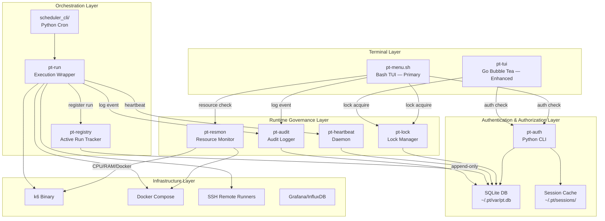

### 2.3 Authentication Flow

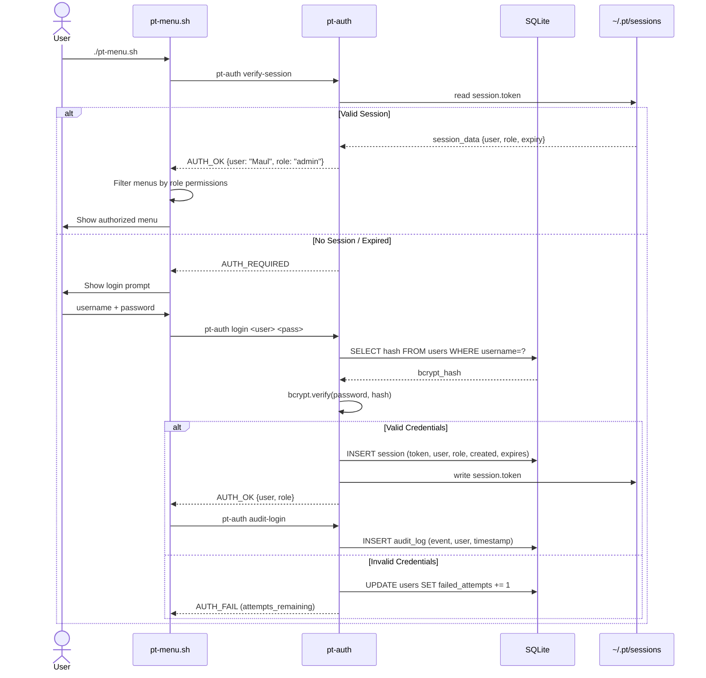

### 2.4 Lock Acquisition Flow

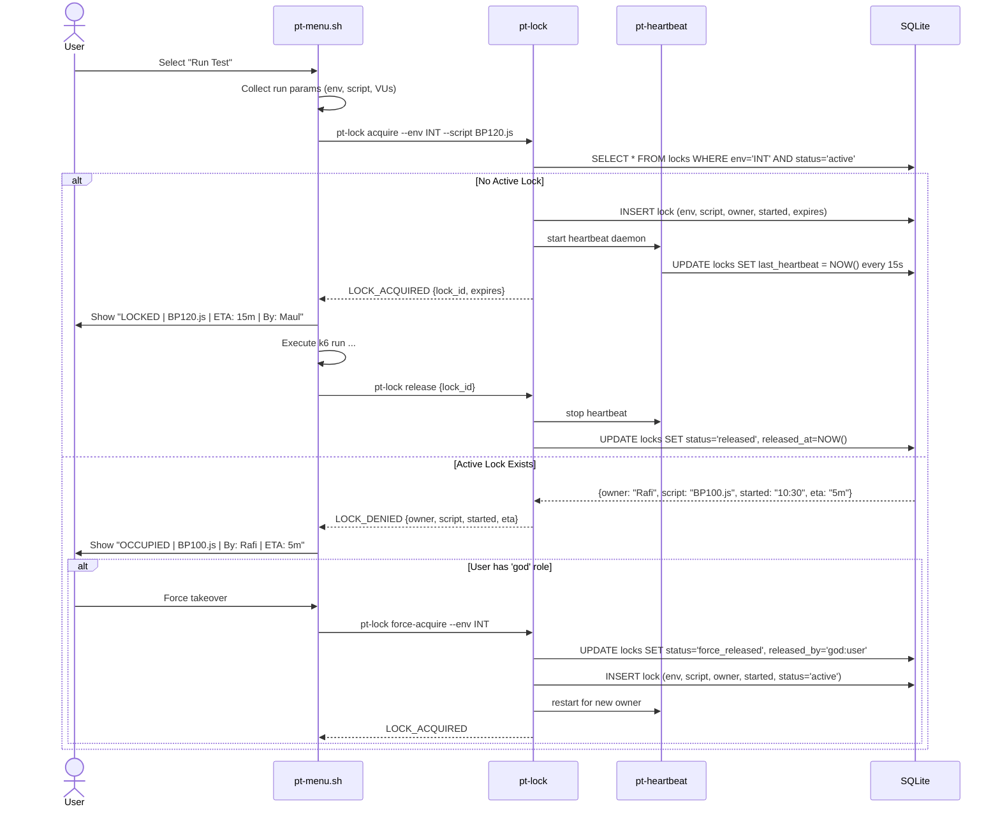

### 2.5 RBAC Enforcement Flow

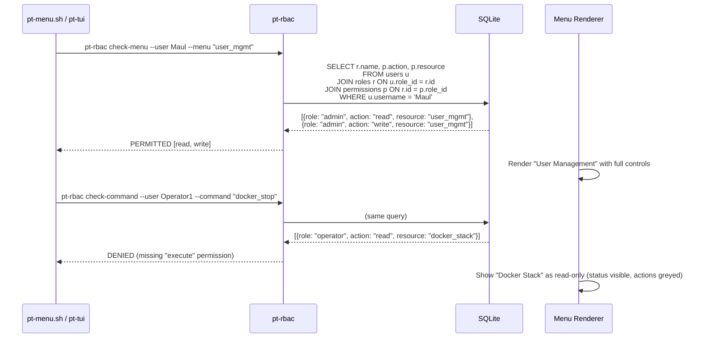

---

## 3. Detailed Subsystem Designs

### 3.1 Authentication & Session Management (pt-auth)

#### 3.1.1 Architecture Decision

**Choice:** Python CLI (`pt-auth`) invoked from bash TUI, backed by SQLite.

**Rationale:**
- Python has mature bcrypt/argon2 libraries (`bcrypt`, `argon2-cffi`)
- SQLite requires zero infrastructure — single `.db` file in `~/.pt/var/`
- Bash-native password hashing would require external tools (OpenSSL `passwd` doesn't do bcrypt cost-factor properly)
- Go TUI can call the same Python CLI or use a shared SQLite library

**Rejected alternatives:**
- **Pure bash with openssl:** OpenSSL passwd supports bcrypt but with limited cost factor control; no session management
- **LDAP direct integration:** Requires LDAP infrastructure most teams don't have; adds network dependency to TUI login
- **PAM integration:** Linux-specific, complex to configure per-user, not portable

#### 3.1.2 Password Hashing

```python
# pt-auth uses bcrypt with cost factor 12
# Hash stored as: $2b$12$<22-char salt><31-char hash>
import bcrypt

def hash_password(plain: str) -> str:
    salt = bcrypt.gensalt(rounds=12)
    return bcrypt.hashpw(plain.encode(), salt).decode()

def verify_password(plain: str, hashed: str) -> bool:
    return bcrypt.checkpw(plain.encode(), hashed.encode())
```

**Migration strategy:** On first install, `pt-auth bootstrap` creates the `god` user with password `Mandirisekuritas2026.` (changed immediately). Existing users are prompted to set passwords on first TUI launch.

#### 3.1.3 Session Management

Sessions are stored in two places for resilience:

1. **SQLite** (`sessions` table) — authoritative source
2. **File cache** (`~/.pt/sessions/{username}.token`) — fast local check without DB lock

```
Session Token: hex64 random (256 bits entropy)
Lifetime: 8 hours of inactivity
Concurrent limit: 3 sessions per user (configurable per role)
Timeout check: Every TUI menu render triggers `pt-auth verify-session --quick`
```

**Quick check path (bash TUI startup — must be <50ms):**
```bash
# ~/.pt/sessions/Maul.token contains: {token: "abc123...", expiry: 1716912000}
pt-auth verify-session --quick --user "$USER" --token-file "~/.pt/sessions/${USER}.token"
# Returns: {"status": "valid", "user": "Maul", "role": "admin", "session_expires": "..."}
```

#### 3.1.4 Login Screen (bash TUI)

```
┌─────────────────────────────────────────────┐
│                                             │
│      GROWIN PERFORMANCE TEST FRAMEWORK      │
│           🔐 Authentication Required         │
│                                             │
│  Username: [Maul______________________]     │
│  Password: [•••••••••••••••••••••••]      │
│                                             │
│  [🔓 Login]  [❌ Exit]                     │
│                                             │
│  Session timeout: 8h | Server: pt-01       │
└─────────────────────────────────────────────┘
```

### 3.2 Role-Based Access Control (pt-rbac)

#### 3.2.1 Role Hierarchy

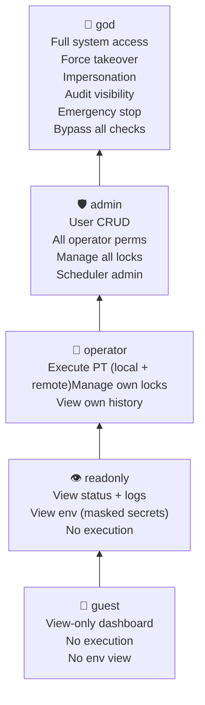

#### 3.2.2 Permission Registry

Permissions are stored as `(role, resource, action)` tuples:

| Role | Resource | Action | Description |
|------|----------|--------|-------------|
| guest | dashboard | read | View public dashboard |
| readonly | dashboard | read | View full dashboard |
| readonly | env | read | View env vars (secrets masked) |
| readonly | audit | read_own | View own audit trail |
| operator | pt_run | execute_local | Run local k6 tests |
| operator | pt_run | execute_remote | Run remote SSH tests |
| operator | lock | acquire_own | Acquire locks on environments |
| operator | lock | release_own | Release own locks |
| operator | env | read | View full env |
| operator | report | read_own | View own reports |
| admin | user | create | Create new users |
| admin | user | delete | Delete/lock users |
| admin | user | update | Reset passwords, change roles |
| admin | lock | manage_all | Force-release any lock |
| admin | scheduler | manage | Pause/resume/any job |
| admin | audit | read_all | View all audit logs |
| admin | docker | manage | Start/stop/restart stacks |
| admin | env | write | Edit environment files |
| god | * | * |Wildcard — all permissions |

#### 3.2.3 Menu Visibility Filtering

The bash TUI filters menu items before presenting them to `fzf`:

```bash
# In pt-menu.sh — menu items filtered by role
build_menu_items() {
    local items=()
    local role; role=$(pt-auth get-role)

    items+=("[1] Remote Runner (SSH + Cloud/Onprem)")
    items+=("[2] Local Runner (Mock Docker K6)")

    if pt-rbac check --role "$role" --resource scheduler --action read; then
        items+=("[3] Cron Scheduler")
    fi
    if pt-rbac check --role "$role" --resource ai_slope --action execute; then
        items+=("[4] AI Slope (Code Quality)")
    fi
    if pt-rbac check --role "$role" --resource env --action write; then
        items+=("[5] ENV Editor")
    fi
    if pt-rbac check --role "$role" --resource docker --action manage; then
        items+=("[6] Docker Stack")
    fi
    if pt-rbac check --role "$role" --resource user --action create; then
        items+=("[U] User Management")
    fi
    if pt-rbac check --role "$role" --resource audit --action read_all; then
        items+=("[A] Audit Log")
    fi
    if pt-rbac check --role "$role" --resource lock --action manage_all; then
        items+=("[L] Active Locks")
    fi
    items+=("[Q] Quit")

    printf '%s\n' "${items[@]}"
}
```

#### 3.2.4 Future SSO/LDAP Integration Path

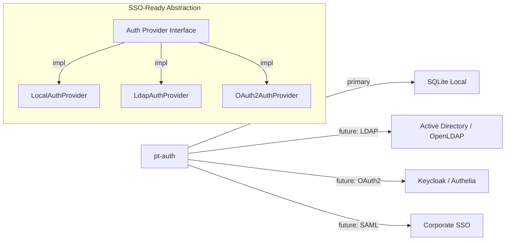

The `pt-auth` module abstracts authentication behind a provider interface. For SSO migration:

1. Configure `~/.pt/config/auth.yml` with `provider: ldap` + connection params
2. `pt-auth` delegates `verify_password()` to LDAP bind
3. Local SQLite still stores role mappings (LDAP groups → PT roles)
4. Session management remains identical regardless of auth provider

### 3.3 Concurrent Test Detection (pt-lock)

#### 3.3.1 Lock Model

Locks are environment-scoped, not server-scoped. An environment (`INT`, `STG`, `PROD`) can have at most one active PT lock.

```sql
-- locks table
CREATE TABLE locks (
    id              INTEGER PRIMARY KEY AUTOINCREMENT,
    env             TEXT NOT NULL,           -- INT, STG, PROD, LOCAL
    lock_type       TEXT DEFAULT 'exclusive', -- exclusive, shared (future)
    status          TEXT DEFAULT 'active',    -- active, released, force_released, expired, stale
    script_name     TEXT NOT NULL,
    script_path     TEXT,
    owner           TEXT NOT NULL,
    owner_uid       INTEGER,
    started_at      DATETIME DEFAULT CURRENT_TIMESTAMP,
    expires_at      DATETIME,                -- NULL = no expiry
    released_at     DATETIME,
    released_by     TEXT,
    last_heartbeat  DATETIME DEFAULT CURRENT_TIMESTAMP,
    heartbeat_pid   INTEGER,                 -- local PID of heartbeat process
    metadata        TEXT,                    -- JSON: {vus, duration, platform, target_host}
    FOREIGN KEY (owner) REFERENCES users(username)
);

CREATE UNIQUE INDEX idx_locks_env_active ON locks(env) WHERE status = 'active';
CREATE INDEX idx_locks_owner ON locks(owner);
CREATE INDEX idx_locks_status ON locks(status);
```

#### 3.3.2 Lock Modes

| Mode | Description | Trigger |
|------|-------------|---------|
| **deny** (default) | Reject execution if lock exists | Any operator attempting locked env |
| **queue** | Add to FIFO queue, notify when lock frees | `--queue` flag or scheduler jobs |
| **force** | God/admin only — preempt active lock | God role selects "Force Takeover" |
| **steal** | Release own previous lock and acquire new | Operator moving between envs |

#### 3.3.3 Heartbeat & Stale Lock Cleanup

```mermaid
graph TD
    A[Heartbeat Daemon] -->|"every HEARTBEAT_INTERVAL=15s"| B[UPDATE locks SET last_heartbeat = NOW()]
    C[Stale Lock Scanner] -->|"every STALE_CHECK=60s"| D[SELECT * FROM locks WHERE last_heartbeat < NOW() - timeout]
    D -->|"found stale"| E[UPDATE locks SET status='stale']
    E --> F[Notify via status bar: "Lock expired — previous owner unresponsive"]
    G[pt-lock cleanup --auto] -->|"on startup"| H[Mark all locks with dead heartbeat_pid as 'stale']
```

**Stale detection thresholds:**
- Normal: Heartbeat timeout = 60 seconds (4 missed beats)
- Aggressive (PROD env): Heartbeat timeout = 30 seconds
- God bypass: Gods can always force-release, regardless of heartbeat state

#### 3.3.4 Enhanced Status Bar

**Before (current):**
```
IP: 10.100.201.192 │ ENV: INT │ VUs: 1 │ Dur: 30s │ Docker: 5 up
```

**After (idle — no active PT):**
```
IP: 10.100.201.192 │ ENV: INT │ VUs: 1 │ Dur: 30s │ 🟢 Available │ Maul [Idle] │ CPU: 23% │ Mem: 4.2G
```

**After (active PT):**
```
IP: 10.100.201.192 │ ENV: INT │ VUs: 1 │ Dur: 30s │ 🔴 PT ACTIVE │ BP120.js │ ETA: 15m │ By: Rafi │ CPU: 67%
```

**After (occupied — another user's lock):**
```
IP: 10.100.201.192 │ ENV: INT │ VUs: — │ Dur: — │ 🟡 OCCUPIED │ BP100.js │ By: Rafi │ ETA: 5m │ Queue: 1
```

Color coding:
- 🟢 Green: Environment available, resources healthy
- 🟡 Yellow: Environment occupied by another user OR resources >70%
- 🔴 Red: PT active (your lock) OR resources >90% OR locked by you on another env
- ⚫ Grey: No permission to use this environment

### 3.4 Resource Management (pt-resmon)

#### 3.4.1 Resource Metrics

```python
# pt-resmon sample — collected every 5 seconds
{
    "timestamp": "2026-05-29T10:15:30Z",
    "cpu_percent": 34.5,
    "memory_percent": 62.1,
    "memory_used_gb": 9.8,
    "memory_total_gb": 15.7,
    "disk_percent": 45.2,
    "docker_containers": {
        "pt_mock_api": "running",
        "pt_grafana": "running",
        "pt_influxdb": "running"
    },
    "k6_processes": 1,
    "k6_total_vus": 500,
    "network_mbps": 12.4,
    "load_average_1m": 2.1,
    "ssh_sessions": 3,
    "health_score": 78,  # 0-100 composite score
    "safe_to_run": true,
    "max_recommended_vus": 1200
}
```

#### 3.4.2 Health Score Algorithm

```python
def calculate_health_score(metrics):
    """
    Composite score 0-100. Components weighted:
    - CPU (30%): 100 - (cpu% * 1.0)
    - Memory (30%): 100 - (mem% * 1.0)
    - Disk (15%): 100 - (disk% * 0.5)
    - Load (15%): 100 - min(load_avg / cores * 50, 100)
    - k6 overhead (10%): 100 - (active_vus / max_vus * 100)
    """
    cpu_score = max(0, 100 - metrics['cpu_percent'])
    mem_score = max(0, 100 - metrics['memory_percent'])
    disk_score = max(0, 100 - metrics['disk_percent'] * 0.5)
    load_score = max(0, 100 - min(metrics['load_average_1m'] / metrics['cpu_cores'] * 50, 100))
    k6_score = max(0, 100 - metrics['k6_total_vus'] / metrics['k6_max_capacity'] * 100)

    health = (
        cpu_score * 0.30 +
        mem_score * 0.30 +
        disk_score * 0.15 +
        load_score * 0.15 +
        k6_score * 0.10
    )
    return round(health)
```

#### 3.4.3 Safe Execution Recommendations

| Health Score | Status | Action |
|-------------|--------|--------|
| 80-100 | 🟢 Healthy | Full capacity available |
| 60-79 | 🟡 Caution | Reduce VUs by 25%, recommend cooldown |
| 40-59 | 🟠 Degraded | Reduce VUs by 50%, short durations only |
| 20-39 | 🔴 Critical | Block new PT, notify admins |
| 0-19 | ⚫ Emergency | Auto-stop non-critical jobs, preserve data |

### 3.5 User Management (pt-usermgmt)

#### 3.5.1 TUI Menu Structure

```
┌─────────────────────────────────────────────────┐
│  👥 User Management (Admin/God only)             │
├─────────────────────────────────────────────────┤
│  [C] Create user          [D] Delete user       │
│  [R] Reset password       [A] Assign role       │
│  [L] Lock account         [U] Unlock account    │
│  [V] View activity        [S] Session mgmt      │
│  [I] Impersonate (god)    [←] Back              │
└─────────────────────────────────────────────────┘
```

#### 3.5.2 Create User Flow

```bash
$ pt-usermgmt create
Username: budi
Full name: Budi Santoso
Email: budi@company.com
Role [operator]: admin
Password (hidden): ************
Confirm password: ************
Send welcome email [y/N]: n

✓ User 'budi' created with role 'admin'
  Account ID: 42
  Created: 2026-05-29 10:20:15
  Created by: Maul (god)
  Audit log: event=user_created, target=budi
```

#### 3.5.3 Session Management

```bash
$ pt-usermgmt sessions
Active Sessions (server: pt-01):
┌──────┬──────────┬─────────────────────┬──────────┬─────────────────┐
│ ID   │ User     │ Login Time          │ From IP  │ Idle            │
├──────┼──────────┼─────────────────────┼──────────┼─────────────────┤
│ 101  │ Maul     │ 2026-05-29 08:15:22 │ 10.0.1.5 │ 2m 15s          │
│ 102  │ Rafi     │ 2026-05-29 09:30:00 │ 10.0.1.8 │ 45m 30s         │
│ 103  │ Budi     │ 2026-05-29 10:20:15 │ 10.0.1.2 │ 0m 5s           │
└──────┴──────────┴─────────────────────┴──────────┴─────────────────┘

[K] Kill session  [F] Force logout user  [←] Back
```

### 3.6 Audit Logging (pt-audit)

#### 3.6.1 Audit Event Schema

```sql
CREATE TABLE audit_logs (
    id              INTEGER PRIMARY KEY AUTOINCREMENT,
    timestamp       DATETIME DEFAULT CURRENT_TIMESTAMP,
    event_type      TEXT NOT NULL,      -- login, logout, pt_start, pt_end, 
                                        -- lock_acquire, lock_release, lock_force,
                                        -- env_edit, docker_op, user_create,
                                        -- user_delete, role_change, scheduler_action,
                                        -- config_change, emergency_stop
    severity        TEXT DEFAULT 'info', -- debug, info, warning, critical
    user            TEXT,
    role            TEXT,
    source_ip       TEXT,
    session_id      TEXT,
    resource        TEXT,               -- env_name, script_name, docker_stack, etc.
    action          TEXT,               -- execute, edit, start, stop, create, delete
    details         TEXT,               -- JSON: {script: "BP120.js", vus: 100, ...}
    result          TEXT,               -- success, failure, denied
    result_reason   TEXT,               -- "insufficient_permissions", "lock_occupied", etc.
    correlation_id  TEXT               -- Links related events (e.g., pt_start → pt_end)
);

CREATE INDEX idx_audit_time ON audit_logs(timestamp);
CREATE INDEX idx_audit_user ON audit_logs(user);
CREATE INDEX idx_audit_event ON audit_logs(event_type);
CREATE INDEX idx_audit_resource ON audit_logs(resource);
```

#### 3.6.2 Immutable Logging Strategy

1. **Append-only:** Rows are INSERT-only; never UPDATE or DELETE
2. **Tamper detection:** Each row includes `hash` column = SHA256(previous_hash + row_content)
3. **Rotation:** Daily archival to `/var/log/pt/audit/YYYY-MM-DD.db.gz`
4. **Retention:** 90 days hot in SQLite, 2 years in compressed archive, permanent in SIEM (future)

#### 3.6.3 Suspicious Activity Detection

```python
# pt-audit scan --alerts
ALERT_RULES = {
    "brute_force": {
        "window_minutes": 5,
        "max_failures": 5,
        "action": "lock_account"
    },
    "unusual_hours": {
        "hours": [0, 1, 2, 3, 4, 5],  # Midnight to 6 AM
        "roles": ["operator"],  # Only flag operators, not on-call admins
        "action": "notify_admin"
    },
    "force_abuse": {
        "window_minutes": 60,
        "max_force_releases": 3,
        "action": "notify_admin"
    },
    "privilege_escalation": {
        "event": "role_change",
        "check": "old_role != new_role AND new_role in ['admin', 'god']",
        "action": "require_dual_approval"
    }
}
```

### 3.7 Active Execution Observability (pt-dashboard)

#### 3.7.1 Terminal Dashboard (Real-Time)

```
┌──────────────────────────────────────────────────────────────────────────────┐
│                     🔥 GROWIN PT — LIVE EXECUTION DASHBOARD                   │
├──────────────────────────────────────────────────────────────────────────────┤
│                                                                              │
│  Active Tests                          Server Health                         │
│  ┌────────────────────────────────┐   ┌─────────────────────────────────┐   │
│  │ ENV: INT                       │   │ CPU: [████████░░░░░░░░] 45%      │   │
│  │ Script: BP120.js               │   │ Mem: [████████████░░░░] 62%      │   │
│  │ Executor: Rafi                 │   │ Disk: [██████░░░░░░░░░░] 28%     │   │
│  │ Started: 10:30:15 (25m ago)    │   │ Load: 1.8  🟢 Healthy            │   │
│  │ ETA: ~15m remaining            │   │ Score: 78/100                    │   │
│  │ VUs: 500/1000                  │   │ k6 proc: 1  VUs: 500             │   │
│  │ RPS: 1,245  Err: 0.02%         │   │ Docker: 3 containers up          │   │
│  │ Target: 10.184.120.48:8080     │   │ SSH sessions: 2                  │   │
│  │ Status: 🟢 Running              │   │                                  │   │
│  └────────────────────────────────┘   └─────────────────────────────────┘   │
│                                                                              │
│  Occupancy Map                                                               │
│  ┌──────────┬──────────┬──────────┬──────────┬──────────┐                   │
│  │ LOCAL    │ INT      │ STG      │ PROD     │ SANDBOX  │                   │
│  │ 🟢 Free  │ 🔴 Rafi  │ 🟢 Free  │ ⚫ NoPerm│ 🟢 Free  │                   │
│  │          │ BP120.js │          │          │          │                   │
│  │          │ 15m left │          │          │          │                   │
│  └──────────┴──────────┴──────────┴──────────┴──────────┘                   │
│                                                                              │
│  Recent Activity (last 10)                                                   │
│  10:55:32  Maul    login        success                                      │
│  10:30:15  Rafi    pt_start     success  INT/BP120.js/500VU/30m              │
│  10:15:00  Budi    pt_end       success  LOCAL/BP099.js/100VU/5m             │
│  09:45:22  Maul    lock_release success  STG                                 │
│                                                                              │
│  [Q] Quit  [R] Refresh  [K] Kill Test  [F] Force Release  [H] Help           │
└──────────────────────────────────────────────────────────────────────────────┘
```

#### 3.7.2 Refresh Strategy

- **Bash TUI:** `watch -n 5` pattern — redraw status bar every 5 seconds using `tput` cursor manipulation
- **Go TUI:** Bubble Tea `Tick` message every 5 seconds triggers `pt-registry query`
- **Low overhead:** Dashboard reads from SQLite (not polling k6 directly); k6 metrics via InfluxDB already exist
- **Optional real-time:** WebSocket push for sub-second updates (future enhancement)

---

## 4. SQLite Database Design

### 4.1 Entity Relationship Diagram

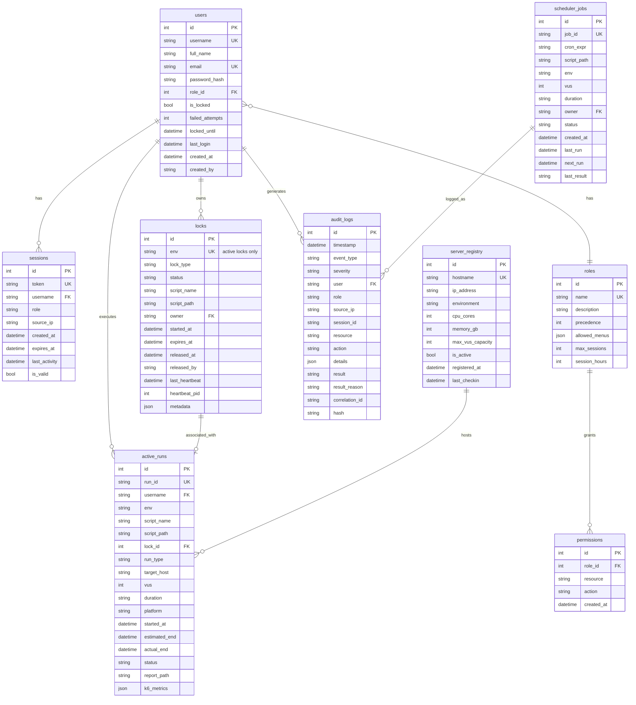

### 4.2 Complete Schema (SQL)

```sql
-- ============================================================
-- Growin PT Framework — Enterprise SQLite Schema
-- Version: 2.0.0
-- ============================================================

PRAGMA journal_mode = WAL;
PRAGMA foreign_keys = ON;
PRAGMA synchronous = NORMAL;

-- -----------------------------------------------------------
-- 1. ROLES
-- -----------------------------------------------------------
CREATE TABLE IF NOT EXISTS roles (
    id              INTEGER PRIMARY KEY AUTOINCREMENT,
    name            TEXT NOT NULL UNIQUE,
    description     TEXT,
    precedence      INTEGER NOT NULL DEFAULT 0,
    max_sessions    INTEGER NOT NULL DEFAULT 3,
    session_hours   INTEGER NOT NULL DEFAULT 8,
    allowed_menus   TEXT DEFAULT '[]',  -- JSON array of menu IDs
    created_at      DATETIME DEFAULT CURRENT_TIMESTAMP
);

INSERT OR IGNORE INTO roles (id, name, description, precedence, max_sessions, session_hours, allowed_menus)
VALUES
    (1, 'god',       'Full system access — bypass all checks',         100, 10, 24, '["*"]'),
    (2, 'admin',     'User management, lock control, full audit',       80,  5,  8,  '["*"]'),
    (3, 'operator',  'Execute PT, manage own locks, view own history',  50,  3,  8,  '["remote_runner","local_runner","scheduler_view","env_read","ai_slope","docker_read","dashboard","report_own"]'),
    (4, 'readonly',  'View status, audit own actions, masked env',      20,  2,  4,  '["dashboard","env_readonly","report_own","audit_own"]'),
    (5, 'guest',     'Public dashboard only',                           10,  1,  2,  '["dashboard_public"]')
    ON CONFLICT(id) DO NOTHING;

-- -----------------------------------------------------------
-- 2. USERS
-- -----------------------------------------------------------
CREATE TABLE IF NOT EXISTS users (
    id              INTEGER PRIMARY KEY AUTOINCREMENT,
    username        TEXT NOT NULL UNIQUE,
    full_name       TEXT,
    email           TEXT UNIQUE,
    password_hash   TEXT NOT NULL,
    role_id         INTEGER NOT NULL DEFAULT 3,
    is_locked       INTEGER NOT NULL DEFAULT 0,
    failed_attempts INTEGER NOT NULL DEFAULT 0,
    locked_until    DATETIME,
    last_login      DATETIME,
    created_at      DATETIME DEFAULT CURRENT_TIMESTAMP,
    created_by      TEXT,
    updated_at      DATETIME DEFAULT CURRENT_TIMESTAMP,
    FOREIGN KEY (role_id) REFERENCES roles(id)
);

-- God user — password must be changed on first login
INSERT OR IGNORE INTO users (id, username, full_name, role_id, password_hash, created_by)
VALUES (1, 'god', 'System Administrator', 1, '$2b$12$PLACEHOLDER_CHANGE_IMMEDIATELY', 'system');

CREATE TRIGGER IF NOT EXISTS trg_users_updated
AFTER UPDATE ON users
BEGIN
    UPDATE users SET updated_at = CURRENT_TIMESTAMP WHERE id = NEW.id;
END;

-- -----------------------------------------------------------
-- 3. PERMISSIONS
-- -----------------------------------------------------------
CREATE TABLE IF NOT EXISTS permissions (
    id          INTEGER PRIMARY KEY AUTOINCREMENT,
    role_id     INTEGER NOT NULL,
    resource    TEXT NOT NULL,
    action      TEXT NOT NULL,
    created_at  DATETIME DEFAULT CURRENT_TIMESTAMP,
    UNIQUE(role_id, resource, action),
    FOREIGN KEY (role_id) REFERENCES roles(id) ON DELETE CASCADE
);

-- Permission seed data
INSERT OR IGNORE INTO permissions (role_id, resource, action) VALUES
    -- Guest
    (5, 'dashboard', 'read_public'),
    -- Readonly
    (4, 'dashboard', 'read'),
    (4, 'env', 'read_masked'),
    (4, 'audit', 'read_own'),
    (4, 'report', 'read_own'),
    -- Operator
    (3, 'dashboard', 'read'),
    (3, 'pt_run', 'execute_local'),
    (3, 'pt_run', 'execute_remote'),
    (3, 'lock', 'acquire_own'),
    (3, 'lock', 'release_own'),
    (3, 'env', 'read'),
    (3, 'scheduler', 'read'),
    (3, 'scheduler', 'manage_own'),
    (3, 'ai_slope', 'execute'),
    (3, 'docker', 'read'),
    (3, 'report', 'read_own'),
    (3, 'audit', 'read_own'),
    -- Admin
    (2, 'dashboard', 'read'),
    (2, 'pt_run', 'execute_local'),
    (2, 'pt_run', 'execute_remote'),
    (2, 'pt_run', 'execute_any'),       -- can stop others' runs
    (2, 'lock', 'acquire_own'),
    (2, 'lock', 'release_own'),
    (2, 'lock', 'manage_all'),          -- force release
    (2, 'user', 'create'),
    (2, 'user', 'read'),
    (2, 'user', 'update'),
    (2, 'user', 'delete'),
    (2, 'user', 'lock'),
    (2, 'user', 'impersonate'),
    (2, 'env', 'read'),
    (2, 'env', 'write'),
    (2, 'scheduler', 'read'),
    (2, 'scheduler', 'manage_all'),
    (2, 'docker', 'read'),
    (2, 'docker', 'manage'),
    (2, 'audit', 'read_all'),
    (2, 'report', 'read_all'),
    (2, 'config', 'manage'),
    -- God (wildcard — checked separately in code, but explicit for documentation)
    (1, '*', '*');

-- -----------------------------------------------------------
-- 4. SESSIONS
-- -----------------------------------------------------------
CREATE TABLE IF NOT EXISTS sessions (
    id              INTEGER PRIMARY KEY AUTOINCREMENT,
    token           TEXT NOT NULL UNIQUE,
    username        TEXT NOT NULL,
    role            TEXT NOT NULL,
    source_ip       TEXT,
    created_at      DATETIME DEFAULT CURRENT_TIMESTAMP,
    expires_at      DATETIME NOT NULL,
    last_activity   DATETIME DEFAULT CURRENT_TIMESTAMP,
    is_valid        INTEGER NOT NULL DEFAULT 1,
    FOREIGN KEY (username) REFERENCES users(username)
);

CREATE INDEX IF NOT EXISTS idx_sessions_username ON sessions(username);
CREATE INDEX IF NOT EXISTS idx_sessions_token ON sessions(token);
CREATE INDEX IF NOT EXISTS idx_sessions_expires ON sessions(expires_at);

-- -----------------------------------------------------------
-- 5. LOCKS
-- -----------------------------------------------------------
CREATE TABLE IF NOT EXISTS locks (
    id              INTEGER PRIMARY KEY AUTOINCREMENT,
    env             TEXT NOT NULL,
    lock_type       TEXT DEFAULT 'exclusive',
    status          TEXT DEFAULT 'active',
    script_name     TEXT NOT NULL,
    script_path     TEXT,
    owner           TEXT NOT NULL,
    started_at      DATETIME DEFAULT CURRENT_TIMESTAMP,
    expires_at      DATETIME,
    released_at     DATETIME,
    released_by     TEXT,
    release_reason  TEXT,
    last_heartbeat  DATETIME DEFAULT CURRENT_TIMESTAMP,
    heartbeat_pid   INTEGER,
    metadata        TEXT DEFAULT '{}',
    FOREIGN KEY (owner) REFERENCES users(username)
);

-- Only one active lock per environment
CREATE UNIQUE INDEX IF NOT EXISTS idx_locks_env_active ON locks(env) WHERE status = 'active';
CREATE INDEX IF NOT EXISTS idx_locks_owner ON locks(owner);
CREATE INDEX IF NOT EXISTS idx_locks_status ON locks(status);
CREATE INDEX IF NOT EXISTS idx_locks_heartbeat ON locks(last_heartbeat);

-- -----------------------------------------------------------
-- 6. ACTIVE RUNS
-- -----------------------------------------------------------
CREATE TABLE IF NOT EXISTS active_runs (
    id              INTEGER PRIMARY KEY AUTOINCREMENT,
    run_id          TEXT NOT NULL UNIQUE,
    username        TEXT NOT NULL,
    env             TEXT NOT NULL,
    script_name     TEXT NOT NULL,
    script_path     TEXT,
    lock_id         INTEGER,
    run_type        TEXT NOT NULL,      -- local, remote_ssh, remote_gcp, scheduled
    target_host     TEXT,
    vus             INTEGER,
    duration        TEXT,
    platform        TEXT,
    started_at      DATETIME DEFAULT CURRENT_TIMESTAMP,
    estimated_end   DATETIME,
    actual_end      DATETIME,
    status          TEXT DEFAULT 'running',  -- running, completed, failed, stopped
    report_path     TEXT,
    k6_metrics      TEXT DEFAULT '{}',
    FOREIGN KEY (username) REFERENCES users(username),
    FOREIGN KEY (lock_id) REFERENCES locks(id)
);

CREATE INDEX IF NOT EXISTS idx_runs_username ON active_runs(username);
CREATE INDEX IF NOT EXISTS idx_runs_env ON active_runs(env);
CREATE INDEX IF NOT EXISTS idx_runs_status ON active_runs(status);

-- -----------------------------------------------------------
-- 7. AUDIT LOGS
-- -----------------------------------------------------------
CREATE TABLE IF NOT EXISTS audit_logs (
    id              INTEGER PRIMARY KEY AUTOINCREMENT,
    timestamp       DATETIME DEFAULT CURRENT_TIMESTAMP,
    event_type      TEXT NOT NULL,
    severity        TEXT DEFAULT 'info',
    username        TEXT,
    role            TEXT,
    source_ip       TEXT,
    session_id      TEXT,
    resource        TEXT,
    action          TEXT,
    details         TEXT DEFAULT '{}',
    result          TEXT,
    result_reason   TEXT,
    correlation_id  TEXT,
    row_hash        TEXT
);

CREATE INDEX IF NOT EXISTS idx_audit_time ON audit_logs(timestamp);
CREATE INDEX IF NOT EXISTS idx_audit_user ON audit_logs(username);
CREATE INDEX IF NOT EXISTS idx_audit_event ON audit_logs(event_type);
CREATE INDEX IF NOT EXISTS idx_audit_resource ON audit_logs(resource);
CREATE INDEX IF NOT EXISTS idx_audit_corr ON audit_logs(correlation_id);

-- -----------------------------------------------------------
-- 8. SCHEDULER JOBS
-- -----------------------------------------------------------
CREATE TABLE IF NOT EXISTS scheduler_jobs (
    id              INTEGER PRIMARY KEY AUTOINCREMENT,
    job_id          TEXT NOT NULL UNIQUE,
    cron_expr       TEXT NOT NULL,
    script_path     TEXT NOT NULL,
    env             TEXT NOT NULL DEFAULT 'LOCAL',
    vus             INTEGER,
    duration        TEXT,
    platform        TEXT,
    owner           TEXT NOT NULL,
    status          TEXT DEFAULT 'active',  -- active, paused, disabled
    created_at      DATETIME DEFAULT CURRENT_TIMESTAMP,
    updated_at      DATETIME DEFAULT CURRENT_TIMESTAMP,
    last_run        DATETIME,
    next_run        DATETIME,
    last_result     TEXT,
    FOREIGN KEY (owner) REFERENCES users(username)
);

CREATE INDEX IF NOT EXISTS idx_jobs_owner ON scheduler_jobs(owner);
CREATE INDEX IF NOT EXISTS idx_jobs_status ON scheduler_jobs(status);

-- -----------------------------------------------------------
-- 9. SERVER REGISTRY
-- -----------------------------------------------------------
CREATE TABLE IF NOT EXISTS server_registry (
    id                  INTEGER PRIMARY KEY AUTOINCREMENT,
    hostname            TEXT NOT NULL UNIQUE,
    ip_address          TEXT,
    environment         TEXT,
    cpu_cores           INTEGER,
    memory_gb           INTEGER,
    max_vus_capacity    INTEGER DEFAULT 5000,
    is_active           INTEGER NOT NULL DEFAULT 1,
    registered_at       DATETIME DEFAULT CURRENT_TIMESTAMP,
    last_checkin        DATETIME,
    metadata            TEXT DEFAULT '{}'
);

CREATE INDEX IF NOT EXISTS idx_servers_active ON server_registry(is_active);
```

### 4.3 Migration Strategy

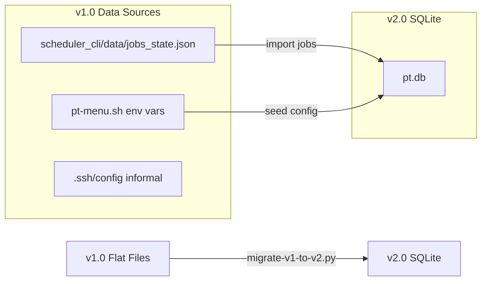

**Migration script (`migrate-v1-to-v2.py`):**
1. Creates `~/.pt/var/` directory
2. Initializes SQLite schema
3. Imports existing cron jobs from `jobs_state.json` into `scheduler_jobs` table
4. Creates default `god` user with password set from interactive prompt
5. Backs up original files to `~/.pt/backup/v1/`
6. Sets file permissions: `chmod 700 ~/.pt/`, `chmod 600 ~/.pt/var/pt.db`

**Rollback:** If migration fails, restore from `~/.pt/backup/v1/` and revert to `pt-menu.sh` v1.

---

## 5. Security Hardening Design

### 5.1 Threat Model

```
Threat Actor: Malicious Insider (engineer with shell access)
  → T1: Unauthorized PT execution on PROD
  → T2: Credential theft from env files
  → T3: Session hijacking from shared server
  → T4: Lock abuse (force-release to disrupt colleagues)

Threat Actor: External Attacker (gained limited server access)
  → T5: Brute force login via TUI
  → T6: Privilege escalation via sudo/suid abuse
  → T7: SQLite database tampering

Threat Actor: Accidental Engineer (well-meaning, mistakes)
  → T8: Running PT while colleague is testing same env
  → T9: Overwriting shared env configuration
  → T10: Leaving long-running test unattended
```

### 5.2 Countermeasures

| Threat | Severity | Countermeasure |
|--------|----------|----------------|
| T1 | Critical | RBAC — only `admin`/`god` can target PROD; operators restricted to INT/STG/LOCAL |
| T2 | Critical | Secret masking in env display; separate secrets file with `chmod 600` |
| T3 | High | Session tokens stored in `~/.pt/sessions/` (mode 700); token binding to TTY |
| T4 | Medium | Audit log all force-releases; alert on >3/hour; require justification comment |
| T5 | High | bcrypt cost 12 (~250ms/hash); account lockout after 5 failures; 15-min lockout |
| T6 | High | pt-menu.sh runs unprivileged; Docker commands via group membership (docker group) |
| T7 | High | DB file mode 600; directory mode 700; append-only audit via hash chain |
| T8 | Medium | Exclusive environment locks; deny-by-default with clear occupancy display |
| T9 | Medium | Env versioning (backup before edit); who-last-edited tracking |
| T10 | Low | Auto-expiry locks (default 2h max); heartbeat timeout kills stale runs |

### 5.3 SSH Security Hardening

**Current vulnerability:** `_ssh_pass()` returns `PT_SSH_PASS:-M@nsek.1234` — password visible in process list via `ps aux` when `sshpass` is used.

**Mitigation:**

```bash
# NEW: pt-ssh wrapper using SSH_ASKPASS
# 1. Store password in ~/.pt/secrets/ssh_pass (chmod 600)
# 2. Use SSH_ASKPASS with a custom helper that reads from the secrets file
# 3. sshpass is DEPRECATED — removed from all code paths

_pt_ssh_askpass() {
    cat ~/.pt/secrets/ssh_pass 2>/dev/null || echo ""
}
export SSH_ASKPASS="$(which pt-ssh-askpass)"
export DISPLAY="dummy:0"  # Required for SSH_ASKPASS to trigger

# All SSH commands use: ssh -o BatchMode=no -o PreferredAuthentications=password
# With SSH_ASKPASS set, ssh calls the helper non-interactively
```

**Alternative (recommended for production):** Migrate to SSH key-based auth with `ssh-agent`:
```bash
# pt-ssh-setup: Generate per-user SSH key, distribute public key to targets
# ~/.pt/ssh/id_ed25519 (chmod 600, encrypted with user password)
ssh -i ~/.pt/ssh/id_ed25519 -o PreferredAuthentications=publickey qa@target
```

### 5.4 Secret Management

```
~/.pt/
├── var/
│   └── pt.db              # SQLite (chmod 600)
├── sessions/
│   └── {user}.token       # Session cache (chmod 600)
├── secrets/
│   ├── ssh_pass           # SSH password (chmod 600, optional if using keys)
│   └── env_keys/          # Per-environment secret overrides
│       ├── INT.env        # (chmod 600)
│       └── PROD.env       # (chmod 600)
├── config/
│   └── pt.yml             # Framework configuration
└── logs/
    └── audit/
        └── 2026-05-29.db.gz
```

**Env file security:**
- `local.env` remains in project directory for shared non-secret config
- Secret values (passwords, API keys, tokens) moved to `~/.pt/secrets/env_keys/{ENV}.env`
- TUI loads: `local.env` (public) + `~/.pt/secrets/env_keys/{ENV}.env` (private) → merged view
- Secret values displayed as `***` in ENV editor for non-god users

### 5.5 Command Injection Prevention

```python
# BAD (current pattern — vulnerable):
run_cmd = f"cd Script/{suite_name} && ../../k6 run {file_sel} -e ENV={env_name}"
# If suite_name contains '; rm -rf /', game over.

# GOOD (parameterized execution):
import shlex
subprocess.run(
    ["k6", "run", script_path,
     "-e", f"ENV={env_name}",
     "-e", f"USER={vus}"],
    cwd=script_dir,
    capture_output=True
)
# All user inputs passed as array elements (no shell interpretation)
```

In bash TUI, use `printf '%q'` for quoting:
```bash
local safe_script
safe_script=$(printf '%q' "$script_name")
run_cmd="cd $(printf '%q' "$suite_dir") && k6 run $safe_script"
```

---

## 6. File Structure Proposal

### 6.1 Target Repository Layout

```
growin_performancetest/
│
├── README.md                          # Project documentation
├── AGENTS.md                          # AI agent instructions
├── go.mod                             # Go module (TUI)
├── go.sum                             # Go checksums
├── k6                                 # k6 binary (committed or symlinked)
│
├── pt-menu.sh                         # PRIMARY ENTRYPOINT — Bash TUI (v2)
│   # v2 adds: auth gate, lock check, resource check, audit calls
│
├── pt-dashboard.sh                    # NEW: Live execution dashboard
│
├── bin/                               # NEW: Python CLI tools (added to PATH)
│   ├── pt-auth                        # Authentication & session management
│   ├── pt-rbac                        # Permission checking
│   ├── pt-lock                        # Lock acquisition & release
│   ├── pt-heartbeat                   # Heartbeat daemon (background)
│   ├── pt-resmon                      # Resource monitoring
│   ├── pt-audit                       # Audit logging & alerting
│   ├── pt-usermgmt                    # User CRUD operations
│   ├── pt-registry                    # Active run tracking
│   ├── pt-dashboard                   # Dashboard data queries
│   └── pt-ssh-askpass                 # SSH password helper
│
├── lib/                               # NEW: Shared libraries
│   ├── python/
│   │   ├── pt_core/
│   │   │   ├── __init__.py
│   │   │   ├── auth.py               # Bcrypt hashing, session CRUD
│   │   │   ├── rbac.py               # Permission resolution
│   │   │   ├── lock.py               # Lock manager with heartbeat
│   │   │   ├── audit.py              # Audit logger with hash chain
│   │   │   ├── resmon.py             # Resource monitor (psutil)
│   │   │   ├── registry.py           # Active run registry
│   │   │   ├── database.py           # SQLite connection pool
│   │   │   ├── config.py             # Configuration loader
│   │   │   └── models.py             # SQLAlchemy/Pydantic models
│   │   ├── pt_core/scripts/
│   │   │   ├── migrate-v1-to-v2.py   # Database migration
│   │   │   ├── bootstrap.py          # First-time setup
│   │   │   └── health-check.py       # System health verification
│   │   └── requirements.txt           # Python deps: bcrypt, psutil, click
│   └── bash/
│       ├── pt_common.sh              # Shared bash functions (colors, helpers)
│       ├── pt_auth_client.sh         # Bash wrapper for pt-auth CLI
│       ├── pt_lock_client.sh         # Bash wrapper for pt-lock CLI
│       ├── pt_rbac_client.sh         # Bash wrapper for pt-rbac CLI
│       ├── pt_audit_client.sh        # Bash wrapper for pt-audit CLI
│       ├── pt_status_bar.sh          # Status bar renderer
│       └── pt_menu_def.sh            # Menu definition with RBAC filters
│
├── tui/                               # Go Bubble Tea TUI (enhanced)
│   ├── main.go
│   ├── model.go                       # + AuthState, LockState, Role
│   ├── update.go                      # + Auth flow, lock checks
│   ├── view.go
│   ├── go.mod
│   ├── actions/
│   │   ├── auth.go                    # NEW: Auth actions
│   │   ├── lock.go                    # NEW: Lock actions
│   │   ├── run.go                     # Execution with lock wrapping
│   │   ├── ssh.go
│   │   ├── docker.go
│   │   └── env.go
│   ├── panels/
│   │   ├── sidebar.go
│   │   ├── mainpanel.go
│   │   ├── preview.go
│   │   └── login.go                   # NEW: Login panel
│   ├── styles/
│   │   └── styles.go
│   └── utils/
│       ├── scanner.go
│       └── db.go                      # NEW: SQLite client
│
├── scheduler_cli/                     # Python Cron Scheduler (v2)
│   ├── main.py
│   ├── requirements.txt
│   ├── core/
│   │   ├── cron_manager.py            # Updated: SQLite backend
│   │   ├── job_runner.py              # NEW: Lock-aware execution
│   │   └── scheduler_daemon.py        # NEW: Background daemon
│   ├── ai/
│   │   └── slope_validator.py
│   └── data/
│       └── .gitkeep                   # DB now in ~/.pt/var/
│
├── docker-local-pt/                   # Local Docker stack
│   ├── docker-compose.yml
│   ├── configs/
│   │   ├── local.env                  # Non-secret config only
│   │   └── local.env.example
│   ├── mock-api/
│   ├── grafana/
│   ├── jenkins/
│   ├── scripts/
│   └── results/
│
├── docker/                            # Remote Docker configs
│   └── pt/
│
├── Script/                            # k6 test scripts
│   ├── {suite-name}/
│   │   ├── *.js                       # k6 scripts
│   │   ├── *.sh                       # Helper scripts
│   │   └── data/                      # Test data
│   └── ...
│
├── Helper/                            # Utility scripts
├── tools/                             # Additional tooling
├── artifacts/
│   └── reports/                       # Generated HTML reports
└── docs/                              # Documentation
    ├── ARCHITECTURE.md                # This document
    ├── SECURITY.md                    # Security procedures
    ├── USER_GUIDE.md                  # End-user documentation
    └── ADMIN_GUIDE.md                 # Administrator documentation
```

### 6.2 Directory Explanations

| Directory | Purpose | Language |
|-----------|---------|----------|
| `bin/` | User-facing CLI tools. All named `pt-*` for tab-completion discoverability. Symlinked to `~/bin/` or `/usr/local/bin/` during install. | Python 3.9+ |
| `lib/python/pt_core/` | Shared Python library. All `bin/pt-*` scripts import from here. Contains the authoritative business logic. | Python |
| `lib/bash/` | Bash include files sourced by `pt-menu.sh`. Thin wrappers that call `bin/pt-*` CLIs — keeps bash TUI logic clean. | Bash |
| `tui/` | Go Bubble Tea TUI. Calls same Python CLIs via `os/exec`. Can be promoted to primary interface after feature parity. | Go |
| `scheduler_cli/` | Python cron scheduler. Upgraded from flat-file JSON to SQLite. Gains lock awareness (won't fire if env occupied). | Python |
| `docker-local-pt/` | Unchanged Docker stack. Config split into public (`local.env`) and private (`~/.pt/secrets/`). | Docker |

---

## 7. Implementation Roadmap

### 7.1 Phase 1: Foundation (Weeks 1-2) — MVP

**Goal:** Authentication + basic RBAC on bash TUI. No lock system yet.

| Task | Complexity | Owner |
|------|-----------|-------|
| Design & create SQLite schema | Medium | Backend |
| Implement `pt-auth` (login, session, bcrypt) | Medium | Backend |
| Implement `pt-rbac` (permission checks) | Low | Backend |
| Create login screen in `pt-menu.sh` | Low | Frontend |
| Filter menus by role | Low | Frontend |
| Add `pt-usermgmt create` for god bootstrap | Low | Backend |
| Write `migrate-v1-to-v2.py` | Medium | Backend |
| Create `lib/bash/pt_*_client.sh` wrappers | Low | Frontend |
| **Deliverable:** `./pt-menu.sh` requires login, shows menus based on role | | |

**Risk:** Low. Parallel development possible. Fallback: skip login if `pt.db` not present.

### 7.2 Phase 2: Concurrency Protection (Weeks 3-4)

**Goal:** Execution locks prevent collisions. Heartbeat + stale cleanup.

| Task | Complexity | Owner |
|------|-----------|-------|
| Implement `pt-lock` (acquire/release/force) | High | Backend |
| Implement `pt-heartbeat` daemon | Medium | Backend |
| Implement `pt-registry` (active run tracking) | Medium | Backend |
| Enhance status bar with occupancy | Medium | Frontend |
| Add lock check to all execution paths in `pt-menu.sh` | Medium | Frontend |
| Add lock check to Go TUI `executeSelected()` | Low | Frontend |
| Stale lock scanner (cron or inotify) | Low | Backend |
| **Deliverable:** Only one PT per env; status bar shows owner/ETA | | |

**Risk:** Medium. Heartbeat daemon must be reliable — test crash scenarios thoroughly.

### 7.3 Phase 3: Observability & Audit (Weeks 5-6)

**Goal:** Full audit trail, resource monitoring, live dashboard.

| Task | Complexity | Owner |
|------|-----------|-------|
| Implement `pt-audit` (append-only logging) | Medium | Backend |
| Implement `pt-resmon` (CPU/RAM/Docker/k6) | Medium | Backend |
| Create `pt-dashboard.sh` (terminal dashboard) | Medium | Frontend |
| Add audit calls to all actions | Low | Frontend |
| Implement suspicious activity detection | Low | Backend |
| Secret masking in ENV editor | Low | Frontend |
| SSH key migration (deprecate sshpass) | Medium | Backend |
| **Deliverable:** All actions logged; dashboard shows live state; secrets masked** | | |

**Risk:** Low. Mostly additive features.

### 7.4 Phase 4: Go TUI Parity (Weeks 7-8)

**Goal:** Go TUI (`pt-tui`) achieves feature parity with bash TUI.

| Task | Complexity | Owner |
|------|-----------|-------|
| Login panel in Go TUI | Medium | Frontend |
| Lock state integration in Go model | Medium | Frontend |
| RBAC menu filtering in Go sidebar | Medium | Frontend |
| Resource bar in Go view | Low | Frontend |
| Dashboard panel in Go TUI | High | Frontend |
| **Deliverable:** `pt-tui` can fully replace `pt-menu.sh` | | |

**Risk:** Medium. Go TUI adoption depends on UX quality — need user feedback.

### 7.5 Phase 5: Enterprise Hardening (Weeks 9-10)

**Goal:** Production-grade security, SSO-ready, distributed-ready.

| Task | Complexity | Owner |
|------|-----------|-------|
| LDAP auth provider | High | Backend |
| Audit log SIEM export (Syslog/CEF) | Medium | Backend |
| WebSocket real-time dashboard | High | Backend |
| REST API (`pt-api`) | High | Backend |
| Queue mode for locks (FIFO) | Medium | Backend |
| Auto-scaling VU recommendations | Low | Backend |
| **Deliverable:** SSO integration; web dashboard; REST API** | | |

**Risk:** High. LDAP/WebSocket/REST are new subsystems — treat as separate projects.

### 7.6 Migration Timeline

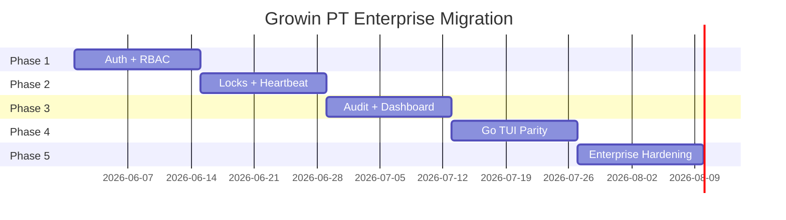

### 7.7 Backward Compatibility

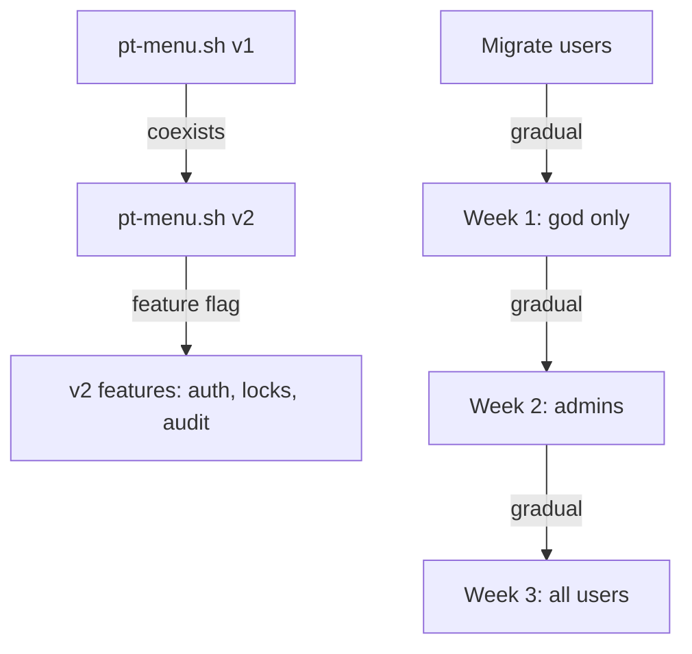

- **Week 1-2:** Only `god` account uses v2. Other users continue on v1 (unauthenticated).
- **Week 3-4:** Admins onboarded to v2.
- **Week 5+:** All users required to use v2. v1 script remains as `pt-menu-legacy.sh` for emergency.
- **Kill switch:** `PT_AUTH_BYPASS=1 ./pt-menu.sh` disables auth for disaster recovery (god-only).

---

## 8. Production-Grade Code Examples

### 8.1 Bash Login Screen

```bash
#!/usr/bin/env bash
# lib/bash/pt_auth_client.sh — Authentication client for pt-menu.sh

PT_VAR_DIR="${HOME}/.pt/var"
PT_SESSION_DIR="${HOME}/.pt/sessions"
PT_DB="${PT_VAR_DIR}/pt.db"

pt_auth_check_session() {
    local user="${USER}"
    local token_file="${PT_SESSION_DIR}/${user}.token"

    # Fast path: check token file exists and not expired
    if [[ -f "$token_file" ]]; then
        local expiry
        expiry=$(jq -r '.expires_at' "$token_file" 2>/dev/null || echo 0)
        local now
        now=$(date +%s)
        if [[ "$expiry" -gt "$now" ]]; then
            # Verify with Python backend (every 5 minutes only)
            local last_verify=$(stat -c %Y "$token_file" 2>/dev/null || echo 0)
            if [[ $((now - last_verify)) -gt 300 ]]; then
                pt-auth verify-session --quick --user "$user" --token-file "$token_file" >/dev/null 2>&1 && return 0
            else
                return 0
            fi
        fi
    fi
    return 1
}

pt_auth_login_prompt() {
    local max_attempts=3
    local attempts=0

    while [[ $attempts -lt $max_attempts ]]; do
        clear
        echo -e "${CYN}${BLD}"
        echo '┏━╸┏━┓┏━┓╻ ╻╻┏┓╻   ┏━┓╺┳╸   ┏━╸┏━┓┏━┓┏┳┓┏━╸╻ ╻┏━┓┏━┓╻┏ '
        echo '┃╺┓┣┳┛┃ ┃┃╻┃┃┃┗┫   ┣━┛ ┃    ┣╸ ┣┳┛┣━┫┃┃┃┣╸ ┃╻┃┃ ┃┣┳┛┣┻┓'
        echo '┗━┛╹┗╸┗━┛┗┻┛╹╹ ╹   ╹   ╹    ╹  ╹┗╸╹ ╹╹ ╹┗━╸┗┻┛┗━┛╹┗╸╹ ╹'
        echo -e "${RST}"
        echo -e "${BLD}           🔐  Authentication Required${RST}\n"

        local username password
        printf "  Username: "
        read -r username
        printf "  Password: "
        stty -echo
        read -r password
        stty echo
        echo ""

        local result
        result=$(pt-auth login --user "$username" --password "$password" 2>&1)
        local rc=$?

        if [[ $rc -eq 0 ]]; then
            local token
            token=$(echo "$result" | jq -r '.token')
            mkdir -p "$PT_SESSION_DIR"
            echo "$result" > "${PT_SESSION_DIR}/${username}.token"
            chmod 600 "${PT_SESSION_DIR}/${username}.token"
            echo -e "\n  ${GRN}✓ Welcome, ${username}!${RST}"
            sleep 1
            return 0
        else
            attempts=$((attempts + 1))
            local remaining=$((max_attempts - attempts))
            echo -e "\n  ${RED}✗ Login failed. Attempts remaining: ${remaining}${RST}"
            if [[ $remaining -eq 0 ]]; then
                echo -e "  ${RED}Account locked for 15 minutes.${RST}"
                sleep 2
                exit 1
            fi
            sleep 2
        fi
    done
}

pt_auth_get_role() {
    local token_file="${PT_SESSION_DIR}/${USER}.token"
    [[ -f "$token_file" ]] && jq -r '.role' "$token_file" 2>/dev/null || echo "guest"
}

pt_auth_logout() {
    pt-auth logout --user "$USER" 2>/dev/null
    rm -f "${PT_SESSION_DIR}/${USER}.token"
    echo -e "  ${YLW}Logged out.${RST}"
}
```

### 8.2 Python pt-auth CLI

```python
#!/usr/bin/env python3
"""pt-auth — Authentication and session management for Growin PT Framework."""

import os
import sys
import hashlib
import secrets
import sqlite3
import json
from datetime import datetime, timedelta
from pathlib import Path

import bcrypt
import click

PT_DIR = Path.home() / ".pt"
DB_PATH = PT_DIR / "var" / "pt.db"
SESSION_DIR = PT_DIR / "sessions"

# Ensure directories exist
PT_DIR.mkdir(mode=0o700, exist_ok=True)
(PT_DIR / "var").mkdir(mode=0o700, exist_ok=True)
SESSION_DIR.mkdir(mode=0o700, exist_ok=True)


def get_db() -> sqlite3.Connection:
    conn = sqlite3.connect(str(DB_PATH), timeout=10)
    conn.row_factory = sqlite3.Row
    return conn


@click.group()
def cli():
    """Growin PT Authentication Manager."""
    pass


@cli.command()
@click.option("--user", required=True)
@click.option("--password", required=True, hide_input=True)
def login(user: str, password: str):
    """Authenticate user and create session."""
    conn = get_db()
    cursor = conn.cursor()

    cursor.execute(
        "SELECT password_hash, role_id, is_locked, failed_attempts, locked_until FROM users WHERE username = ?",
        (user,)
    )
    row = cursor.fetchone()

    if not row:
        click.echo(json.dumps({"status": "error", "message": "Invalid credentials"}), err=True)
        sys.exit(1)

    if row["is_locked"]:
        if row["locked_until"] and datetime.fromisoformat(row["locked_until"]) > datetime.now():
            click.echo(json.dumps({"status": "error", "message": "Account locked until " + row["locked_until"]}), err=True)
            sys.exit(1)
        # Lock expired, auto-unlock
        cursor.execute("UPDATE users SET is_locked = 0, failed_attempts = 0, locked_until = NULL WHERE username = ?", (user,))

    if not bcrypt.checkpw(password.encode(), row["password_hash"].encode()):
        # Increment failed attempts
        cursor.execute(
            "UPDATE users SET failed_attempts = failed_attempts + 1 WHERE username = ?",
            (user,)
        )
        cursor.execute(
            "SELECT failed_attempts FROM users WHERE username = ?",
            (user,)
        )
        attempts = cursor.fetchone()["failed_attempts"]

        if attempts >= 5:
            lock_until = datetime.now() + timedelta(minutes=15)
            cursor.execute(
                "UPDATE users SET is_locked = 1, locked_until = ? WHERE username = ?",
                (lock_until.isoformat(), user)
            )
            conn.commit()
            click.echo(json.dumps({"status": "error", "message": f"Too many attempts. Locked until {lock_until}"}), err=True)
            sys.exit(1)

        conn.commit()
        click.echo(json.dumps({"status": "error", "message": f"Invalid credentials ({5 - attempts} attempts remaining)"}), err=True)
        sys.exit(1)

    # Success: reset failed attempts
    cursor.execute(
        "UPDATE users SET failed_attempts = 0, last_login = ? WHERE username = ?",
        (datetime.now().isoformat(), user)
    )

    # Get role name
    cursor.execute("SELECT name FROM roles WHERE id = ?", (row["role_id"],))
    role = cursor.fetchone()["name"]

    # Create session
    token = secrets.token_hex(32)
    expires = datetime.now() + timedelta(hours=8)

    cursor.execute(
        """INSERT INTO sessions (token, username, role, source_ip, expires_at)
           VALUES (?, ?, ?, ?, ?)""",
        (token, user, role, os.environ.get("SSH_CONNECTION", "").split()[0] if os.environ.get("SSH_CONNECTION") else "local", expires.isoformat())
    )
    conn.commit()

    result = {
        "status": "success",
        "token": token,
        "user": user,
        "role": role,
        "expires_at": int(expires.timestamp())
    }
    click.echo(json.dumps(result))


@cli.command()
@click.option("--user", required=True)
@click.option("--token-file", required=True)
def verify_session(user: str, token_file: str):
    """Quick session verification."""
    if not os.path.exists(token_file):
        click.echo(json.dumps({"status": "invalid"}), err=True)
        sys.exit(1)

    with open(token_file) as f:
        data = json.load(f)

    token = data.get("token")
    conn = get_db()
    cursor = conn.cursor()
    cursor.execute(
        """SELECT username, role, expires_at, is_valid FROM sessions
           WHERE token = ? AND username = ? AND is_valid = 1""",
        (token, user)
    )
    row = cursor.fetchone()

    if not row:
        click.echo(json.dumps({"status": "invalid"}), err=True)
        sys.exit(1)

    expires = datetime.fromisoformat(row["expires_at"])
    if datetime.now() > expires:
        click.echo(json.dumps({"status": "expired"}), err=True)
        sys.exit(1)

    # Update last activity
    cursor.execute(
        "UPDATE sessions SET last_activity = ? WHERE token = ?",
        (datetime.now().isoformat(), token)
    )
    conn.commit()

    click.echo(json.dumps({
        "status": "valid",
        "user": row["username"],
        "role": row["role"]
    }))


@cli.command()
def bootstrap():
    """First-time setup — create god user."""
    if DB_PATH.exists():
        click.echo("Database already exists. Run migrate-v1-to-v2.py instead.")
        sys.exit(1)

    click.echo("=== Growin PT Bootstrap ===")
    click.echo("Creating database and god user...")

    # Initialize schema (simplified — full schema in docs)
    conn = get_db()
    with open("lib/python/pt_core/schema.sql") as f:
        conn.executescript(f.read())

    username = click.prompt("God username", default="god")
    password = click.prompt("God password", hide_input=True, confirmation_prompt=True)
    full_name = click.prompt("Full name", default="System Administrator")

    password_hash = bcrypt.hashpw(password.encode(), bcrypt.gensalt(rounds=12)).decode()

    conn.execute(
        "INSERT INTO users (username, full_name, role_id, password_hash, created_by) VALUES (?, ?, 1, ?, 'bootstrap')",
        (username, full_name, password_hash)
    )
    conn.commit()

    click.echo(f"✓ Created god user '{username}'")
    click.echo(f"Database: {DB_PATH}")


if __name__ == "__main__":
    cli()
```

### 8.3 Lock Manager (Python)

```python
#!/usr/bin/env python3
"""pt-lock — Distributed lock manager for Growin PT Framework."""

import os
import sys
import json
import sqlite3
import signal
import time
from datetime import datetime, timedelta
from pathlib import Path

import click

PT_DIR = Path.home() / ".pt"
DB_PATH = PT_DIR / "var" / "pt.db"
HEARTBEAT_INTERVAL = 15  # seconds
STALE_TIMEOUT = 60       # seconds


def get_db() -> sqlite3.Connection:
    conn = sqlite3.connect(str(DB_PATH), timeout=5)
    conn.row_factory = sqlite3.Row
    conn.execute("PRAGMA journal_mode = WAL")
    return conn


@click.group()
def cli():
    """Lock manager for PT environment coordination."""
    pass


@cli.command()
@click.option("--env", required=True, help="Environment name (INT, STG, PROD, LOCAL)")
@click.option("--script", required=True, help="Script being executed")
@click.option("--user", default=lambda: os.environ.get("USER", "unknown"))
@click.option("--duration", default="30m", help="Expected duration (e.g., 30m, 2h)")
@click.option("--vus", type=int, default=1)
@click.option("--force", is_flag=True, help="Force acquire (god/admin only)")
def acquire(env: str, script: str, user: str, duration: str, vus: int, force: bool):
    """Acquire a lock on an environment."""
    conn = get_db()
    cursor = conn.cursor()

    # Check for existing active lock
    cursor.execute(
        "SELECT * FROM locks WHERE env = ? AND status = 'active'",
        (env,)
    )
    existing = cursor.fetchone()

    if existing:
        # Check if stale
        last_hb = datetime.fromisoformat(existing["last_heartbeat"])
        if datetime.now() - last_hb > timedelta(seconds=STALE_TIMEOUT):
            cursor.execute(
                "UPDATE locks SET status = 'stale' WHERE id = ?",
                (existing["id"],)
            )
            conn.commit()
        elif not force:
            click.echo(json.dumps({
                "status": "denied",
                "reason": "lock_exists",
                "owner": existing["owner"],
                "script": existing["script_name"],
                "started": existing["started_at"],
                "heartbeat": existing["last_heartbeat"]
            }))
            sys.exit(1)
        else:
            # Force release
            cursor.execute(
                "UPDATE locks SET status = 'force_released', released_at = ?, released_by = ? WHERE id = ?",
                (datetime.now().isoformat(), f"force:{user}", existing["id"])
            )

    # Parse duration
    duration_min = _parse_duration(duration)
    expires = datetime.now() + timedelta(minutes=duration_min)

    # Insert new lock
    cursor.execute(
        """INSERT INTO locks (env, script_name, owner, expires_at, metadata)
           VALUES (?, ?, ?, ?, ?)""",
        (env, script, user, expires.isoformat(), json.dumps({"vus": vus, "duration": duration}))
    )
    lock_id = cursor.lastrowid
    conn.commit()

    # Start heartbeat daemon
    heartbeat_pid = _start_heartbeat(lock_id)

    cursor.execute(
        "UPDATE locks SET heartbeat_pid = ? WHERE id = ?",
        (heartbeat_pid, lock_id)
    )
    conn.commit()

    click.echo(json.dumps({
        "status": "acquired",
        "lock_id": lock_id,
        "env": env,
        "expires": int(expires.timestamp())
    }))


@cli.command()
@click.option("--lock-id", type=int, required=True)
def release(lock_id: int):
    """Release a lock."""
    conn = get_db()
    cursor = conn.cursor()

    cursor.execute("SELECT heartbeat_pid FROM locks WHERE id = ?", (lock_id,))
    row = cursor.fetchone()

    if row and row["heartbeat_pid"]:
        try:
            os.kill(row["heartbeat_pid"], signal.SIGTERM)
        except ProcessLookupError:
            pass

    cursor.execute(
        """UPDATE locks SET status = 'released', released_at = ?
           WHERE id = ? AND status = 'active'""",
        (datetime.now().isoformat(), lock_id)
    )
    conn.commit()

    click.echo(json.dumps({"status": "released", "lock_id": lock_id}))


@cli.command()
@click.option("--env", help="Filter by environment")
def status(env: str = None):
    """Show current lock status."""
    conn = get_db()
    cursor = conn.cursor()

    if env:
        cursor.execute("SELECT * FROM locks WHERE env = ? ORDER BY started_at DESC LIMIT 5", (env,))
    else:
        cursor.execute("SELECT * FROM locks WHERE status = 'active' ORDER BY started_at")

    locks = [dict(row) for row in cursor.fetchall()]
    click.echo(json.dumps({"locks": locks}))


def _parse_duration(d: str) -> int:
    """Parse '30m', '2h', '1h30m' to minutes."""
    import re
    total = 0
    if m := re.search(r'(\d+)h', d):
        total += int(m.group(1)) * 60
    if m := re.search(r'(\d+)m', d):
        total += int(m.group(1))
    return total or 30


def _start_heartbeat(lock_id: int) -> int:
    """Fork heartbeat daemon process. Returns PID."""
    pid = os.fork()
    if pid == 0:
        # Child process: heartbeat daemon
        _heartbeat_daemon(lock_id)
        sys.exit(0)
    return pid


def _heartbeat_daemon(lock_id: int):
    """Run as background process, updating heartbeat timestamp."""
    def handle_sigterm(signum, frame):
        sys.exit(0)
    signal.signal(signal.SIGTERM, handle_sigterm)

    while True:
        try:
            conn = sqlite3.connect(str(DB_PATH), timeout=5)
            conn.execute(
                "UPDATE locks SET last_heartbeat = ? WHERE id = ? AND status = 'active'",
                (datetime.now().isoformat(), lock_id)
            )
            conn.commit()
            conn.close()
        except Exception:
            pass
        time.sleep(HEARTBEAT_INTERVAL)


if __name__ == "__main__":
    cli()
```

### 8.4 Enhanced Status Bar Renderer (Bash)

```bash
#!/usr/bin/env bash
# lib/bash/pt_status_bar.sh — Real-time status bar for pt-menu.sh

PT_STATUS_BAR_RENDER() {
    local term_w
    term_w=$(tput cols 2>/dev/null || echo 80)

    # Gather data
    local ip env_tag vus dur docker_ct role user
    ip=$(get_local_ip)
    env_tag=$(env_val ENV "—")
    vus=$(env_val K6_USERS "—")
    dur=$(env_val DURATION "—")
    docker_ct=$(docker ps --format "{{.Names}}" 2>/dev/null | grep -cE "pt-|k6" || echo 0)
    user="${PT_USER:-$USER}"
    role="${PT_ROLE:-unknown}"

    # Check lock status via pt-lock
    local lock_info lock_status lock_owner lock_script lock_eta
    lock_info=$(pt-lock status --env "$env_tag" 2>/dev/null || echo '{}')
    lock_status=$(echo "$lock_info" | jq -r '.locks[0].status // "free"')
    lock_owner=$(echo "$lock_info" | jq -r '.locks[0].owner // ""')
    lock_script=$(echo "$lock_info" | jq -r '.locks[0].script_name // ""')

    # Determine status color and text
    local status_color="$GRN"
    local status_text="Available"

    if [[ "$lock_status" == "active" ]]; then
        if [[ "$lock_owner" == "$user" ]]; then
            status_color="$RED"
            status_text="PT ACTIVE | ${lock_script}"
        else
            status_color="$YLW"
            status_text="OCCUPIED | ${lock_script} | By: ${lock_owner}"
        fi
    fi

    # Resource info (quick check)
    local cpu_mem
    cpu_mem=$(pt-resmon quick 2>/dev/null || echo '{}')
    local cpu_pct=$(echo "$cpu_mem" | jq -r '.cpu // "?"')
    local mem_pct=$(echo "$cpu_mem" | jq -r '.memory // "?"')

    # Build status bar
    local sep="${DIM}│${RST}"
    echo -e "  ${DIM}IP:${RST} ${ip}  ${sep}  ${YLW}ENV:${RST} ${env_tag}  ${sep}  ${YLW}VUs:${RST} ${vus}  ${sep}  ${YLW}Dur:${RST} ${dur}  ${sep}  ${status_color}${status_text}${RST}"
    echo -e "  ${DIM}User:${RST} ${user} (${role})  ${sep}  ${DIM}CPU:${RST} ${cpu_pct}%  ${sep}  ${DIM}Mem:${RST} ${mem_pct}%  ${sep}  ${GRN}Docker: ${docker_ct} up${RST}"
    echo -e "  ${DIM}$(printf '─%.0s' $(seq 1 $(( term_w - 4 ))))${RST}\n"
}
```

### 8.5 RBAC Middleware (Python)

```python
#!/usr/bin/env python3
"""pt-rbac — Role-based access control for Growin PT Framework."""

import sqlite3
import json
from pathlib import Path
from functools import wraps

PT_DIR = Path.home() / ".pt"
DB_PATH = PT_DIR / "var" / "pt.db"


class RBACError(Exception):
    pass


class RBAC:
    def __init__(self, db_path: str = None):
        self.db_path = db_path or str(DB_PATH)

    def _get_conn(self):
        conn = sqlite3.connect(self.db_path)
        conn.row_factory = sqlite3.Row
        return conn

    def check(self, username: str, resource: str, action: str) -> bool:
        """Check if user has permission for resource+action."""
        conn = self._get_conn()
        cursor = conn.cursor()

        # God wildcard check
        cursor.execute("""
            SELECT r.name FROM users u
            JOIN roles r ON u.role_id = r.id
            WHERE u.username = ? AND r.name = 'god'
        """, (username,))
        if cursor.fetchone():
            return True

        # Explicit permission check
        cursor.execute("""
            SELECT p.action FROM users u
            JOIN roles r ON u.role_id = r.id
            JOIN permissions p ON r.id = p.role_id
            WHERE u.username = ? AND (p.resource = ? OR p.resource = '*')
            AND (p.action = ? OR p.action = '*')
        """, (username, resource, action))

        return cursor.fetchone() is not None

    def get_role(self, username: str) -> str:
        conn = self._get_conn()
        cursor = conn.cursor()
        cursor.execute("""
            SELECT r.name FROM users u
            JOIN roles r ON u.role_id = r.id
            WHERE u.username = ?
        """, (username,))
        row = cursor.fetchone()
        return row["name"] if row else "guest"

    def get_allowed_menus(self, username: str) -> list:
        """Return list of menu IDs the user can see."""
        conn = self._get_conn()
        cursor = conn.cursor()
        cursor.execute("""
            SELECT r.allowed_menus FROM users u
            JOIN roles r ON u.role_id = r.id
            WHERE u.username = ?
        """, (username,))
        row = cursor.fetchone()
        if not row:
            return []
        menus = json.loads(row["allowed_menus"] or "[]")
        if "*" in menus:
            return ["*"]  # All menus
        return menus

    def require_permission(self, resource: str, action: str):
        """Decorator for Python functions requiring permission."""
        def decorator(func):
            @wraps(func)
            def wrapper(*args, **kwargs):
                # Extract username from kwargs or use current user
                username = kwargs.get("username") or kwargs.get("user")
                if not username:
                    raise RBACError("Username required for permission check")

                if not self.check(username, resource, action):
                    raise RBACError(
                        f"Permission denied: {username} lacks {action} on {resource}"
                    )
                return func(*args, **kwargs)
            return wrapper
        return decorator


# CLI interface
if __name__ == "__main__":
    import click
    rbac = RBAC()

    @click.group()
    def cli():
        pass

    @cli.command()
    @click.option("--user", required=True)
    @click.option("--resource", required=True)
    @click.option("--action", required=True)
    def check(user, resource, action):
        result = rbac.check(user, resource, action)
        click.echo(json.dumps({"permitted": result}))

    @cli.command()
    @click.option("--user", required=True)
    def role(user):
        click.echo(json.dumps({"role": rbac.get_role(user)}))

    @cli.command()
    @click.option("--user", required=True)
    def menus(user):
        click.echo(json.dumps({"menus": rbac.get_allowed_menus(user)}))

    cli()
```

---

## 9. UX/TUI Improvement Specifications

### 9.1 Design Inspirations

| Tool | Element to Adapt |
|------|-----------------|
| **lazydocker** | Panel layout (sidebar + main + logs), color-coded status |
| **k9s** | Real-time resource view, quick actions via keybinds |
| **lazygit** | Contextual help bar, clean information density |
| **btop** | Gradient status colors, sparkline history |
| **htop** | Process tree, sortable columns, signal sending |

### 9.2 Proposed UX Enhancements

#### Keyboard Navigation (Bash TUI with fzf)

```
Global Keys (always active):
  Ctrl+L    — Refresh screen
  Ctrl+D    — Dashboard (if authorized)
  Ctrl+U    — User management (admin/god only)
  Ctrl+A    — Audit log (admin/god only)
  Ctrl+Q    — Quit
  ?         — Help overlay

Menu Navigation:
  ↑/↓       — Navigate menu
  Enter     — Select
  ESC       — Back / Cancel
  /         — Search/filter current list

Quick Actions (main menu shortcuts):
  1         — Remote Runner
  2         — Local Runner
  3         — Scheduler (if authorized)
  4         — AI Slope (if authorized)
  5         — ENV Editor (if authorized)
  6         — Docker Stack (if authorized)
```

#### Color System

```bash
# Status colors — semantic meaning consistent across all views
STATUS_HEALTHY="\033[38;5;82m"     # Bright green
STATUS_CAUTION="\033[38;5;220m"    # Gold/Yellow
STATUS_DEGRADED="\033[38;5;208m"   # Orange
STATUS_CRITICAL="\033[38;5;196m"   # Red
STATUS_UNKNOWN="\033[38;5;245m"    # Grey
STATUS_INFO="\033[38;5;39m"        # Cyan
```

#### Execution Timeline (Dashboard)

```
Timeline (last 24h):
00:00    06:00    12:00    18:00    24:00
|        |        |        |        |
[████]   [░]      [████████] [██]
 Rafi     -        Maul       Budi
 BP100              BP120      BP099
 INT                STG        LOCAL
```

### 9.3 Fuzzy Search

All list selections (`fzf`) gain these enhancements:

```bash
# Enhanced fzf with preview and status
pick_fzf_enhanced() {
    local prompt="$1"; shift
    printf '%s\n' "$@" | fzf \
        --prompt="$prompt " \
        --header="↑↓ navigate  ↵ select  ESC=back  /=search  ?=help" \
        --height=~70% \
        --border=rounded \
        --layout=reverse \
        --preview='pt-preview {}' \  # NEW: Context-aware preview
        --preview-window=right:40% \
        --color='prompt:cyan,pointer:yellow,fg+:bright-green,header:240,border:cyan,hl:yellow,hl+:bright-yellow,preview-bg:235' \
        --no-info --ansi
}
```

Preview script (`pt-preview`) shows:
- For scripts: Last run result, VU count, duration, owner
- For envs: Lock status, active user, resource usage
- For Docker containers: Status, ports, uptime

---

## 10. Advanced Features — Future Roadmap

### 10.1 REST API (`pt-api`)

```python
# FastAPI-based REST API for external integrations
from fastapi import FastAPI, Depends, HTTPException

app = FastAPI(title="Growin PT API")

@app.get("/api/v1/status")
async def get_status():
    """Current lock status, resource usage, active runs."""
    return {
        "locks": registry.get_active_locks(),
        "resources": resmon.get_current(),
        "active_runs": registry.get_active_runs()
    }

@app.post("/api/v1/locks/{env}/acquire")
async def acquire_lock(env: str, req: LockRequest, user: User = Depends(get_current_user)):
    """Acquire lock via API (for CI/CD integration)."""
    if not rbac.check(user.username, "pt_run", "execute_remote"):
        raise HTTPException(403, "Permission denied")
    result = lock_manager.acquire(env, req.script, user.username, req.duration)
    audit.log("lock_acquire", user=user, resource=env, result=result.status)
    return result

@app.get("/api/v1/audit")
async def get_audit(start: datetime, end: datetime, user: User = Depends(get_current_user)):
    """Query audit logs (admin/god only)."""
    if not rbac.check(user.username, "audit", "read_all"):
        raise HTTPException(403, "Permission denied")
    return audit.query(start, end)
```

### 10.2 WebSocket Real-Time Dashboard

```python
# WebSocket endpoint for live dashboard updates
@app.websocket("/ws/dashboard")
async def dashboard_ws(websocket: WebSocket):
    await websocket.accept()
    while True:
        data = {
            "timestamp": datetime.utcnow().isoformat(),
            "locks": await registry.get_active_locks(),
            "resources": await resmon.get_current(),
            "runs": await registry.get_active_runs()
        }
        await websocket.send_json(data)
        await asyncio.sleep(5)
```

### 10.3 Slack/Discord Notifications

```python
# pt-notify — Alert on events
NOTIFICATION_RULES = {
    "pt_start": {
        "channels": ["#pt-alerts"],
        "message": "🟢 PT Started: {script} on {env} by {user} ({vus} VUs, {duration})"
    },
    "pt_end": {
        "channels": ["#pt-alerts"],
        "message": "{'🟢' if result == 'success' else '🔴'} PT Ended: {script} on {env} — {result} ({elapsed})"
    },
    "lock_force": {
        "channels": ["#pt-alerts", "#pt-admins"],
        "message": "⚠️ Force Lock: {user} force-released {env} from {previous_owner}"
    },
    "resource_critical": {
        "channels": ["#pt-admins"],
        "message": "🔴 CRITICAL: {hostname} health score {score}/100 — CPU {cpu}%, Mem {mem}%"
    }
}
```

### 10.4 Queue Orchestration

```python
# FIFO queue for popular environments
class LockQueue:
    def enqueue(self, env: str, user: str, script: str, priority: int = 0) -> int:
        """Add to queue. Returns queue position."""
        pass

    def dequeue(self, env: str) -> Optional[QueueEntry]:
        """Get next in line when lock frees."""
        pass

    def notify(self, position: int):
        """Notify user when they're next or lock is available."""
        pass
```

### 10.5 Kubernetes Future Support

```yaml
# Future: k6-operator integration
apiVersion: k6.io/v1alpha1
kind: K6
metadata:
  name: growin-pt-test
  namespace: pt-namespace
spec:
  parallelism: 4
  script:
    configMap:
      name: bp120-script
  arguments: "-e ENV=STG -e VUS=1000 -e DURATION=10m"
  runner:
    resources:
      limits:
        cpu: "2"
        memory: "4Gi"
```

The framework would:
1. Acquire lock via `pt-lock` (same SQLite DB mounted as PVC)
2. Submit `K6` CRD to Kubernetes API
3. Monitor pod status via `kubectl` / Kubernetes Python client
4. Release lock when `K6` job completes

### 10.6 Distributed Coordinator

For multi-server PT infrastructure:

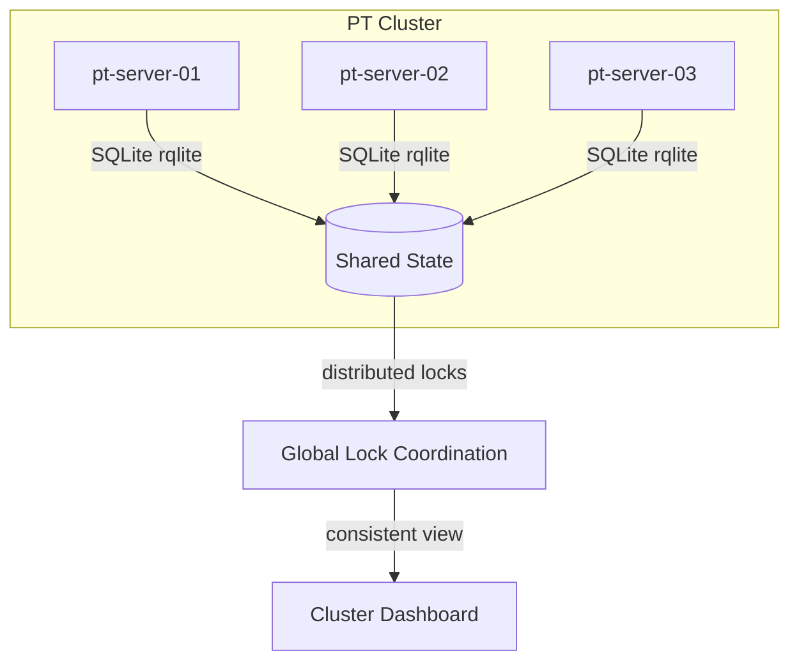

Replace local SQLite with [rqlite](https://github.com/rqlite/rqlite) (distributed SQLite) for lock consistency across servers. Zero application code changes — just different connection string.

---

## 11. Architecture Decision Records (ADRs)

### ADR-001: SQLite over PostgreSQL
**Status:** Accepted  
**Context:** Need transactional storage for locks, sessions, audit. Shared PT servers may not have PostgreSQL.  
**Decision:** Use SQLite with WAL mode. Single `~/.pt/var/pt.db` file per server.  
**Consequences:** Zero infra overhead; sufficient for ~50 concurrent users; rqlite path available for multi-server.  

### ADR-002: Python CLI tools over pure Bash
**Status:** Accepted  
**Context:** Auth needs bcrypt, audit needs structured storage, locks need concurrency-safe access.  
**Decision:** Core business logic in Python CLI tools (`pt-*`). Bash TUI (`pt-menu.sh`) is thin wrapper.  
**Consequences:** Python 3.9+ required (available on all modern Linux); bash TUI stays simple; Go TUI calls same CLIs.  

### ADR-003: Keep bash TUI as primary interface
**Status:** Accepted  
**Context:** Go TUI exists but is experimental; engineers are accustomed to bash+fzf workflow.  
**Decision:** Bash TUI remains primary for v2. Go TUI developed to parity, then promoted based on user feedback.  
**Consequences:** Feature development must update both paths; bash TUI gains auth/lock/audit integration.  

### ADR-004: File-based sessions over Redis
**Status:** Accepted  
**Context:** Session storage needs to survive process restarts; Redis adds infrastructure dependency.  
**Decision:** SQLite sessions table (authoritative) + file cache (`~/.pt/sessions/`) for fast auth checks.  
**Consequences:** <50ms auth check; no network dependency; sessions tied to server (not shared across cluster).  

### ADR-005: Heartbeat over lease-based locks
**Status:** Accepted  
**Context:** Need to detect crashed PT processes and auto-release locks.  
**Decision:** Heartbeat daemon (PID-tracked) with 60s stale timeout.  
**Consequences:** Reliable crash detection; requires fork() capability; works on all Linux systems.  

---

## 12. Appendices

### Appendix A: Environment Variables

| Variable | Description | Example |
|----------|-------------|---------|
| `PT_AUTH_BYPASS` | Emergency auth bypass (god only) | `1` |
| `PT_DB_PATH` | Override SQLite database path | `/shared/pt/pt.db` |
| `PT_SESSION_TIMEOUT` | Session expiry in hours | `8` |
| `PT_HEARTBEAT_INTERVAL` | Lock heartbeat seconds | `15` |
| `PT_STALE_TIMEOUT` | Lock stale detection seconds | `60` |
| `PT_SSH_KEY` | SSH private key path | `~/.pt/ssh/id_ed25519` |
| `PT_LOG_LEVEL` | Audit log verbosity | `info` |
| `PT_NOTIFY_WEBHOOK` | Slack/Discord webhook URL | `https://hooks.slack.com/...` |

### Appendix B: Operational Runbooks

**Runbook: Lock Emergency Release**
```bash
# When a user's session dies and lock remains
$ pt-lock status --env INT
# Shows: active, owner=dead_user, heartbeat=5min ago

# Option 1: Admin force release
$ pt-rbac check --user $USER --resource lock --action manage_all
$ pt-lock release --env INT --force --reason "Session timeout, user unresponsive"

# Option 2: God direct database edit
$ sqlite3 ~/.pt/var/pt.db "UPDATE locks SET status='force_released' WHERE env='INT';"

# Audit trail automatically captures force release with reason
```

**Runbook: User Lockout Recovery**
```bash
# Unlock account after failed login attempts
$ pt-usermgmt unlock --username budi
# Or direct SQL:
$ sqlite3 ~/.pt/var/pt.db "UPDATE users SET is_locked=0, failed_attempts=0 WHERE username='budi';"
```

**Runbook: Database Backup/Restore**
```bash
# Hot backup (SQLite WAL mode allows this)
$ cp ~/.pt/var/pt.db ~/.pt/backup/pt-$(date +%Y%m%d).db
$ cp ~/.pt/var/pt.db-wal ~/.pt/backup/pt-$(date +%Y%m%d).db-wal

# Restore
$ cp ~/.pt/backup/pt-20260529.db ~/.pt/var/pt.db
```

### Appendix C: Glossary

| Term | Definition |
|------|------------|
| **PT** | Performance Test |
| **VU** | Virtual User (k6 load generation unit) |
| **BP** | Business Process (test scenario identifier, e.g., BP001) |
| **ENV** | Target environment (LOCAL, INT, STG, PROD) |
| **Mock API** | Local Docker container simulating backend APIs |
| **Lock** | Exclusive permission to execute PT on an environment |
| **Heartbeat** | Periodic signal proving a PT process is still alive |
| **Stale Lock** | Lock whose heartbeat has timed out (owner likely crashed) |
| **God** | Super-administrator role with all permissions |
| **WAL** | Write-Ahead Logging (SQLite journaling mode) |

---

## Document Control

| Version | Date | Author | Changes |
|---------|------|--------|---------|
| 1.0 | 2026-05-29 | Platform Engineering | Initial RFC — complete architecture specification |

---

*End of Document*
