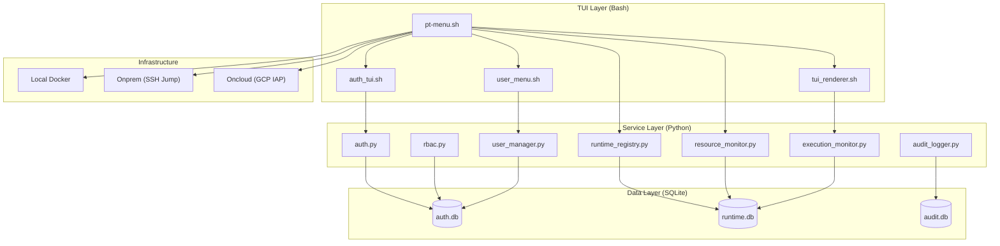
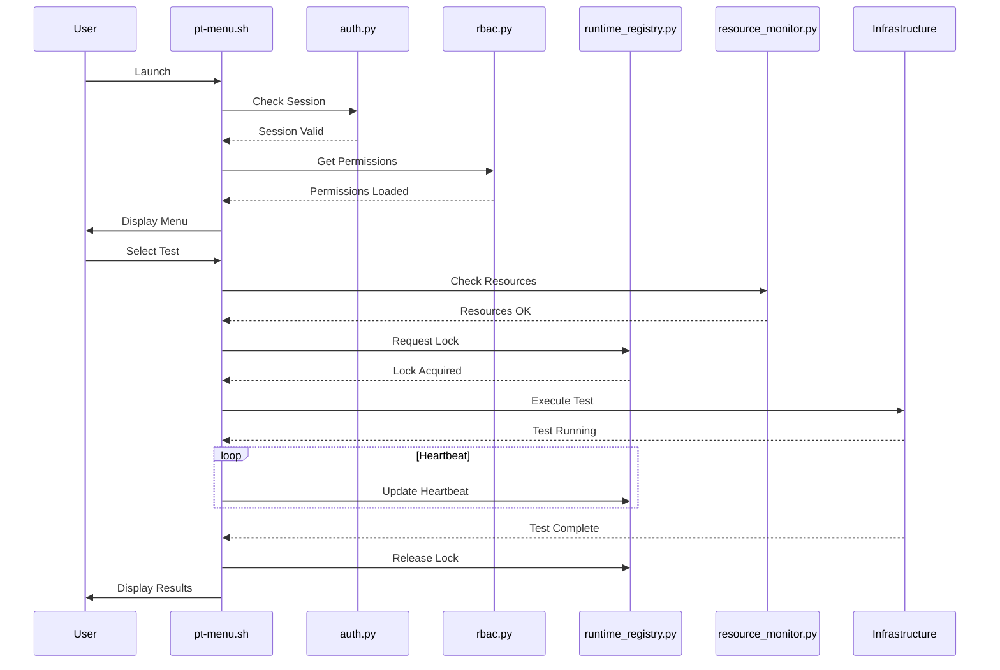
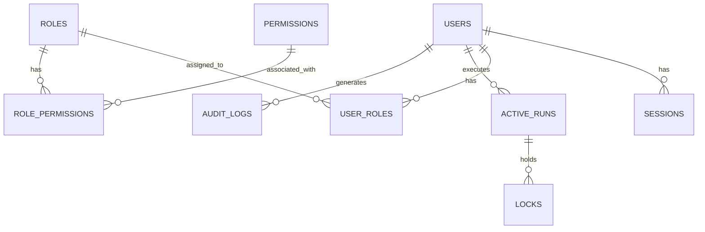

# Growin Performance Test Framework: Enterprise Architecture Blueprint

## Executive Summary
This document outlines a comprehensive architecture enhancement plan for the Growin Performance Test Framework. The goal is to transform the existing TUI-based framework into a multi-user, role-based, resource-aware, and collision-safe enterprise-grade PT orchestration platform. The proposed architecture leverages a hybrid Bash/Python approach, using SQLite for centralized state management and implementing robust security and observability features.

## A. Complete System Architecture

### Component Diagram


### Execution Flow


## B. Detailed File Structure Proposal

```
growin_performancetest/
├── auth/                       # Authentication logic
│   ├── auth.py                 # Python auth module
│   ├── auth_tui.sh             # Bash login TUI
│   └── session_store/          # Temporary session files
├── rbac/                       # Role-Based Access Control
│   ├── rbac.py                 # Python RBAC module
│   └── permissions.yaml        # Configurable permission registry
├── runtime_registry/           # Execution state tracking
│   ├── runtime_registry.py     # Python registry module
│   └── heartbeat_daemon.py     # Background heartbeat service
├── locks/                      # Resource locking mechanism
│   └── lock_manager.py         # Python lock manager
├── sessions/                   # Session management
│   └── session_manager.py      # Python session manager
├── audit/                      # Audit logging
│   ├── audit_logger.py         # Python audit logger
│   └── forensics_tool.py       # Log analysis tool
├── resource_management/        # Resource monitoring
│   └── resource_monitor.py     # Python resource monitor
├── user_management/            # User management TUI/Logic
│   ├── user_manager.py         # Python user manager
│   └── user_menu.sh            # Bash user menu
├── tui/                        # TUI components and renderers
│   ├── tui_renderer.sh         # Dashboard renderer
│   └── status_bar.sh           # Dynamic status bar
├── db/                         # SQLite database files
│   ├── auth.db                 # Users, roles, sessions
│   ├── runtime.db              # Active runs, locks, resources
│   └── audit.db                # Audit logs
├── api/                        # Future REST API (optional)
├── plugins/                    # Extension points
└── pt-menu.sh                  # Main entrypoint TUI (refactored)
```

## C. SQLite Database Design

### ERD


### Schema
```sql
-- auth.db
CREATE TABLE users (
    id INTEGER PRIMARY KEY AUTOINCREMENT,
    username TEXT UNIQUE NOT NULL,
    password_hash TEXT NOT NULL,
    status TEXT DEFAULT 'active', -- active, locked
    created_at TIMESTAMP DEFAULT CURRENT_TIMESTAMP,
    last_login TIMESTAMP
);

CREATE TABLE roles (
    id INTEGER PRIMARY KEY AUTOINCREMENT,
    name TEXT UNIQUE NOT NULL,
    description TEXT
);

CREATE TABLE permissions (
    id INTEGER PRIMARY KEY AUTOINCREMENT,
    name TEXT UNIQUE NOT NULL,
    description TEXT
);

CREATE TABLE role_permissions (
    role_id INTEGER,
    permission_id INTEGER,
    PRIMARY KEY (role_id, permission_id),
    FOREIGN KEY (role_id) REFERENCES roles(id),
    FOREIGN KEY (permission_id) REFERENCES permissions(id)
);

CREATE TABLE user_roles (
    user_id INTEGER,
    role_id INTEGER,
    PRIMARY KEY (user_id, role_id),
    FOREIGN KEY (user_id) REFERENCES users(id),
    FOREIGN KEY (role_id) REFERENCES roles(id)
);

CREATE TABLE sessions (
    id INTEGER PRIMARY KEY AUTOINCREMENT,
    user_id INTEGER,
    token TEXT UNIQUE NOT NULL,
    expires_at TIMESTAMP NOT NULL,
    created_at TIMESTAMP DEFAULT CURRENT_TIMESTAMP,
    FOREIGN KEY (user_id) REFERENCES users(id)
);

-- runtime.db
CREATE TABLE active_runs (
    id INTEGER PRIMARY KEY AUTOINCREMENT,
    user_id INTEGER,
    script_name TEXT NOT NULL,
    environment TEXT NOT NULL,
    target TEXT NOT NULL,
    vus INTEGER,
    duration TEXT,
    start_time TIMESTAMP DEFAULT CURRENT_TIMESTAMP,
    eta TIMESTAMP,
    status TEXT DEFAULT 'running',
    FOREIGN KEY (user_id) REFERENCES users(id)
);

CREATE TABLE performance_metrics (
    id INTEGER PRIMARY KEY AUTOINCREMENT,
    run_id INTEGER,
    api_name TEXT NOT NULL,
    samples INTEGER,
    avg_ms REAL,
    max_ms REAL,
    min_ms REAL,
    p95_ms REAL,
    error_rate_pct REAL,
    rps REAL,
    error_sample INTEGER,
    FOREIGN KEY (run_id) REFERENCES active_runs(id)
);

CREATE TABLE locks (
    id INTEGER PRIMARY KEY AUTOINCREMENT,
    run_id INTEGER,
    resource_type TEXT NOT NULL, -- environment, server
    resource_id TEXT NOT NULL,
    acquired_at TIMESTAMP DEFAULT CURRENT_TIMESTAMP,
    heartbeat TIMESTAMP DEFAULT CURRENT_TIMESTAMP,
    FOREIGN KEY (run_id) REFERENCES active_runs(id)
);

CREATE TABLE server_registry (
    id INTEGER PRIMARY KEY AUTOINCREMENT,
    server_name TEXT UNIQUE NOT NULL,
    ip_address TEXT NOT NULL,
    cpu_usage REAL,
    ram_usage REAL,
    docker_containers INTEGER,
    k6_processes INTEGER,
    health_score INTEGER,
    last_updated TIMESTAMP DEFAULT CURRENT_TIMESTAMP
);

-- audit.db
CREATE TABLE audit_logs (
    id INTEGER PRIMARY KEY AUTOINCREMENT,
    user_id INTEGER,
    timestamp TIMESTAMP DEFAULT CURRENT_TIMESTAMP,
    action TEXT NOT NULL,
    target TEXT,
    outcome TEXT,
    details TEXT,
    FOREIGN KEY (user_id) REFERENCES users(id)
);
```

## D. Security Hardening Design

### Password Hashing
Use `bcrypt` or `argon2` with a high cost factor.
```python
import bcrypt
password = b"user_password"
hashed = bcrypt.hashpw(password, bcrypt.gensalt())
# Verification
if bcrypt.checkpw(password, hashed):
    print("Match")
```

### Lockout Policy
Implement brute-force protection by locking accounts after 5 failed login attempts.
```sql
UPDATE users SET status = 'locked' WHERE username = '?' AND (SELECT COUNT(*) FROM audit_logs WHERE user_id = ? AND action = 'login_failure' AND timestamp > datetime('now', '-15 minutes')) >= 5;
```

### Secure SSH Handling
*   Avoid hardcoded passwords.
*   Use SSH keys with passphrases.
*   Restrict SSH commands via `authorized_keys`.
*   Use `ssh-agent` for secure key management.

### Secret Management
*   Store secrets in environment variables or a dedicated secret manager (e.g., HashiCorp Vault).
*   Use encrypted files with strict permissions for local secrets.

### Sudo Strategy
*   Restrict `sudo` access to only necessary commands.
*   Use `visudo` to configure granular `sudo` rules.

### Audit Integrity
*   Ensure audit logs are append-only.
*   Periodically back up audit logs to a secure, remote location.

## E. Implementation Roadmap

### Phase 1: MVP (Foundation)
*   Implement `auth.py` and `auth_tui.sh`.
*   Design and create SQLite databases (`auth.db`, `runtime.db`, `audit.db`).
*   Integrate basic login into `pt-menu.sh`.
*   Implement basic `audit_logger.py`.

### Phase 2: Production (Core Features)
*   Implement `rbac.py` and integrate with TUI menus.
*   Implement `runtime_registry.py` and `lock_manager.py`.
*   Add concurrent test detection and locking to `pt-menu.sh`.
*   Implement `resource_monitor.py` and dynamic status bar.

### Phase 3: Enterprise (Advanced Features)
*   Implement `user_manager.py` and `user_menu.sh`.
*   Implement `execution_monitor.py` and terminal dashboard.
*   Add advanced features like queue mode, force takeover, and forensics tool.
*   Refine security hardening and performance optimization.

## F. Code Examples

### Bash Login Screen (`auth_tui.sh`)
```bash
#!/usr/bin/env bash
echo -e "\n${CYN}${BLD} ── Growin PT Framework Login ──${RST}"
printf " Username: "
read -r username
printf " Password: "
read -s password
echo ""
# Call auth.py to verify credentials
session_token=$(python3 auth/auth.py login "$username" "$password")
if [[ $? -eq 0 ]]; then
    echo "Login successful!"
    export PT_SESSION_TOKEN="$session_token"
else
    echo "Login failed."
    exit 1
fi
```

### SQLite Auth Query (`auth.py`)
```python
import sqlite3
import bcrypt

def verify_user(username, password):
    conn = sqlite3.connect('db/auth.db')
    cursor = conn.cursor()
    cursor.execute("SELECT id, password_hash, status FROM users WHERE username = ?", (username,))
    user = cursor.fetchone()
    conn.close()
    
    if user and user[2] == 'active' and bcrypt.checkpw(password.encode('utf-8'), user[1]):
        return user[0] # Return user ID
    return None
```

### Python RBAC Middleware (`rbac.py`)
```python
def has_permission(user_id, permission_name):
    conn = sqlite3.connect('db/auth.db')
    cursor = conn.cursor()
    query = """
    SELECT 1 FROM user_roles ur
    JOIN role_permissions rp ON ur.role_id = rp.role_id
    JOIN permissions p ON rp.permission_id = p.id
    WHERE ur.user_id = ? AND p.name = ?
    """
    cursor.execute(query, (user_id, permission_name))
    result = cursor.fetchone()
    conn.close()
    return result is not None
```

## G. UX/TUI Improvement Ideas

*   **Standardized Reporting Dashboard**: Implement a TUI view that mirrors the enterprise report format, showing columns for:
    *   **API Name**
    *   **Samples**
    *   **Average (ms)**
    *   **Max/Min (ms)**
    *   **P95 (ms)**
    *   **Error Rate (%)**
    *   **RPS (/s)**
    *   **Error Sample**
*   **Better Dashboards**: Use `fzf` for interactive searching and selection. Integrate with `btop`-like visualizations for resource monitoring.
*   **Occupancy Visualization**: Use ASCII charts or color-coded maps to show environment occupancy.
*   **Execution Timeline**: Display a progress bar or timeline for active tests.
*   **Server Health Indicators**: Use emoji or color-coded icons (e.g., 🟢, 🟡, 🔴) for quick health assessment.
*   **Colorized State**: Use consistent color schemes for different statuses (e.g., green for PASS, red for FAIL, yellow for WARNING).
*   **Keyboard Navigation**: Support common terminal shortcuts for navigation and actions.
*   **Fuzzy Execution Search**: Allow users to quickly find scripts or executions using fuzzy matching.

## H. Advanced Features

*   **Distributed Orchestration**: Support coordinating tests across multiple clusters or regions.
*   **Central PT Coordinator**: A dedicated service for managing all PT activities across the enterprise.
*   **REST API**: Expose system functionality via a REST API for integration with other tools and CI/CD pipelines.
*   **Websocket Observability**: Real-time data streaming for high-performance dashboards.
*   **Slack/Discord Notifications**: Automated alerts for test completions, failures, or critical resource events.
*   **Grafana Integration**: Export metrics to Grafana for advanced visualization and historical analysis.
*   **Queue Orchestration**: Implement a sophisticated queueing system for fair resource allocation.
*   **Auto Resource Balancing**: Automatically distribute tests across available servers based on current load.
*   **Kubernetes Future Support**: Design the architecture to be container-native and ready for Kubernetes deployment.
