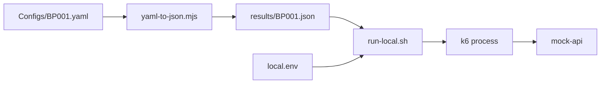
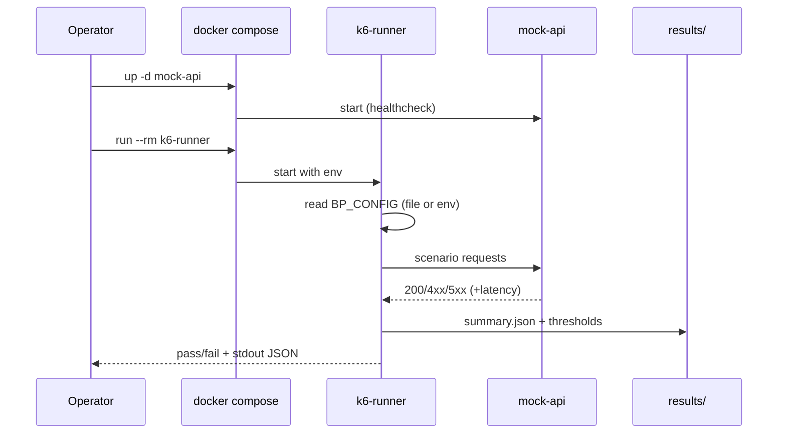
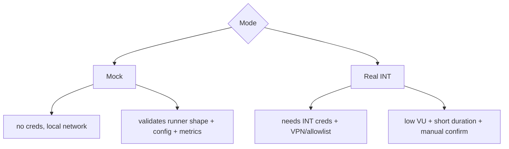

# Local Docker PT Lab

Run k6 PT scripts locally against a mock API. Safe defaults for MacBook M4 16GB.

## Jenkins CI (profile `ci`)

```bash
docker compose -f docker-local-pt/docker-compose.yml --profile ci up -d mock-api jenkins
docker exec pt-jenkins cat /var/jenkins_home/secrets/initialAdminPassword
# UI: http://localhost:18081
```

See `jenkins/README.md` and `READMOCKDOCK.md` (Jenkins section).

## Layout
```
docker-local-pt/
  docker-compose.yml
  jenkins/               (profile ci — local Pipeline)
  mock-api/
    Dockerfile package.json server.js
  configs/
    local.env.example
    local.env            (gitignored)
  scripts/
    run-local.sh         (k6 entrypoint inside container)
    yaml-to-json.mjs     (host: BP YAML → BP_CONFIG JSON)
    k6-local-runner.js   (local wrapper: BP001 + bypass auth)
  results/               (mounted, summary.json output)
```

## Prereqs
- Docker Desktop running (Apple Silicon arm64 supported)
- ≥ 6 GB allocated to Docker, ≥ 4 vCPU

## Quick Start — Mode 1 Contract Smoke

```bash
# 0) host: render BP YAML to JSON
node docker-local-pt/scripts/yaml-to-json.mjs "Script/Growin_PT_Dev[ToDo]/Configs/BP001.yaml" > docker-local-pt/results/BP001.json

# 1) edit env (already pre-seeded)
cat docker-local-pt/configs/local.env

# 2) start mock + run smoke (USER=1 DURATION=30s)
docker compose -f docker-local-pt/docker-compose.yml up -d mock-api
docker compose -f docker-local-pt/docker-compose.yml run --rm k6-runner

# 3) cleanup
docker compose -f docker-local-pt/docker-compose.yml down
```

Results: `docker-local-pt/results/summary.json`

## Modes

| Mode | env | Use |
|---|---|---|
| 1 Contract smoke | `USER=1 DURATION=10s MOCK_LATENCY_MS=50` | sanity: script loads + emits metrics |
| 2 Local stability | `USER=5 DURATION=1m MOCK_LATENCY_MS=80` | pacing, error_rate stable |
| 3 Error path | `USER=2 DURATION=30s MOCK_ERROR_RATE=0.1 MOCK_LATENCY_MS=300` | threshold trip + error metrics |

Hard cap defaults: `USER<=10 DURATION<=2m`.

## Observability (optional)

```bash
docker compose -f docker-local-pt/docker-compose.yml --profile observability up -d influxdb grafana
# In local.env set:
#   K6_OUT=influxdb=http://influxdb:8086/k6
# Grafana: http://localhost:3000 (anon admin), import k6 dashboard JSON manually
```

## Validation

| Cmd | Expect |
|---|---|
| `docker compose -f docker-local-pt/docker-compose.yml config` | valid YAML, no errors |
| `docker compose -f docker-local-pt/docker-compose.yml up -d mock-api` | healthy |
| `curl http://localhost:18080/health` | `{"ok":true}` |
| `docker compose -f docker-local-pt/docker-compose.yml run --rm k6-runner` | k6 runs, summary printed |
| `ls -la docker-local-pt/results/summary.json` | exists |

## Architecture

```mermaid
flowchart TD
  Host[MacBook M4 16GB] --> DD[Docker Desktop]
  DD --> K6[pt-k6-runner]
  DD --> Mock[pt-mock-api :18080->:8080]
  DD --> Results[(results volume)]
  K6 -->|HTTP load| Mock
  K6 -->|summary.json| Results
  Cfg[configs/local.env] --> K6
  Wrapper[scripts/k6-local-runner.js] --> K6
  PT_Dev[Script/Growin_PT_Dev[ToDo]/Web/BP001.js] --> Wrapper
```

## Config Flow



## Execution Flow



## Real vs Mock



## Resource Plan (MacBook M4 16GB)

| Component | CPU | RAM | Notes |
|---|---:|---:|---|
| pt-k6-runner | 2 cores | 1 GB | safe default |
| pt-mock-api | 0.5 core | 256 MB | enough |
| pt-influx (opt) | 1 core | 1 GB | profile only |
| pt-grafana (opt) | 0.5 core | 512 MB | profile only |

Docker Desktop suggested: CPU 4-6, Memory 6-8 GB, Swap 1-2 GB. Do NOT allocate full 16 GB.

## Risks

- Mock not production truth; business behavior not validated.
- Helper/runner hardcodes HTTPS hosts; `extra_hosts` + `K6_INSECURE_SKIP_TLS_VERIFY=true` lets traffic reach mock when those hosts are used.
- High VU/duration may overload Mac; defaults capped.
- Apple Silicon images may differ from Jenkins Linux x64; rebuild may be needed.
- `Helper/config.js` carries default password literal (pre-existing); mock mode does not exercise real auth, but do not run real INT smoke without rotating that.
- Influx/Grafana profile increases RAM usage; disable when not needed.

## Next Step
1. Render BP001.yaml once.
2. Run Mode 1 smoke.
3. Diff summary vs Jenkins INT artifact (when available).
4. Enable observability profile for visual compare.
5. Only then attempt real INT smoke from a host with creds outside the repo.

## Grafana Observability

Start full observability stack:
```bash
docker compose -f docker-local-pt/docker-compose.yml --profile observability up -d mock-api influxdb grafana
```

Run k6 with InfluxDB sink:
```bash
docker compose -f docker-local-pt/docker-compose.yml --profile observability run --rm \
  -e K6_OUT=influxdb=http://influxdb:8086/k6 -e USER=1 -e DURATION=30s k6-runner
```

- Grafana: http://localhost:3000 (admin/admin, anon viewer enabled)
- Dashboard: `Local PT / Local k6 PT Dashboard`
- InfluxDB host port: 18086 (db `k6`)

See `docs/OBSERVABILITY.md` for panel list, queries, troubleshooting.
