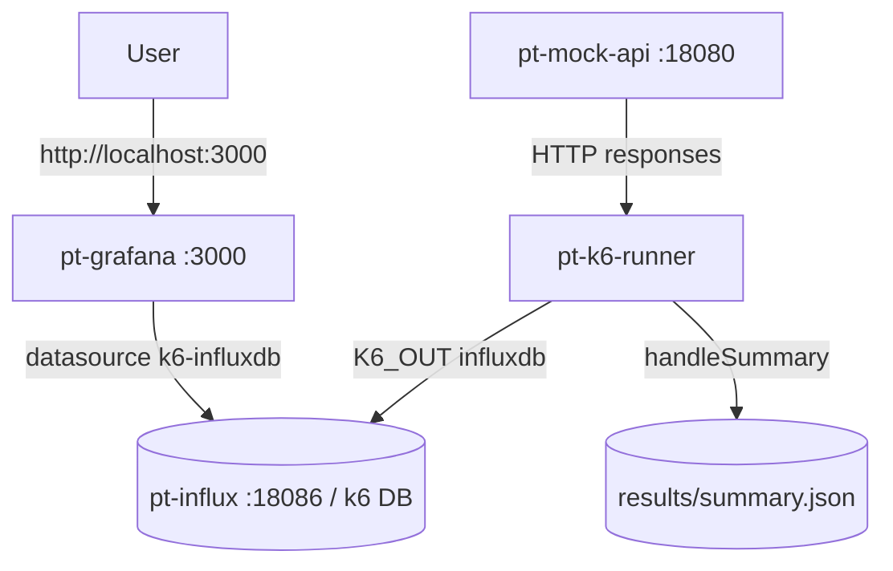
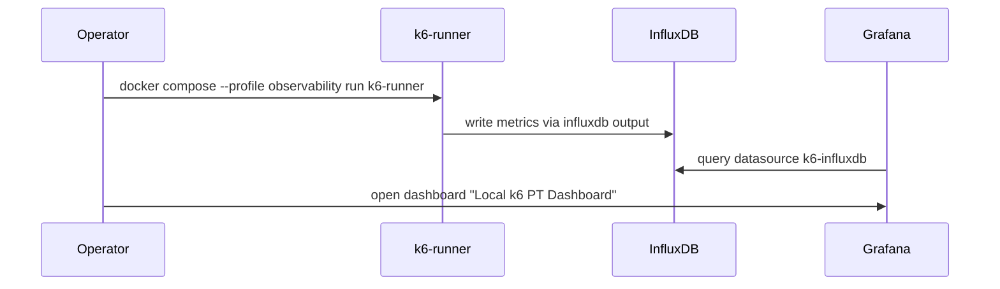

# Local k6 PT Observability

## Architecture



## Data Flow



## Services
| Service | Host Port | Image | Purpose |
|---|---:|---|---|
| pt-mock-api | 18080 | local build node:20-alpine | backend mock |
| pt-k6-runner | — | grafana/k6:0.51.0 | k6 driver |
| pt-influx | 18086 | influxdb:1.8 | k6 metrics sink |
| pt-grafana | 3000 | grafana/grafana:10.4.2 | dashboard UI |

## Panels
| # | Panel | Source |
|---:|---|---|
| 1 | Total HTTP Requests | `http_reqs` |
| 2 | Iterations | `iterations` |
| 3 | VUs (max) | `vus` |
| 4 | Checks Pass Rate | `checks` |
| 5 | HTTP Request Duration avg/p95/p99 | `http_req_duration` |
| 6 | HTTP Request Rate (RPS) | `http_reqs` /10s |
| 7 | HTTP Failed Rate | `http_req_failed` |
| 8 | Waiting Time | `http_req_waiting` |
| 9 | Custom BP `duration_*` | `/^duration_/` (note: edit panel to use `SELECT percentile(value,95) FROM /^duration_/ WHERE $timeFilter GROUP BY time($__interval), \"metric\"`) |
| 10 | Custom BP `waiting_*` | `/^waiting_/` |
| 11 | Mock API endpoint duration | `http_req_duration GROUP BY url` |

## Commands
```bash
# Start observability + mock
docker compose -f docker-local-pt/docker-compose.yml --profile observability up -d mock-api influxdb grafana

# Run k6 with InfluxDB output
docker compose -f docker-local-pt/docker-compose.yml --profile observability run --rm \
  -e K6_OUT=influxdb=http://influxdb:8086/k6 \
  -e USER=1 -e DURATION=30s \
  k6-runner

# Health
curl http://localhost:18080/health
curl http://localhost:3000/api/health
curl -I http://localhost:18086/ping

# Influx queries
docker exec pt-influx influx -database k6 -execute 'SHOW MEASUREMENTS'
docker exec pt-influx influx -database k6 -execute 'SELECT count(value) FROM http_reqs'

# Grafana — open dashboard
open http://localhost:3000/d/k6-local-pt/local-k6-pt-dashboard

# Cleanup (preserve volumes)
docker compose -f docker-local-pt/docker-compose.yml --profile observability down

# Full cleanup (delete metrics + dashboards)
docker compose -f docker-local-pt/docker-compose.yml --profile observability down -v
```

## Validation
| Cmd | Expect |
|---|---|
| `curl http://localhost:18080/health` | `{"ok":true}` |
| `curl http://localhost:3000/api/health` | `"database":"ok"` |
| `curl -I http://localhost:18086/ping` | `204 No Content` |
| k6 run with `K6_OUT=influxdb=...` | iter+http_reqs > 0 |
| `influx ... SHOW MEASUREMENTS` | includes `http_reqs`, `http_req_duration`, `duration_BP001_*`, `error_rate_BP001_*` |
| Grafana `/api/datasources` | `k6-influxdb` present |
| Grafana `/api/search` | `Local k6 PT Dashboard` present in folder `Local PT` |

## Troubleshooting
| Symptom | Fix |
|---|---|
| Dashboard empty | run k6 with `K6_OUT=influxdb=...`; refresh time range to last 15m |
| Datasource missing | check `grafana/provisioning/datasources/influxdb.yml` mounted; `docker logs pt-grafana` |
| Influx empty | container name must be `influxdb` (compose service name); db `k6`; check `docker logs pt-influx` |
| Port 3000 conflict | edit compose: `"13000:3000"` |
| Port 18086 conflict | edit compose: pick free host port |
| Mac RAM pressure | stop observability: `docker compose ... --profile observability down` |
| Panel 9/10 "no data" | k6 outputs custom metrics as separate measurements per name; either edit query or use regex `FROM /^duration_/` style |

## Limits
- Mock data only; no production parity.
- Custom k6 metrics emit as distinct Influx measurements (`duration_BP001_*` etc.), not as a single `duration` metric with `metric` tag — adjust queries when grouping.
- MacBook M4 16GB safe limits: USER ≤ 10, DURATION ≤ 2m, default.
- Grafana anonymous viewer enabled for convenience; admin/admin for edit. No external exposure recommended.
