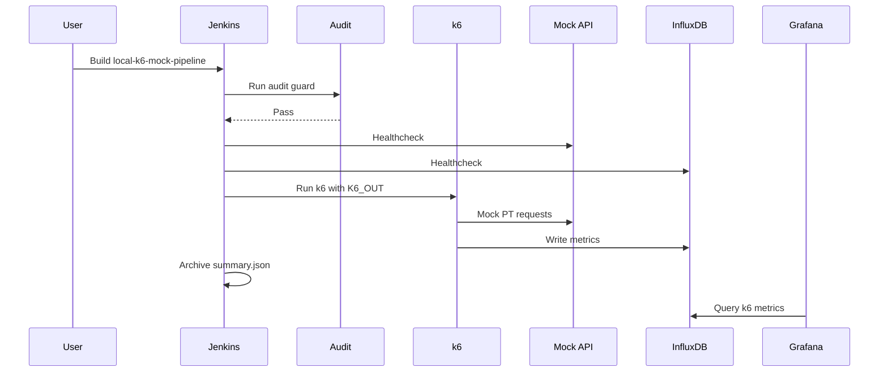

# Jenkins Local — k6 Mock PT + Grafana Sync

Jenkins + Influx + Grafana untuk local mock k6 PT di MacBook M4 16GB.

## Quick Start (full stack)

```bash
docker compose -f docker-local-pt/docker-compose.yml \
  --profile ci --profile observability \
  up -d mock-api influxdb grafana jenkins
```

| URL | Purpose |
|-----|---------|
| http://localhost:18081 | Jenkins UI |
| http://localhost:3000 | Grafana (`admin` / `admin`) |
| http://localhost:18080/health | mock-api |

## Pipeline job (auto-created)

**Name:** `local-k6-mock-pipeline`

On **first** Jenkins boot (empty `pt-jenkins-home` volume), init Groovy creates job from:

`docker-local-pt/jenkins/pipelines/Jenkinsfile.local-k6-mock`

Confirm in logs:

```bash
docker logs pt-jenkins 2>&1 | grep local-k6-mock-pipeline
```

Expected: `Configured Jenkins pipeline job: local-k6-mock-pipeline`

### Re-seed job (existing volume)

```bash
docker exec pt-jenkins bash /workspace/docker-local-pt/jenkins/scripts/configure-jenkins-job.sh
```

### Fresh Jenkins home (reset wizard + job init)

```bash
docker compose -f docker-local-pt/docker-compose.yml --profile ci stop jenkins
docker volume rm docker-local-pt_pt-jenkins-home
docker compose -f docker-local-pt/docker-compose.yml --profile ci --profile observability up -d jenkins
```

## First Jenkins unlock

```bash
docker exec pt-jenkins cat /var/jenkins_home/secrets/initialAdminPassword
```

1. Open http://localhost:18081
2. Install suggested plugins (Pipeline required)
3. Create admin user
4. Open job **local-k6-mock-pipeline** → **Build with Parameters**

## Pipeline parameters

| Param | Default | Notes |
|-------|---------|-------|
| SUITE | Growin_PT_Dev[ToDo] | |
| SCENARIO | BP001 | |
| PLATFORM | Web | |
| VARIANT | original | |
| USER_COUNT | 1 | max 2 |
| DURATION | 30s | |
| USE_GRAFANA_OUTPUT | **true** | writes to Influx → Grafana |
| SKIP_AUDIT | false | |

`RUN_ID` env: `{JOB}-{BUILD}-{SCENARIO}-{PLATFORM}-{VARIANT}` → k6 tags for Grafana alignment.

## Manual k6 (no UI)

```bash
docker exec pt-jenkins bash -c \
  'USE_GRAFANA_OUTPUT=true RUN_ID=manual-test-1 bash /workspace/docker-local-pt/jenkins/scripts/run-k6-mock.sh'
```

## Verify Grafana sync

```bash
docker exec pt-influx influx -database k6 -execute 'SHOW MEASUREMENTS'
docker exec pt-influx influx -database k6 -execute 'SELECT count(value) FROM http_reqs'
```

Grafana:

- Datasource: **k6-influxdb** (uid `k6-influxdb`)
- Dashboard: **Local k6 PT Dashboard** → http://localhost:3000/d/k6-local-pt/local-k6-pt-dashboard
- Time range: **Last 15 minutes**

## Architecture

```mermaid
flowchart TD
  User[User] --> Jenkins[Jenkins :18081]
  Jenkins --> Pipeline[local-k6-mock-pipeline]
  Pipeline --> Audit[Audit enhanced contracts]
  Pipeline --> K6[k6 run]
  K6 --> Mock[pt-mock-api]
  K6 --> Results[/results/jenkins summary.json]
  K6 --> Influx[(InfluxDB k6)]
  Grafana[Grafana :3000] --> Influx
  User --> Grafana
```



## Artifacts

`docker-local-pt/results/jenkins/*_summary.json`

## Resource caps

| Service | RAM |
|---------|-----|
| pt-jenkins | 1536m |
| pt-mock-api | 256m |
| pt-influx + grafana | ~1.5GB |

## Troubleshooting

| Issue | Fix |
|-------|-----|
| Job missing | reset volume or `configure-jenkins-job.sh` |
| Build API 403 | complete Jenkins unlock first |
| Grafana empty | `USE_GRAFANA_OUTPUT=true`, Last 15m |
| Datasource UID mismatch | restart grafana after `influxdb.yml` uid fix |
| mock unreachable | `http://mock-api:8080` not localhost |
| OOM | stop Grafana when idle |

## Cleanup

```bash
docker compose -f docker-local-pt/docker-compose.yml --profile ci --profile observability down
docker compose -f docker-local-pt/docker-compose.yml --profile ci --profile observability down -v
```
