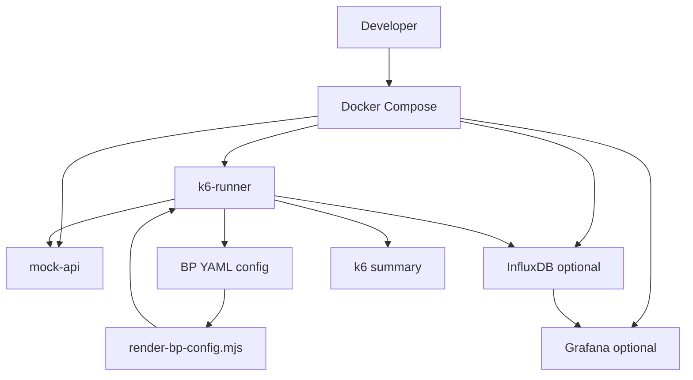
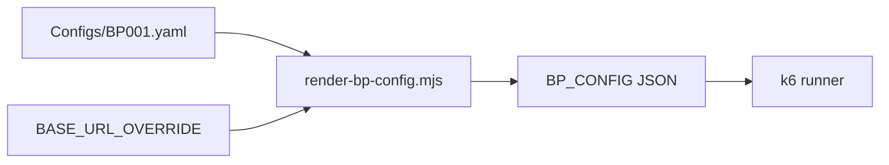
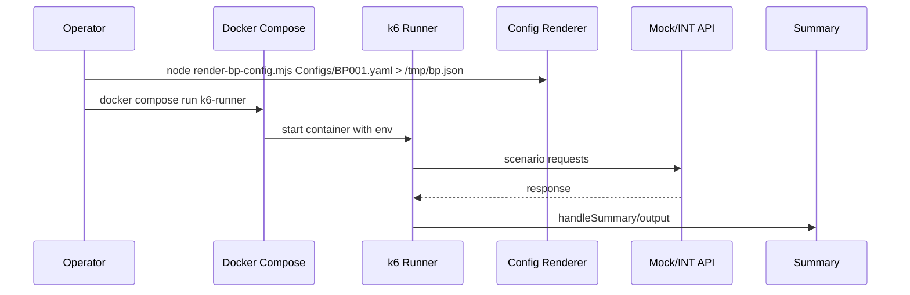

# Local Docker PT Simulation

## Verdict

Local Docker simulates: runner load, config flow (YAML → JSON), env contract, metric output, optional InfluxDB+Grafana, optional mock API.

Local Docker does NOT replace: real backend behavior, real auth/session, real INT latency, real Grafana production dashboard, real Jenkins env wiring.

Use real INT when validating contract before promoting an enhanced sibling. Use local mock for runner shape + config parsing checks.

## Architecture



## Config Flow



## Execution Flow



## Modes

| Mode | Profile | Command |
|---|---|---|
| Mock smoke (recommended for local) | `mock` | `docker compose -f docker/pt/docker-compose.pt.yml --profile mock up --build` |
| Real INT smoke | `real` | `docker compose -f docker/pt/docker-compose.pt.yml --profile real run --rm k6-runner` |
| Observability local | `observability` | `docker compose -f docker/pt/docker-compose.pt.yml --profile observability up -d` |

## Commands (use `rtk` wrapper if installed)

```bash
# 1) Copy env example and edit
cp docker/pt/.env.pt.example docker/pt/.env.pt

# 2) Render YAML to JSON one-liner (host)
node docker/pt/scripts/render-bp-config.mjs "Script/Growin_PT_Dev[ToDo]/Configs/BP001.yaml" > /tmp/bp.json

# 3) Pass JSON path via env file
# Edit docker/pt/.env.pt:
#   BP_CONFIG_FILE=/tmp/bp.json   (mounted in container) OR
#   BP_CONFIG='{...}'             (paste output of step 2)
# For mock mode, also set:
#   PT_RUNNER=docker/pt/local-runner/Growin_PT_Dev_LOCAL.js
#   BASE_URL=http://mock-api:8088

# 4a) Mock mode
rtk docker compose -f docker/pt/docker-compose.pt.yml --profile mock up --build

# 4b) Real INT mode (creds must already work outside repo)
rtk docker compose -f docker/pt/docker-compose.pt.yml --profile real run --rm k6-runner

# 4c) Observability stack
rtk docker compose -f docker/pt/docker-compose.pt.yml --profile observability up -d

# 5) Cleanup
rtk docker compose -f docker/pt/docker-compose.pt.yml down -v
```

## Env Variables

| Env | Required | Default | Used By | Meaning | Docker local value |
|---|---|---|---|---|---|
| RUNBY | yes | LocalDocker | runner+suites | run mode label | `LocalDocker` |
| ENV | yes | INT | Helper/config + PT_Dev runner | env→base_url map | `INT` (mock via extra_hosts) |
| USER | yes | 1 | runner | VU count | `1` |
| DURATION | yes | 30s | runner options | k6 duration | `30s` |
| NUMSTART | yes | 1 | credential lookup | user index offset | `1` |
| SCENARIO | yes | BP001 | runner | which BP to dispatch | `BP001` |
| PLATFORM | yes | Web | runner | Web/iOS/Android | `Web` |
| BP_CONFIG | one of | — | PT_Dev runner | raw JSON config | from render-bp-config.mjs |
| BP_CONFIG_FILE | one of | — | run-k6-local.sh | path to pre-rendered JSON | `/tmp/bp.json` |
| DEBUG | no | false | enchange siblings | verbose logs | `true` |
| STRICT_PLATFORM_IMPLEMENTATION | no | false | enchange runners | block Android→Web fallback | `false` |
| ALLOW_ANDROID_WEB_FALLBACK | no | true | enchange runners | legacy fallback | `true` |
| MOCK_STATUS | no | 200 | mock-api | response status | `200` |
| MOCK_LATENCY_MS | no | 50 | mock-api | latency injection | `50` |
| K6_OUT | no | (stdout) | k6 | output sink | `influxdb=http://influxdb:8086/k6` |
| K6_INSECURE_SKIP_TLS_VERIFY | no | true | k6 | accept self-signed/cert mismatch | `true` |

## Troubleshooting

| Symptom | Cause | Fix |
|---|---|---|
| `BP_CONFIG parse error` | env empty or not JSON | render YAML first, set BP_CONFIG or BP_CONFIG_FILE |
| `cannot resolve internal-api-pt.growin.id` | DNS blocked | use mock profile + `extra_hosts: host-gateway` mapping |
| k6 hangs on TLS | mock is HTTP, original runner uses HTTPS | set `K6_INSECURE_SKIP_TLS_VERIFY=true` + use local-runner wrapper |
| `❌ PLATFORM must be specified` | env missing | set `PLATFORM=Web` |
| `[ToDo]` shell quoting | bracket path | always quote paths in shell commands |
| no metric in Grafana | InfluxDB output not set | set `K6_OUT=influxdb=http://influxdb:8086/k6` |
| permission denied on mount | UID mismatch | run `chmod -R a+rX` on repo or use `--user $(id -u)` |
| mock returns 404 | server only catch-all by design | request still arrives; not 404 unless server fails |

## Safety

- `.env.pt.example` carries placeholders only. Real `.env.pt` must NOT be committed (already in `.gitignore`).
- `Helper/config.js` contains a default password literal (carryover from repo). Local runs override via mock; do not export this image.
- Do NOT run mock mode against real INT/QA/DRC env vars — credentials would leak through real outbound logins.
