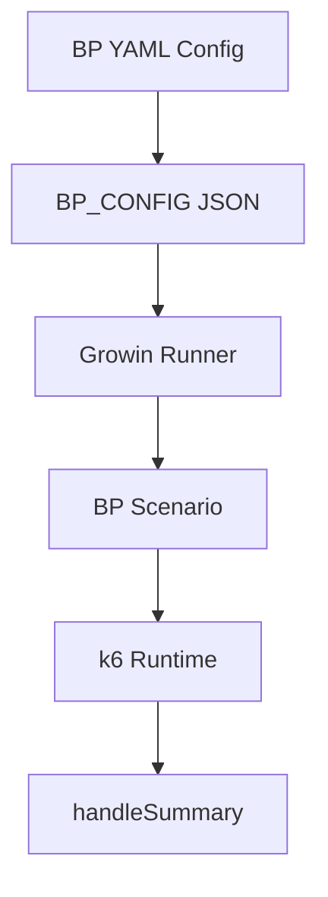
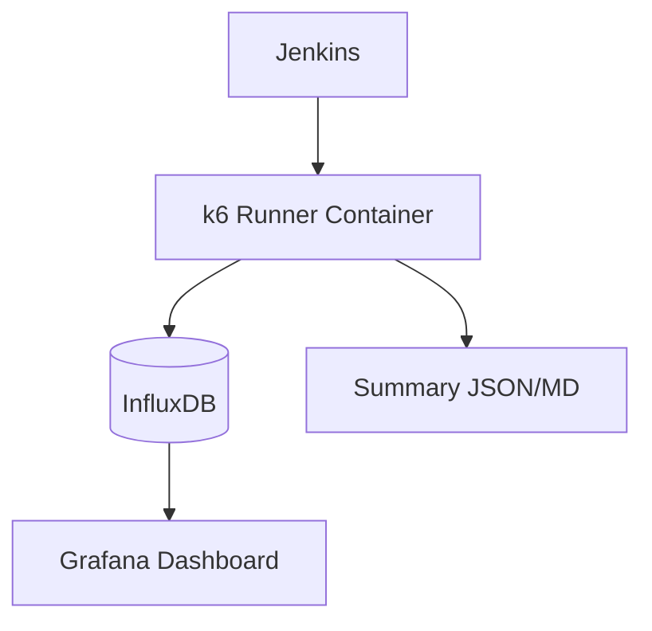

# Growin Performance Test — Codebase Audit

| Field | Value |
|---|---|
| Project | `growin_performancetest` |
| Scope | `k6 + Docker + Jenkins + Grafana + Influx` |
| Generated At | `2026-05-19T07:18:00Z` |

## 1. Tech Stack

| Layer | Tool | File |
|---|---|---|
| PT script runtime | k6 `0.51.0` | `Script/**`, `docker-local-pt/scripts/*.js` |
| Mock load lab | Docker Compose | `docker-local-pt/docker-compose.yml` |
| Mock backend | Node API | `docker-local-pt/mock-api/server.js` |
| Local runner | shell + generated runner | `docker-local-pt/scripts/run-mock-scenario.sh`, `gen-mock-runner.mjs`, `run-local.sh` |
| CI local | Jenkins | `docker-local-pt/jenkins/**` |
| Metrics sink | InfluxDB 1.8 | `docker-local-pt/docker-compose.yml` |
| Dashboard | Grafana 10.4.2 | `docker-local-pt/grafana/**` |
| Contract audit tool | Node mjs | `tools/audit-enhanced-contracts.mjs` |

## 2. Script Inventory

| Suite | Scenario | Platform | Original | Enchange | Config |
|---|---|---|---|---|---|
| Growin_PT_Dev[ToDo] | BP001 | Web | `Script/Growin_PT_Dev[ToDo]/Web/BP001.js` | `Script/Growin_PT_Dev[ToDo]/Web/enchange_BP001.js` | `Script/Growin_PT_Dev[ToDo]/Configs/BP001.yaml` |
| Fleet summary | multiple (108 candidates) | Web/iOS/Android mix | present | present (`enchange_*.js`) | mixed yaml/yml per suite |

## 3. Runner / Config Flow

## 4. Jenkins / Grafana Flow

## 5. Contract Rules

| Contract | Status | Notes |
| ------------------ | ------ | ----- |
| Jenkins env | PASS | `run-k6-mock.sh` validates `USER_COUNT` numeric 1..2 |
| Metric naming | PASS | custom metric prefixes `duration_*`, `error_rate_*`, `sample_*` present |
| Grafana dashboard | PASS | dashboard JSON + provisioning yaml present |
| Mock mode | PASS | runner hard-sets `BASE_URL=http://mock-api:8080` |
| Original preserved | PASS | original + enchange both exist |

## 6. Risks

| Severity | Risk | Evidence | Mitigation |
| -------- | ---- | -------- | ---------- |
| High | Enchange parser drift vs k6 runtime | `enchange_BP001.js` failed on `??`, `?.`, spread | enforce k6-compat lint/check before merge (`docker-local-pt/scripts/check-k6-js-compat.mjs`) |
| Medium | Repo split path drift (`Growin_PT_Dev` tracked vs `Growin_PT_Dev[ToDo]` active) | git tracks `Script/Growin_PT_Dev/*`; runtime used `[ToDo]` | define single source-of-truth suite path, update runner/docs |
| Medium | Untracked working tree large drift | `git status` shows many modified files | isolate local validation branch/worktree, avoid accidental cross-suite mutation |
| Low | Grafana optional provisioning log noise | startup errors for optional dirs | add empty dirs if want clean logs |

